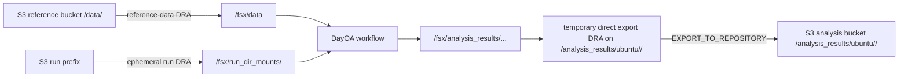

# Daylily Ephemeral Cluster

[](https://github.com/Daylily-Informatics/daylily-ephemeral-cluster/releases) [](https://github.com/Daylily-Informatics/daylily-ephemeral-cluster/tags)

DayEC is the operator control plane for short-lived AWS ParallelCluster environments that run Daylily analysis workloads on FSx for Lustre. The current data plane is DRA-first: the cluster starts with reference data mounted at `/fsx/data`, run folders are attached only when needed under `/fsx/run_dir_mounts/<mount_id>`, workflow outputs stay under `/fsx/analysis_results/ubuntu/<analysis_dir>`, and completed analysis directories are exported through a temporary direct DRA to a chosen S3 analysis bucket.

The cluster is ephemeral. S3 buckets are durable. Verify the export receipt before deleting the cluster.

## Supported Operator Contract

Use the checkout environment and the CLI, not historical helper-script paths:

1. `source ./activate`
2. `dyec preflight`
3. `dyec create`
4. `dyec headnode connect`
5. `dyec samples stage` for sample-manifest inputs, or `dyec mounts create` for run-folder inputs
6. `dyec workflow launch`
7. `dyec export --source-path /fsx/analysis_results/ubuntu/<analysis_dir> --destination-s3-uri s3://bucket/analysis_results/ubuntu/<analysis_dir>/`
8. inspect `fsx_export.yaml`
9. `dyec delete --dry-run`
10. `dyec delete`

`daylily-ec` and `dyec` are the same entrypoint. The shorter `dyec` form is used in examples.

## One Copy-Pasteable Lifecycle

```bash
source ./activate

export AWS_PROFILE=daylily-service-lsmc
export REGION=us-west-2
export REGION_AZ=us-west-2d
export CLUSTER_NAME=day-demo-$(date +%Y%m%d%H%M%S)
export DAY_EX_CFG="$HOME/.config/daylily/daylily_ephemeral_cluster.yaml"
export REF_BUCKET=s3://lsmc-dayoa-omics-analysis-us-west-2
export ANALYSIS_BUCKET=s3://lsmc-dayoa-analysis-results-us-west-2
export ANALYSIS_DIR=dayoa
export ANALYSIS_SAMPLES=etc/analysis_samples_template.tsv
export STAGE_CFG_DIR="$PWD/tmp-stage-config/$CLUSTER_NAME"
export EXPORT_DIR="$PWD/tmp-export/$ANALYSIS_DIR"
export EXPORT_S3_URI="$ANALYSIS_BUCKET/analysis_results/ubuntu/$ANALYSIS_DIR/"

dyec preflight \
  --profile "$AWS_PROFILE" \
  --region-az "$REGION_AZ" \
  --config "$DAY_EX_CFG"

dyec create \
  --profile "$AWS_PROFILE" \
  --region-az "$REGION_AZ" \
  --config "$DAY_EX_CFG"

dyec headnode connect \
  --profile "$AWS_PROFILE" \
  --region "$REGION" \
  --cluster "$CLUSTER_NAME"

dyec samples stage "$ANALYSIS_SAMPLES" \
  --profile "$AWS_PROFILE" \
  --region "$REGION" \
  --reference-bucket "$REF_BUCKET" \
  --config-dir "$STAGE_CFG_DIR"

dyec workflow launch \
  --profile "$AWS_PROFILE" \
  --region "$REGION" \
  --cluster "$CLUSTER_NAME" \
  --stage-dir "/fsx/data/staged_sample_data/remote_stage_<timestamp>" \
  --destination "$ANALYSIS_DIR" \
  --git-tag 1.0.7

# For run-folder work, attach only the S3 prefix you need.
dyec --json mounts create \
  --profile "$AWS_PROFILE" \
  --region "$REGION" \
  --cluster "$CLUSTER_NAME" \
  --s3-uri "s3://sequencer-run-bucket/runs/RUN123/" \
  --mount-id RUN123 \
  --run-id RUN123 \
  --platform ILMN \
  --read-only \
  --wait

dyec --json mounts verify \
  --profile "$AWS_PROFILE" \
  --region "$REGION" \
  --cluster "$CLUSTER_NAME" \
  --mount-id RUN123

dyec workflow launch \
  --profile "$AWS_PROFILE" \
  --region "$REGION" \
  --cluster "$CLUSTER_NAME" \
  --run-context-file ./runs.tsv \
  --destination "<run-analysis-id>" \
  --git-tag 1.0.7 \
  --dy-command "bin/day_run produce_illumina_run_qc --config run_context_file=config/runs.tsv -p -j 5 -k"

dyec export \
  --profile "$AWS_PROFILE" \
  --region "$REGION" \
  --cluster "$CLUSTER_NAME" \
  --source-path "/fsx/analysis_results/ubuntu/$ANALYSIS_DIR" \
  --destination-s3-uri "$EXPORT_S3_URI" \
  --output-dir "$EXPORT_DIR"

cat "$EXPORT_DIR/fsx_export.yaml"

dyec delete --dry-run \
  --profile "$AWS_PROFILE" \
  --region "$REGION" \
  --cluster "$CLUSTER_NAME"

dyec delete \
  --profile "$AWS_PROFILE" \
  --region "$REGION" \
  --cluster "$CLUSTER_NAME"
```

## Architecture At A Glance



Key rules:

- `/fsx/data` is the reference-data DRA created with the cluster.
- `/fsx/run_dir_mounts/<mount_id>` is for read-oriented run inputs and is not an export source.
- `/fsx/analysis_results/...` is where workflow checkouts and outputs live.
- `dyec export` creates a temporary DRA on the exact completed analysis directory, runs `EXPORT_TO_REPOSITORY`, and detaches it with `DeleteDataInFileSystem=false`.
- `fsx_export.yaml` is the v3 export receipt to keep before teardown.

## Pipeline Catalog

`config/daylily_available_repositories.yaml` is the source of truth for repositories and blessed launch profiles. The packaged copy under `daylily_ec/resources/payload/config/` must match it.

The current DayOA pin is `1.0.7` for the repository default and every DayOA command. Catalog v2 separates:

- `sample_analysis`: uses `analysis_samples.tsv`, stages inputs, and writes `samples.tsv` / `units.tsv`.
- `run_analysis`: uses `runs.tsv`, requires a run DRA, and launches run-folder workflows such as Illumina run QC and BCL Convert.

## What This Repo Ships

- `source ./activate`: creates or repairs the `DAY-EC` environment and installs the checkout editable
- `dyec` / `daylily-ec`: preflight, create, headnode, sample, workflow, mount, export, delete, state, repository, pricing, and AWS validation commands
- DRA-backed ParallelCluster templates under `config/day_cluster/`
- packaged resources under `daylily_ec/resources/payload/`
- `day-clone` for headnode repository checkouts
- tests that guard the catalog, packaged resources, SSM behavior, DRA mounts, export receipts, and environment contract

## Read This Next

- [docs/dra_fsx_strategy.md](docs/dra_fsx_strategy.md): current DRA-enabled FSx strategy and diagrams
- [docs/ultra_rapid_start.md](docs/ultra_rapid_start.md): shortest current run path
- [docs/quickest_start.md](docs/quickest_start.md): guided walkthrough with checks
- [docs/operations.md](docs/operations.md): day-2 operations
- [docs/cli_reference.md](docs/cli_reference.md): command reference
- [docs/aws_setup.md](docs/aws_setup.md): AWS prerequisites
- [docs/monitoring_and_troubleshooting.md](docs/monitoring_and_troubleshooting.md): failure triage
- [docs/testing_and_debugging.md](docs/testing_and_debugging.md): local and AWS-backed validation
- [docs/DAY_EC_ENVIRONMENT.md](docs/DAY_EC_ENVIRONMENT.md): environment contract
- [docs/pip_install.md](docs/pip_install.md): pip install path
- [docs/archive/README.md](docs/archive/README.md): historical material only
