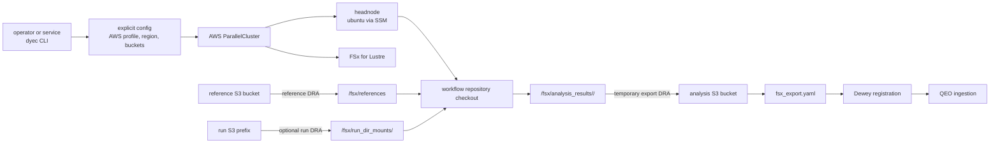

# Daylily Ephemeral Cluster

[](https://github.com/lsmc-bio/daylily-ephemeral-cluster/releases) [](https://github.com/lsmc-bio/daylily-ephemeral-cluster/tags)

Daylily Ephemeral Cluster, usually called DYEC or DayEC, is the Daylily control plane for short-lived AWS ParallelCluster environments. It renders cluster configuration, validates AWS prerequisites, creates FSx for Lustre storage, connects to headnodes through AWS Systems Manager, stages inputs, launches workflow repositories, exports completed analysis directories, and optionally registers exported evidence with Dewey for downstream QEO ingestion.

The cluster is disposable. The S3 inputs, reference bucket, analysis-export bucket, command catalog, and evidence receipts are durable. Do not delete a cluster until the export receipt and expected S3 outputs are verified.

## Philosophy

DYEC is deliberately not a dogma-locked workflow manager. It provisions and exports the execution environment. The checked-out repository owns its workflow engine, command syntax, containers, profile, and final file layout below the analysis root. DayOA/Snakemake is the first-class Daylily workflow repository, and nf-core/Nextflow repositories such as `daylily-sarek` can also run on the same cluster when they honor the same FSx analysis-root and export contract.

The operating contract is strict. Missing config, credentials, references, run mounts, licenses, runtime assets, invalid sample identity, unsafe path segments, non-empty export destinations, and malformed command catalog rows should fail hard. DYEC should not guess a bucket, invent a credential, choose a replacement reference, or silently fall back to a legacy launch path.

## Architecture


```mermaid
flowchart LR
  Operator["operator or service<br/>dyec CLI"] --> Config["explicit config<br/>AWS profile, region, buckets"]
  Config --> Pcluster["AWS ParallelCluster"]
  Pcluster --> Headnode["headnode<br/>ubuntu via SSM"]
  Pcluster --> FSx["FSx for Lustre"]
  RefBucket["reference S3 bucket"] -->|reference DRA| References["/fsx/references"]
  RunBucket["run S3 prefix"] -->|optional run DRA| RunMount["/fsx/run_dir_mounts/<mount_id>"]
  Headnode --> Repo["workflow repository checkout"]
  References --> Repo
  RunMount --> Repo
  Repo --> Results["/fsx/analysis_results/<entity>/<analysis_id>"]
  Results -->|temporary export DRA| AnalysisBucket["analysis S3 bucket"]
  AnalysisBucket --> Receipt["fsx_export.yaml"]
  Receipt --> Dewey["Dewey registration"]
  Dewey --> QEO["QEO ingestion"]
```

## Filesystem Contract

| Path | Owner | Purpose |
|---|---|---|
| `/fsx/references` | DYEC cluster config | Reference and runtime assets mounted from the configured reference bucket. |
| `/fsx/control_data` | optional cluster config | Repeated-test or control assets when configured. |
| `/fsx/run_dir_mounts/<mount_id>` | `dyec mounts` | Read-oriented S3 run-folder Data Repository Associations. |
| `/fsx/analysis_results/<executing_entity>/<analysis_id>` | workflow repository | Repository checkout, logs, work state, outputs, reports, and benchmarks. |
| `s3://<analysis-bucket>/<prefix>/<cluster>/<analysis_id>/` | `dyec workflow launch` auto-export | Durable export destination derived from an export root. |
| `s3://<analysis-bucket>/<prefix>/<executing_entity>/<analysis_id>/` | `dyec export` | Durable explicit export destination for one completed analysis directory. |

Run mounts and references are inputs. They are not export sources. The export source is exactly one completed analysis directory under `/fsx/analysis_results/<executing_entity>/<analysis_id>`.

### Per-cluster FSx selection

Interactive `dyec create` runs explicitly ask for:

1. the FSx for Lustre deployment type (`SCRATCH_2` or `PERSISTENT_2`);
2. the dedicated filesystem capacity; and
3. for `PERSISTENT_2`, the throughput tier (`125`, `250`, `500`, or `1000` MB/s/TiB).

The offered defaults are `PERSISTENT_2`, `4800` GiB, and `250` MB/s/TiB.
They remain visible interactive choices: pressing Enter accepts them, while a
different listed value can be selected before any AWS context or provisioning.

At the start of an interactive create, DYEC also asks for an optional explicit
Ursa root URL. When supplied, a successful create ends with the canonical
cluster-detail link:

```text
https://<ursa-root>/clusters/<cluster-name>?region=<region>
```

The service root is never inferred. A configured URL must be an absolute HTTP
or HTTPS root without credentials, query parameters, or a fragment.

Before AWS context and provisioning, DYEC prints the selected type, capacity,
applicable throughput, and lifecycle. Each cluster receives its own filesystem;
the selection is not a shared regional `/fsx`. `/fsx/analysis_results` remains
writable cluster workspace, and result export to S3 remains an explicit DRA
export rather than automatic writeback.

Non-interactive creates must provide explicit set values. Defaults are not
silently accepted in non-interactive mode:

```yaml
ephemeral_cluster:
  config:
    fsx_deployment_type: [USESETVALUE, "", "PERSISTENT_2"]
    fsx_fs_size: [USESETVALUE, "", "4800"]
    fsx_throughput_mbps_per_tib: [USESETVALUE, "", "250"]
```

`fsx_throughput_mbps_per_tib` is required only for `PERSISTENT_2`. Explicit
benchmark/profile configs continue to use `USESETVALUE`; the canonical default
template uses `PROMPTUSER` for type, size, and throughput.

There is no retained-filesystem choice in the create workflow. The dedicated
filesystem is cluster-bound: ParallelCluster-managed `SCRATCH_2` renders with
deletion policy `Delete`, and DYEC deletes its external `PERSISTENT_2` after
the ParallelCluster is absent. A future retained mode requires a separate,
explicit ownership and lifecycle contract.

For external `PERSISTENT_2`, the selected filesystem must exist before the
final ParallelCluster configuration can reference its `FileSystemId`. DYEC
therefore labels that phase **LIVE AWS STORAGE PROVISIONING**: it creates or
resumes the cluster-specific FSx client security group, filesystem, and
reference DRA, then runs the ParallelCluster dry-run with that exact ID.

Before any create-side mutation, DYEC resolves current AWS Price List rates for
the configured on-demand headnode, rendered gp3 root volume, selected FSx
storage profile, and one in-use public IPv4 address. The successful-create
summary prints those components and their total configured idle hourly
estimate. Slurm compute nodes are excluded because cluster templates render
their minimum count as zero; usage-driven transfer, requests, logging, and
backup charges are also outside this idle floor.

## Setup

Prerequisites:

- AWS credentials for a non-default profile with ParallelCluster, EC2, IAM, CloudFormation, S3, FSx, SSM, CloudWatch, AWS Price List `pricing:GetProducts`, and related read/write permissions.
- AWS region and availability zone selected for the cluster.
- AWS Session Manager plugin installed locally.
- AWS ParallelCluster CLI available through this repo environment. This repo targets exactly `aws-parallelcluster==3.15.0`.
- Configured S3 buckets for references, optional control data, staging, and analysis exports.
- A Daylily config file, normally `~/.config/daylily/daylily_ephemeral_cluster.yaml`, with explicit bucket and cluster settings.

Activate the checkout and inspect the live CLI:

```bash
cd /path/to/daylily-ephemeral-cluster
source ./activate
dyec --json version
dyec --help
dyec runtime status
dyec --json repositories commands
pcluster version
```

`pcluster version` must report `3.15.0`. Refresh the pinned checkout environment with `python -m pip install --upgrade pip` followed by `python -m pip install -e .`; do not install `aws-parallelcluster` unpinned or from `latest`.

Current DYEC examples use the `dyec` executable and the `--cluster` flag for cluster/headnode commands. Keep `--cluster-name` for tools such as `pcluster` that require it. If a configured headnode is missing `dyec analysis`, refresh it with `dyec headnode configure --profile "$AWS_PROFILE" --region "$REGION" --cluster "$CLUSTER_NAME"` from this activated checkout before DayOA workflow writes.

Use placeholders in examples until your environment has real values:

```bash
export AWS_PROFILE=<non-default-profile>
export REGION=us-west-2
export REGION_AZ=us-west-2d
export CLUSTER_NAME=<cluster-name>
export DAY_EX_CFG="$HOME/.config/daylily/daylily_ephemeral_cluster.yaml"
export REF_S3_URI=s3://<reference-bucket>
export CONTROL_DATA_S3_URI=s3://<control-data-bucket>
export STAGE_S3_URI=s3://<staging-bucket>/<prefix>
export ANALYSIS_RESULTS_S3_URI=s3://<analysis-results-bucket>/<prefix>
export EXECUTING_ENTITY=ubuntu
export ANALYSIS_ID=<analysis-id>
export EXPORT_S3_ROOT="$ANALYSIS_RESULTS_S3_URI/"
export EXPORT_S3_URI="$EXPORT_S3_ROOT$CLUSTER_NAME/$ANALYSIS_ID/"
```

## Lifecycle

```bash
dyec preflight \
  --profile "$AWS_PROFILE" \
  --region-az "$REGION_AZ" \
  --config "$DAY_EX_CFG"

dyec create \
  --profile "$AWS_PROFILE" \
  --region-az "$REGION_AZ" \
  --config "$DAY_EX_CFG"

dyec headnode connect \
  --profile "$AWS_PROFILE" \
  --region "$REGION" \
  --cluster "$CLUSTER_NAME"
```

Cluster AWS Budget enforcement is enabled by default on new clusters and the
budget name is the cluster name. The staged Slurm wrapper always requires
`sbatch --comment <cost-center>`; that value is validated against the global
cost-center registry and usage cap. Use `--disable-budget-enforcement` only
when the cluster AWS Budget lookup should be skipped. Cost-center validation
and the `--comment` requirement still apply. For per-run cost-center overrides,
pass `--project <cost-center>` to `dyec samples run` or `dyec workflow launch`.

New clusters omit Slurm accounting by default so an unavailable or
network-incompatible accounting service cannot block cluster creation. Cluster
creation rejects accounting-enabled configuration; accounting is attached only
after creation with `dyec slurm-accounting attach` and only after the compute
fleet has been explicitly stopped.

After connection, the supported headnode user is `ubuntu` in an interactive bash login shell. Manual DayOA workflow work belongs in a persistent `tmux` session and uses separate commands:

```bash
source dyoainit
dy-a slurm hg38_broad
dy-r help -p -k -j 1 -n
```

For catalog-backed sample analysis, prefer `dyec samples run`:

```bash
dyec samples run ./analysis_samples.tsv \
  --command-id illumina_snv_alignstats \
  --profile "$AWS_PROFILE" \
  --region "$REGION" \
  --cluster "$CLUSTER_NAME" \
  --reference-s3-uri "$REF_S3_URI" \
  --control-data-s3-uri "$CONTROL_DATA_S3_URI" \
  --stage-s3-uri "$STAGE_S3_URI" \
  --analysis-id "$ANALYSIS_ID" \
  --executing-entity "$EXECUTING_ENTITY" \
  --export-destination-s3-uri "$EXPORT_S3_ROOT" \
  --export-trigger on-success \
  --dry-run
```

For run-folder analysis, attach a read-only run mount before launching a run-context command:

```bash
dyec --json mounts create "s3://<sequencing-run-bucket>/<run-prefix>/" \
  --profile "$AWS_PROFILE" \
  --region "$REGION" \
  --cluster "$CLUSTER_NAME" \
  --platform ILMN \
  --read-only \
  --wait \
  --timeout-seconds 5400

dyec --json mounts verify \
  --profile "$AWS_PROFILE" \
  --region "$REGION" \
  --cluster "$CLUSTER_NAME" \
  --mount-id <mount_id>
```

Export exactly one completed analysis directory:

```bash
dyec export \
  --profile "$AWS_PROFILE" \
  --region "$REGION" \
  --cluster "$CLUSTER_NAME" \
  --source-path "/fsx/analysis_results/$EXECUTING_ENTITY/$ANALYSIS_ID" \
  --destination-s3-uri "$EXPORT_S3_URI" \
  --output-dir "./tmp-export/$ANALYSIS_ID"
```

For `dyec samples run` and `dyec workflow launch`, `--export-destination-s3-uri` may be
either a full destination or an export root. If it is a root, DYEC appends
`<cluster>/<analysis-id>/`. Direct `dyec export` remains explicit and should be
given the final S3 destination.

Inspect `fsx_export.yaml` before cleanup. Delete is destructive; run `dyec delete --dry-run` first and perform live deletion only after the intended effect is approved and understood.

## CLI Surface

Use `dyec --help` for the current root command list. Current major groups include:

- `preflight`, `create`, `delete`, `drift`, `cluster-info`
- `cluster`, `headnode`, `samples`, `workflow`
- `repositories`, `mounts`, `mount`, `export`, `exports`
- `slurm-accounting`, `aws`, `pricing`, `runtime`, `env`, `state`, `resources-dir`

```rtf
dyec

 Usage: dyec [OPTIONS] COMMAND [ARGS]...

 Create and manage ephemeral AWS ParallelCluster environments for bioinformatics workloads.

╭─ Options ─────────────────────────────────────────────────────────────────────────────────────────────────╮
│ --json                        Emit machine-readable JSON.                                                 │
│ --dry-run                     Plan the command without making persistent changes.                         │
│ --no-color                    Disable ANSI styling.                                                       │
│ --debug                       Enable debug diagnostics.                                                   │
│ --install-completion          Install completion for the current shell.                                   │
│ --show-completion             Show completion for the current shell, to copy it or customize the          │
│                               installation.                                                               │
│ --help                        Show this message and exit.                                                 │
╰───────────────────────────────────────────────────────────────────────────────────────────────────────────╯
╭─ Commands ────────────────────────────────────────────────────────────────────────────────────────────────╮
│ version           Show version.                                                                           │
│ info              Show system info.                                                                       │
│ create            Create an ephemeral AWS ParallelCluster environment.                                    │
│ preflight         Run preflight validation only (no cluster creation).                                    │
│ drift             Check for drift against a previous run's state.                                         │
│ cluster-info      List ParallelCluster clusters and their status.                                         │
│ export            Export FSx outputs through an explicit temporary DRA.                                   │
│ delete            Delete a cluster and monitor teardown to completion.                                    │
│ resources-dir     Print the extracted resource directory used by Daylily.                                 │
│ env               Environment guidance.                                                                   │
│ runtime           Runtime inspection.                                                                     │
│ pricing           Spot pricing inspection helpers.                                                        │
│ aws               AWS readiness validation helpers.                                                       │
│ slurm-accounting  Slurm accounting database helpers.                                                      │
│ cluster           ParallelCluster inspection helpers.                                                     │
│ headnode          Headnode bootstrap and shell-context helpers.                                           │
│ samples           Sample staging helpers.                                                                 │
│ workflow          Headnode workflow helpers.                                                              │
│ repositories      Repository catalog and blessed analysis command helpers.                                │
│ tests             Local and cluster prep-test helpers.                                                    │
│ exports           Explicit FSx output DRA export helpers.                                                 │
│ mounts            FSx run-directory mount helpers.                                                        │
│ mount             Run-directory mount aliases.                                                            │
│ state             Local Daylily state inspection helpers.                                                 │
╰───────────────────────────────────────────────────────────────────────────────────────────────────────────╯
```


Important inspection commands:

```bash
dyec --json version
dyec --json cluster describe --profile "$AWS_PROFILE" --region "$REGION" --cluster "$CLUSTER_NAME"
dyec --json repositories commands
dyec repositories commands --command-id illumina_snv_alignstats
dyec pricing spot-logs --profile "$AWS_PROFILE" --region "$REGION" --cluster "$CLUSTER_NAME" > spot_prices.csv
dyec pricing spot-logs --profile "$AWS_PROFILE" --region "$REGION" --cluster "$CLUSTER_NAME" --path /fsx/logs --path /fsx/scratch --name-glob "*.log" -o spot_prices.csv
dyec workflow status --profile "$AWS_PROFILE" --region "$REGION" --cluster "$CLUSTER_NAME" --session <session>
dyec workflow logs --profile "$AWS_PROFILE" --region "$REGION" --cluster "$CLUSTER_NAME" --session <session> --lines 100
```

`dyec pricing spot-logs` scans `/fsx/logs`, `/fsx/scratch`, and `/fsx/tmp` by default. It emits one CSV row per parsed spot-price log event with `slurm_partition`, `compute_resource`, `instance_type`, `spot_price_usd_per_hour`, `source_path`, and node identity columns.

Local and cluster prep-test commands:

```bash
dyec tests pytest
dyec tests pytest --coverage

dyec tests command-catalog \
  --cluster "$CLUSTER_NAME" \
  --profile lsmc \
  --region us-west-2 \
  --command-codes dyec-released-core \
  --evidence-s3-uri "s3://<evidence-root>/" \
  --dry-run
```

`dyec tests command-catalog` writes local command evidence under `docs/plans/<stamp>_dyec_tests_command_catalog_logs` unless `--output-dir` is set. Successful workflow phases export to `<evidence-s3-uri>/<cluster>/command_catalog_results/<dayoa-version>-<UTCSTAMP>/ubuntu/<analysis-id>/`. Missing run-directory DRAs fail hard unless `--create-missing-mounts` is supplied.

Use `--command-codes dyec-released-core` for the released core validation set and `--command-codes dyec-released-all` for every released non-research catalog command. The BCL Convert commands remain `research` type and are excluded from `dyec-released-all`; launch them only by explicit command id when research validation is intended.

The command-catalog runner launches in source-availability groups. Commands that use no external data, default-mounted data, or an already available run DRA launch immediately. When `--create-missing-mounts` is supplied, commands for a missing `SOURCE_S3_URI` wait only for that source's run DRA and launch as soon as that directory is available; unrelated ready commands do not wait behind it. New run-DRA creation waits up to 5400 seconds by default.

By default `dyec tests command-catalog` uses `--parallel 16` for concurrent launched phases and renders DayOA commands with `--jobs 150`. Catalog command text may contain smaller `-j` values for individual live run-analysis recipes, but the command-catalog renderer normalizes the launched test phases to `-j 150` unless `--jobs` is set explicitly.

The Slurm accounting helper manages external accounting infrastructure when configured. A running cluster can have the `sacct` binary installed while accounting storage is disabled; in that state `sacct` cannot provide job accounting records even though the command exists.

## Repository Catalog

`config/daylily_pipeline_command_catalog.yaml` is the source of truth for blessed repositories and commands. The packaged copy under `daylily_ec/resources/payload/config/` must match it. The current catalog default for DayOA is `10.0.69`; `daylily-sarek` is also present as a Nextflow/nf-core Sarek repository entry.

On the headnode, `day-clone` consumes the same repository catalog:

```bash
day-clone --list
day-clone --check-auth --repository daylily-omics-analysis --git-tag 10.0.69
day-clone --repository daylily-omics-analysis --destination "$ANALYSIS_ID" --git-tag 10.0.69 --executing-entity "$EXECUTING_ENTITY"
day-clone -d "$ANALYSIS_ID" -t 10.0.69
```

`-t` is the short form of `--git-tag`; `-d` is the short form of the required `--destination`. For operator-launched analyses, do not omit `--git-tag`/`-t`: resolve the intended DayOA release tag first, record it in the ledger, and pass it explicitly. When `--git-tag`/`-t` is omitted, `day-clone` falls back to the selected repository's `default_ref`; that fallback is for catalog implementation behavior, not live analysis runbooks. The checkout lands at `/fsx/analysis_results/<executing_entity>/<analysis_id>/<relative_path>`, where `relative_path` comes from the catalog row.

The DayOA catalog row uses `clone_transport: ssh` with `auth_mode: aws_deploy_key`.
Cluster config must set explicit `dayoa_deploy_key_secret_arn` and
`dayoa_deploy_key_policy_arn` values. DYEC validates the shared read-only
`DayECHeadnodeGitHubClone` policy for the
`dayec/github-deploy-keys/lsmc-bio*` Secrets Manager namespace, attaches it only to
the headnode, and writes only the configured non-secret secret ARN/region to the
headnode. The policy deliberately omits secret listing and compute-node access;
repository-to-secret mappings remain explicit. `day-clone` retrieves the selected
key for one Git operation, uses strict pinned GitHub host keys, and removes the
temporary mode-`0600` key on every exit path.
Authentication failures do not fall back to HTTPS, ambient SSH keys, or Git bundles.

The DYEC launch equivalent is also explicit: pass `--git-tag <dayoa_version>` to `dyec workflow launch` or `dyec samples run`. Do not rely on their default `--git-tag` value for new analyses.

Catalog command classes:

- `utility`: no sample or run inputs, usually used for smoke tests.
- `sample_analysis`: consumes `analysis_samples.tsv`, stages sample/unit manifests, and launches a repository command.
- `run_analysis`: consumes `runs.tsv` and requires a matching `/fsx/run_dir_mounts/<mount_id>` input mount.

Each command also declares `compatible_cluster_types`, using `daywgs` for the standard DayOA/Sentieon whole-genome clusters and `dragen` for DRAGEN f2 clusters.

## Reference Bucket Contract

The reference bucket is mounted to `/fsx/references` at cluster creation. It should contain:

- organism references and indexes for supported genome builds
- GIAB truth resources and high-confidence BEDs where concordance targets need them
- slim sample read fixtures used by catalog validation
- runtime assets that must be present before workflow activation, such as pinned tool installs, container caches, and licensed commercial tool assets
- tool-specific resource directories for annotation, STR, contamination, metagenomics, or other optional targets

DYEC does not choose alternate references at runtime. If a command catalog row points to a missing path, the launch should fail during staging, profile activation, or workflow execution with a clear missing-asset error.

## Supporting Services

- **Dewey**: DYEC can register exported DayOA evidence after a successful export when the command catalog declares an explicit `artifact_registration` policy.
- **QEO**: QEO loading is requested through Dewey/outbox events. DayOA emits local evidence; DYEC maps that evidence to exported S3 artifacts.
- **Ursa**: Ursa can own operator worksets and launch UX above DYEC. DYEC remains the cluster and export control plane. DRAGEN cluster creation and run notes live in [running_dragen_manually.md](docs/other/running_dragen_manually.md).
- **PCUI**: PCUI-style interfaces should call the same catalog and CLI/API surfaces rather than duplicating launch policy.
- **Slurm**: Slurm is cluster infrastructure. Monitoring with `squeue`, `sacct` when configured, logs, and DYEC status commands is allowed. Scheduler, node, job, drain/resume, requeue, cancel, or service interventions require explicit operator approval.

### Ursa Service User Cluster Management

When Ursa is managing two live cluster families, keep the cluster family
explicit in workset and launch metadata. The two families are not
interchangeable:

- Standard DayOA/Sentieon cluster: command catalog rows declare
  `compatible_cluster_types: [daywgs]`; launch through the standard Ubuntu
  cluster path and keep DayOA workflow execution inside the supported
  `day-clone`, `dy-a`, and `dy-r` path.
- DRAGEN RHEL/f2 cluster: command catalog rows declare
  `compatible_cluster_types: [dragen]`; create with
  `dyec create --profile lsmc --region-az us-west-2c --cluster-type rhel` or a
  verified equivalent RHEL/f2 AZ, then run native DRAGEN work on the DRAGEN
  Slurm partition.

Ursa should persist these fields for every cluster-backed workset:

- AWS profile: usually `lsmc`
- AWS region: usually `us-west-2`
- Cluster name: for example `dragain9b`
- Cluster family: `daywgs` or `dragen`
- Cluster type used at creation: for example `rhel` for DRAGEN
- DayOA/DYEC git tag or ref used for launched workflows
- Cost-center or Slurm comment used for submitted jobs

Useful inspect and supported post-create commands:

```bash
dyec cluster-info --profile lsmc --region us-west-2
dyec headnode jobs --profile lsmc --region us-west-2 --cluster <cluster>
dyec headnode connect --profile lsmc --region us-west-2 --cluster <cluster>
dyec headnode configure --profile lsmc --region us-west-2 --cluster <standard-ubuntu-cluster>
dyec headnode configure-dragen --profile lsmc --region us-west-2 --cluster <rhel-dragen-cluster>
```

Do not silently reroute a workset from one family to the other. If a requested
command's `compatible_cluster_types` does not match the selected cluster, fail
the launch with the mismatch and require an operator decision. Likewise, do not
fall back from a missing RHEL DRAGEN template or AMI to another AZ, AMI, or
cluster type without an explicit operator request.

Before deleting either cluster family, verify the export receipt, expected S3
objects, and any run-specific S3 syncs. For DRAGEN clusters created with
`Auto delete FSx [Delete]`, `dyec delete` removes the FSx file system with the
cluster, so deletion requires explicit approval of that data-loss boundary:

```bash
dyec delete --dry-run --profile lsmc --region us-west-2 --cluster-name <cluster>
dyec delete --profile lsmc --region us-west-2 --cluster-name <cluster>
```

## Contributing

When adding a runnable pipeline repository:

- add a repository row to the command catalog with a pinned `default_ref`
- verify `day-clone --repository <repo-key> --destination <analysis-id> --git-tag <ref>` produces the intended checkout path
- add explicit command rows for supported launch profiles
- declare input contract, required columns, genome build, targets, jobs, and runtime parameters
- make the repository write all durable outputs below `/fsx/analysis_results/<executing_entity>/<analysis_id>`
- document export-relevant reports, logs, benchmarks, and manifests
- add tests for catalog rendering, command validation, and dry-run behavior where possible
- avoid compatibility aliases, inferred defaults, or fallback command paths

Historical plans and terminal working docs live under `docs/jem_working_docs/`. Active ledgers remain in `docs/plans/`.

## Further Reading

- [Quickest Start](docs/quickest_start.md)
- [CLI Reference](docs/cli_reference.md)
- [Pipeline Manager Launches](docs/pipeline_manager_launches.md)
- [DRA and FSx Strategy](docs/dra_fsx_strategy.md)
- [HG003 Benchmarking And Costs](docs/hg003_benchmarking_and_costs.md)
- [Working Docs Archive Index](docs/jem_working_docs/INDEX.md)
