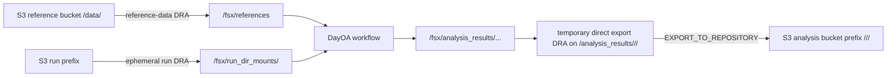

# Daylily Ephemeral Cluster

[](https://github.com/Daylily-Informatics/daylily-ephemeral-cluster/releases) [](https://github.com/Daylily-Informatics/daylily-ephemeral-cluster/tags)

DayEC is the operator control plane for short-lived AWS ParallelCluster environments that run Daylily analysis workloads on FSx for Lustre. The current data plane is DRA-first: the cluster starts with reference data mounted at `/fsx/references`, run folders are attached only when needed under `/fsx/run_dir_mounts/<mount_id>`, workflow outputs stay under `/fsx/analysis_results/<executing_entity>/<analysis_id>`, and completed analysis directories are exported through a temporary direct DRA to a chosen S3 analysis bucket.

The cluster is ephemeral. S3 buckets are durable. Verify the export receipt before deleting the cluster.

## Supported Operator Contract

Use the checkout environment and the CLI, not historical helper-script paths:

1. `source ./activate`
2. `dyec preflight`
3. `dyec create`
4. `dyec headnode connect`
5. `dyec samples stage` for sample-manifest inputs, or `dyec mounts create` for run-folder inputs
6. `dyec workflow launch`
7. `dyec export --source-path /fsx/analysis_results/<executing_entity>/<analysis_id> --destination-s3-uri s3://bucket/prefix/<executing_entity>/<analysis_id>/`
8. inspect `fsx_export.yaml`
9. `dyec delete --dry-run`
10. `dyec delete`

`daylily-ec` and `dyec` are the same entrypoint. The shorter `dyec` form is used in examples.

## One Copy-Pasteable Lifecycle

```bash
source ./activate

export AWS_PROFILE=daylily-service-lsmc
export REGION=us-west-2
export REGION_AZ=us-west-2d
export CLUSTER_NAME=day-demo-$(date +%Y%m%d%H%M%S)
export DAY_EX_CFG="$HOME/.config/daylily/daylily_ephemeral_cluster.yaml"
export REF_S3_URI=s3://lsmc-dayoa-references-usw2
export CONTROL_DATA_S3_URI=s3://lsmc-dayoa-control-data-usw2
export STAGE_S3_URI=s3://lsmc-ssf-sequencing-data/staged_external_data
export ANALYSIS_BUCKET=s3://lsmc-dayoa-analysis-results-us-west-2
export EXECUTING_ENTITY="${USER:-ubuntu}"
export ANALYSIS_ID=dayoa
export ANALYSIS_SAMPLES=etc/analysis_samples_template.tsv
export STAGE_CFG_DIR="$PWD/tmp-stage-config/$CLUSTER_NAME"
export EXPORT_DIR="$PWD/tmp-export/$ANALYSIS_ID"
export EXPORT_S3_URI="$ANALYSIS_BUCKET/analysis_results/$EXECUTING_ENTITY/$ANALYSIS_ID/"

dyec preflight \
  --profile "$AWS_PROFILE" \
  --region-az "$REGION_AZ" \
  --config "$DAY_EX_CFG"

dyec create \
  --profile "$AWS_PROFILE" \
  --region-az "$REGION_AZ" \
  --config "$DAY_EX_CFG"

dyec headnode connect \
  --profile "$AWS_PROFILE" \
  --region "$REGION" \
  --cluster "$CLUSTER_NAME"

dyec samples stage "$ANALYSIS_SAMPLES" \
  --profile "$AWS_PROFILE" \
  --region "$REGION" \
  --reference-s3-uri "$REF_S3_URI" \
  --control-data-s3-uri "$CONTROL_DATA_S3_URI" \
  --stage-s3-uri "$STAGE_S3_URI" \
  --config-dir "$STAGE_CFG_DIR"

dyec workflow launch \
  --profile "$AWS_PROFILE" \
  --region "$REGION" \
  --cluster "$CLUSTER_NAME" \
  --stage-dir "/fsx/staging/staged_external_sequencing_data/remote_stage_<timestamp>" \
  --analysis-id "$ANALYSIS_ID" \
  --executing-entity "$EXECUTING_ENTITY" \
  --git-tag 2.0.29 \
  --export-destination-s3-uri "$EXPORT_S3_URI" \
  --export-trigger on-success

# For run-folder work, attach only the S3 prefix you need.
dyec --json mounts create "s3://sequencer-run-bucket/runs/RUN123/" \
  --profile "$AWS_PROFILE" \
  --region "$REGION" \
  --cluster "$CLUSTER_NAME" \
  --platform ILMN \
  --read-only \
  --wait

dyec --json mounts verify \
  --profile "$AWS_PROFILE" \
  --region "$REGION" \
  --cluster "$CLUSTER_NAME" \
  --mount-id RUN123

dyec workflow launch \
  --profile "$AWS_PROFILE" \
  --region "$REGION" \
  --cluster "$CLUSTER_NAME" \
  --run-context-file ./runs.tsv \
  --analysis-id "<run-analysis-id>" \
  --executing-entity "$EXECUTING_ENTITY" \
  --git-tag 2.0.29 \
  --dy-command "bin/day_run produce_illumina_run_qc --config run_context_file=config/runs.tsv -p -j 5 -k"

dyec export \
  --profile "$AWS_PROFILE" \
  --region "$REGION" \
  --cluster "$CLUSTER_NAME" \
  --source-path "/fsx/analysis_results/$EXECUTING_ENTITY/$ANALYSIS_ID" \
  --destination-s3-uri "$EXPORT_S3_URI" \
  --output-dir "$EXPORT_DIR"

cat "$EXPORT_DIR/fsx_export.yaml"

dyec delete --dry-run \
  --profile "$AWS_PROFILE" \
  --region "$REGION" \
  --cluster "$CLUSTER_NAME"

dyec delete \
  --profile "$AWS_PROFILE" \
  --region "$REGION" \
  --cluster "$CLUSTER_NAME"
```

## Architecture At A Glance


```mermaid
flowchart LR
  Ref["S3 reference bucket /data/"] -->|reference-data DRA| Data["/fsx/references"]
  Run["S3 run prefix"] -->|ephemeral run DRA| Mount["/fsx/run_dir_mounts/<mount_id>"]
  Data --> Workflow["DayOA workflow"]
  Mount --> Workflow
  Workflow --> Results["/fsx/analysis_results/..."]
  Results --> Export["temporary direct export DRA on /analysis_results/<executing_entity>/<analysis_id>/"]
  Export -->|EXPORT_TO_REPOSITORY| Analysis["S3 analysis bucket prefix /<executing_entity>/<analysis_id>/"]
```

Key rules:

- `/fsx/references` is the reference-data DRA created with the cluster.
- `/fsx/run_dir_mounts/<mount_id>` is for read-oriented run inputs and is not an export source.
- `/fsx/analysis_results/...` is where workflow checkouts and outputs live.
- `dyec export` creates a temporary DRA on the exact completed analysis directory, runs `EXPORT_TO_REPOSITORY`, and detaches it with `DeleteDataInFileSystem=false`.
- `fsx_export.yaml` is the v3 export receipt to keep before teardown.

## Pipeline Catalog

`config/daylily_pipeline_command_catalog.yaml` is the source of truth for repositories and blessed launch profiles. The packaged copy under `daylily_ec/resources/payload/config/` must match it.

The current DayOA pin is `2.0.29` for the repository default and every DayOA command. Catalog v2 separates:

- `sample_analysis`: uses `analysis_samples.tsv`, stages inputs, and writes `samples.tsv` / `units.tsv`.
- `run_analysis`: uses `runs.tsv`, requires a run DRA, and launches run-folder workflows such as Illumina run QC and BCL Convert.

Each `test_data_profile` declares how source data is expected to appear on FSx:

- `source_mount_mode: default_mounted` means the source prefix is already exposed by the cluster's default `/fsx/references` or `/fsx/control_data` DRAs.
- `source_mount_mode: run_dra_required` means the exact run prefix comes from `runs.tsv` `SOURCE_S3_URI`; DYEC must verify or create the matching `/fsx/run_dir_mounts/<MOUNT_ID>/` DRA before launch.
- `source_mount_mode: none` means the command does not consume external sample or run source data.

The catalog records the primary `source_s3_uri_template`, `source_fsx_prefix`, and, for run-analysis profiles, the required `SOURCE_S3_URI` and `MOUNT_ID` run-context columns. Historical or alternate validation roots stay in profile notes and `test_data_locations`.

For BCL Convert run-analysis launches, DYEC patches the active DayOA profile for direct mounted input, zero barcode mismatches, `merge_lane_fastqs: false`, `merge_tile_fastqs: false`, and `shared_thread_odirect_output: false`; the launcher then hard-requires a DayOA checkout that exposes native lane-split BCL rules and lane-level downstream report consumption.

## Dewey Registration And QEO MultiQC Loading

Dewey registration is supported as a DYEC export concern. DayOA emits local
evidence manifests only; it does not receive Dewey or QEO configuration. DYEC
maps DayOA evidence relative paths through `fsx_export.yaml`, registers the
selected artifacts with Dewey, and lets Dewey emit QEO outbox events. QEO loading
is then requested through Dewey, not through DYEC.

The live contract is intentionally strict:

- `config/daylily_pipeline_command_catalog.yaml` must contain an explicit
  `artifact_registration` policy for the command.
- The exported DayOA tree must contain the evidence manifest selected by that
  policy, or an explicit `s3-inventory` registration must be requested.
- Every registered file artifact must have a SHA-256 digest. Do not substitute
  an S3 ETag for SHA-256.
- `config/samples.tsv` and `config/units.tsv` are registered when present.
  Their metadata and tags include sample names plus unique unit-table values
  such as `EXPERIMENTID`, `RUNID`, `LANEID`, `BARCODEID`, `LIBPREP`,
  `SEQ_VENDOR`, and `SEQ_PLATFORM`.
- MultiQC HTML and MultiQC data-dir artifacts carry the same sample and unit
  context in Dewey artifact metadata, plus report-kind tags such as
  `report_kind:final`, `report_kind:run_qc`, or `report_kind:bclconvert`.

### Register During Export

Use this path for a completed analysis directory that is still on FSx and needs
to be exported to S3 and registered with Dewey in one operation:

```bash
source ./activate

export AWS_PROFILE=daylily-service-lsmc
export REGION=us-west-2
export DEWEY_URL=https://dewey.example
export DEWEY_TOKEN_ENV=DEWEY_TOKEN
export DEWEY_TOKEN='<dewey bearer token>'
export EXECUTING_ENTITY=ubuntu
export ANALYSIS_ID=ccv20260530r50_illumina_hg002_kitchensink_multiqc
export EXPORT_S3_URI="s3://bucket/derived/validation/dyec-test/$EXECUTING_ENTITY/$ANALYSIS_ID/"
export EXPORT_DIR="$PWD/tmp-export/$ANALYSIS_ID"

dyec export \
  --profile "$AWS_PROFILE" \
  --region "$REGION" \
  --cluster-name "<cluster-name>" \
  --source-path "/fsx/analysis_results/$EXECUTING_ENTITY/$ANALYSIS_ID" \
  --destination-s3-uri "$EXPORT_S3_URI" \
  --output-dir "$EXPORT_DIR" \
  --artifact-registration-command-id illumina_hg002_kitchensink_multiqc \
  --dewey-url "$DEWEY_URL" \
  --dewey-token-env "$DEWEY_TOKEN_ENV"
```

Successful registration writes:

- `$EXPORT_DIR/fsx_export.yaml`
- `$EXPORT_DIR/dewey_registration_receipt.json`

Check the receipt before requesting QEO loading:

```bash
jq '.fsx_export.dewey_registration_status,
    .fsx_export.dewey_selected_artifact_count,
    .fsx_export.dewey_multiqc_artifact_set_count' \
  "$EXPORT_DIR/fsx_export.yaml"

jq '.analysis_response.artifact_set_euid,
    .multiqc_responses[].artifact_set_euid' \
  "$EXPORT_DIR/dewey_registration_receipt.json"
```

### Register An Existing Export

Use `exports register-dewey` only when the analysis directory has already been
exported to S3 and you do not want to create a new DRA or export task:

```bash
dyec exports register-dewey \
  --profile "$AWS_PROFILE" \
  --region "$REGION" \
  --source-path "/fsx/analysis_results/$EXECUTING_ENTITY/$ANALYSIS_ID" \
  --destination-s3-uri "$EXPORT_S3_URI" \
  --output-dir "$EXPORT_DIR" \
  --artifact-registration-command-id illumina_hg002_kitchensink_multiqc \
  --manifest-source dayoa-manifest \
  --dewey-url "$DEWEY_URL" \
  --dewey-token-env "$DEWEY_TOKEN_ENV"
```

Use `--manifest-source s3-inventory` only for exported prefixes where every
selected S3 object has SHA-256 metadata or an S3 SHA-256 checksum. Older FSx DRA
exports commonly do not have that metadata, so this mode should fail before any
Dewey POST rather than registering weakly identified objects.

Run-analysis commands with multiple MultiQC reports use their own command ID.
For Illumina run QC plus BCL Convert, use:

```bash
--artifact-registration-command-id illumina_run_qc_bclconvert
```

That policy registers both:

- `results/runs/**/run_qc/illumina/multiqc_report.html`
- `results/runs/**/bclconvert/multiqc_report.html`

and their corresponding `multiqc_report_data/` files.

### Request QEO Loading Through Dewey

DYEC does not call QEO directly and does not carry a QEO URL or QEO token.
Successful Dewey registration creates Dewey outbox events:

- `lsmc.dewey.artifact_set.registered.v1`
- `lsmc.dewey.multiqc_artifact_set.registered.v1`

Dewey now has filtered QEO dispatch support. In the Dewey checkout for the
target deployment:

```bash
source ./activate <deploy-name>

dewey qeo status

dewey qeo dispatch \
  --artifact-set-euid "<multiqc-artifact-set-euid-from-dewey_registration_receipt.json>" \
  --limit 10
```

If the operator has the outbox event ID instead of the artifact-set EUID, use:

```bash
dewey qeo dispatch --event-id "<dewey-outbox-event-id>" --limit 10
```

The dispatch command requires Dewey QEO config to be explicit and valid:

- `qeo.ingest_url` must be an absolute `https://` URL for QEO's Dewey event
  ingest endpoint.
- `qeo.api_token` must be present.
- `qeo.consumer_group` must be present.

A good QEO loading request should include:

- the DYEC `fsx_export.yaml` path,
- the DYEC `dewey_registration_receipt.json` path,
- the analysis artifact-set EUID,
- every MultiQC artifact-set EUID to dispatch,
- whether to dispatch by `--artifact-set-euid` or exact `--event-id`,
- the expected QEO evidence: ingest ledger rows, parsed metric counts, and
  dead-letter state.

If Dewey registration did not complete, there is nothing for QEO to load. Fix
registration first by providing SHA-256-complete DayOA evidence manifests,
re-exporting with SHA-256 metadata, or explicitly changing the Dewey checksum
contract.

## What This Repo Ships

- `source ./activate`: creates or repairs the `DAY-EC` environment and installs the checkout editable
- `dyec` / `daylily-ec`: preflight, create, headnode, sample, workflow, mount, export, delete, state, repository, pricing, and AWS validation commands
- DRA-backed ParallelCluster templates under `config/day_cluster/`
- packaged resources under `daylily_ec/resources/payload/`
- `day-clone` for headnode repository checkouts
- tests that guard the catalog, packaged resources, SSM behavior, DRA mounts, export receipts, and environment contract

## Read This Next

- [docs/dra_fsx_strategy.md](docs/dra_fsx_strategy.md): current DRA-enabled FSx strategy and diagrams
- [docs/ultra_rapid_start.md](docs/ultra_rapid_start.md): shortest current run path
- [docs/quickest_start.md](docs/quickest_start.md): guided walkthrough with checks
- [docs/operations.md](docs/operations.md): day-2 operations
- [docs/cli_reference.md](docs/cli_reference.md): command reference
- [docs/pipeline_manager_launches.md](docs/pipeline_manager_launches.md): Snakemake 7, Snakemake 8, Nextflow, and Cromwell launch contracts
- [docs/aws_setup.md](docs/aws_setup.md): AWS prerequisites
- [docs/monitoring_and_troubleshooting.md](docs/monitoring_and_troubleshooting.md): failure triage
- [docs/testing_and_debugging.md](docs/testing_and_debugging.md): local and AWS-backed validation
- [docs/DAY_EC_ENVIRONMENT.md](docs/DAY_EC_ENVIRONMENT.md): environment contract
- [docs/pip_install.md](docs/pip_install.md): pip install path
- [docs/archive/README.md](docs/archive/README.md): historical material only
 
