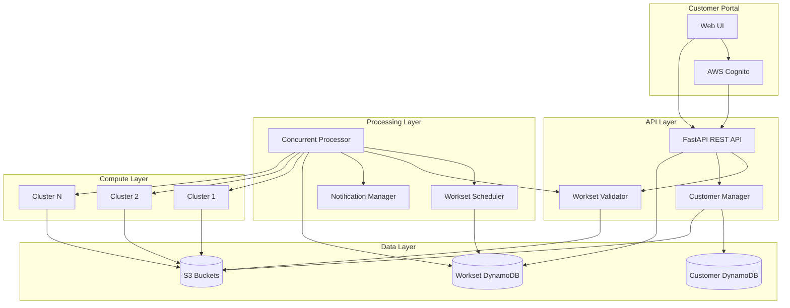
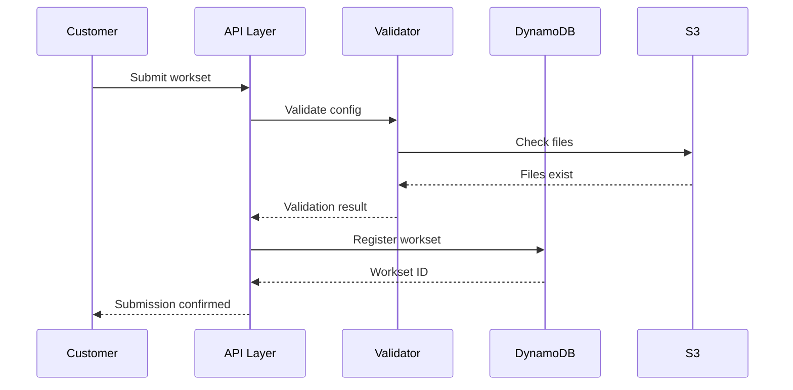
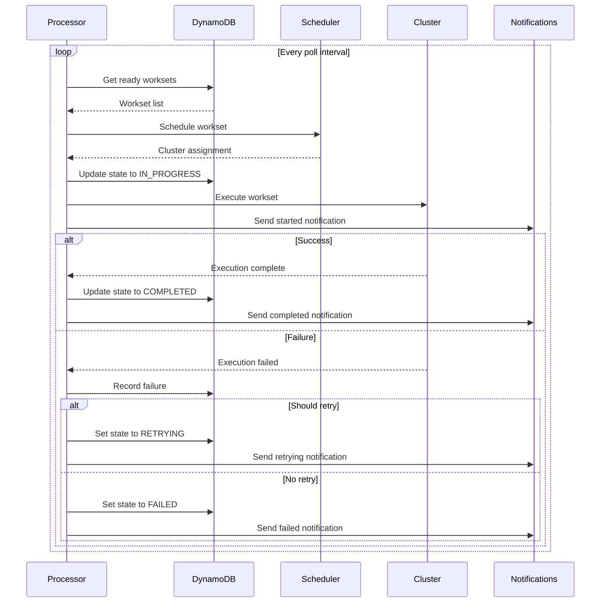
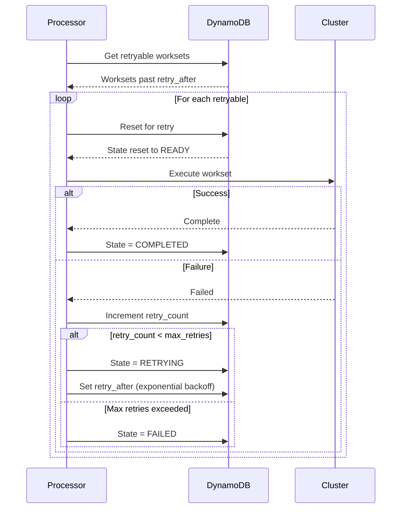
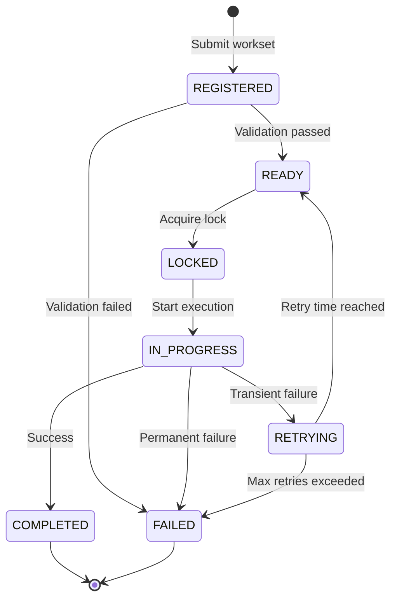
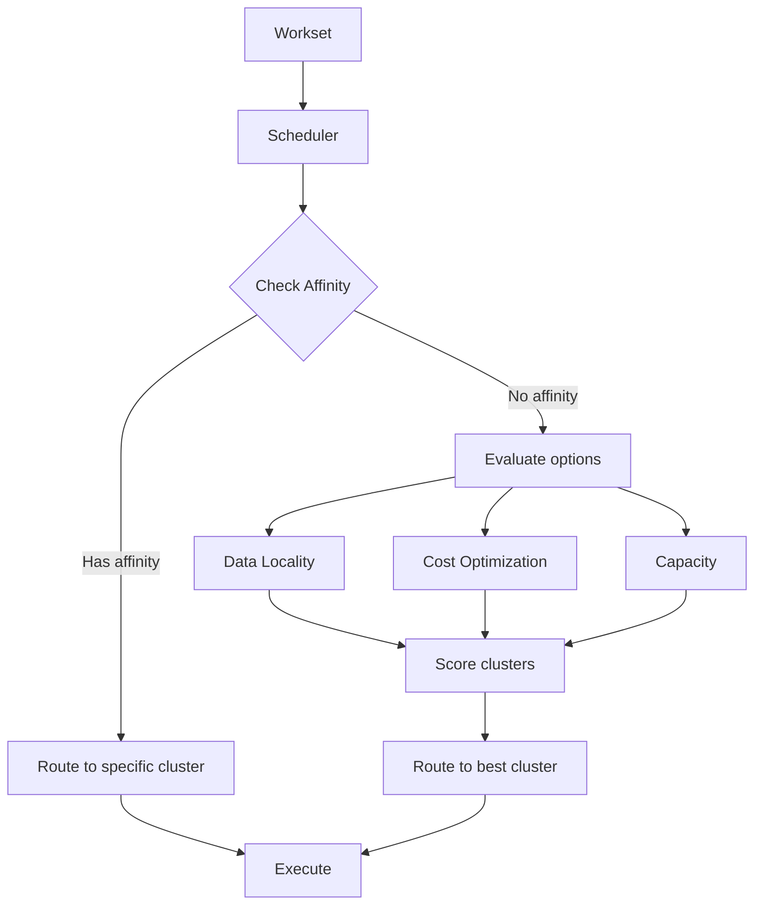
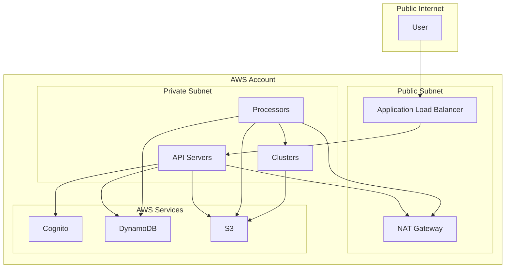

# Workset Monitor Architecture

This document describes the architecture of the Daylily Workset Monitor system.

## System Overview

## Component Details

### 1. Customer Portal

**Purpose**: Self-service interface for customers

**Components**:
- Web UI (HTML/JavaScript)
- AWS Cognito for authentication
- JWT token management

**Features**:
- Customer registration
- Workset submission
- Status monitoring
- Usage tracking
- YAML generator

### 2. API Layer

**Purpose**: REST API for all operations

**Components**:
- FastAPI application
- Pydantic models for validation
- Authentication middleware
- CORS support

**Endpoints**:
- `/worksets/*` - Workset operations
- `/customers/*` - Customer management
- `/queue/stats` - Queue statistics
- `/scheduler/stats` - Scheduler statistics

### 3. Processing Layer

**Purpose**: Concurrent workset execution

**Components**:
- `ConcurrentWorksetProcessor`: Main processor
- `WorksetScheduler`: Cluster scheduling
- `NotificationManager`: Multi-channel notifications

**Features**:
- Thread pool execution
- Automatic retry with backoff
- Cluster affinity routing
- Load balancing

### 4. Data Layer

**Purpose**: Persistent storage

**Components**:
- Workset DynamoDB table
- Customer DynamoDB table
- S3 buckets (per-customer)

**Schema**:
- Workset records with state tracking
- Customer configurations
- Usage metrics

### 5. Compute Layer

**Purpose**: Execute worksets

**Components**:
- AWS ParallelCluster instances
- Slurm scheduler
- FSx for Lustre storage

**Features**:
- Auto-scaling
- Spot instance support
- Multi-AZ deployment

## Data Flow

### Workset Submission Flow

### Concurrent Processing Flow

### Retry Flow

## State Machine

## Cluster Affinity Routing

## Scaling Considerations

### Horizontal Scaling

- **API Layer**: Multiple API instances behind load balancer
- **Processing Layer**: Multiple processor instances with distributed locking
- **Compute Layer**: Multiple clusters across regions/AZs

### Vertical Scaling

- **DynamoDB**: On-demand or provisioned capacity
- **S3**: Unlimited storage, request rate limits
- **Clusters**: Instance type and count per cluster

### Performance Targets

- **API Response Time**: < 100ms for reads, < 500ms for writes
- **Workset Throughput**: 10+ concurrent worksets per processor
- **Queue Depth**: Support 1000+ queued worksets
- **Retry Latency**: < 1 minute for first retry

## Security Architecture

## Monitoring and Observability

### Metrics

- Queue depth by state
- Workset processing rate
- Error rate by category
- Retry rate
- Cluster utilization
- API latency
- Customer usage

### Logging

- API access logs
- Workset execution logs
- Error logs with stack traces
- Audit logs for customer operations

### Alarms

- High error rate
- Queue depth threshold
- Cluster capacity
- API latency
- Failed authentication attempts

## See Also

- [Concurrent Processing](CONCURRENT_PROCESSING.md)
- [Customer Portal](CUSTOMER_PORTAL.md)
- [Feature Summary](FEATURE_SUMMARY.md)

