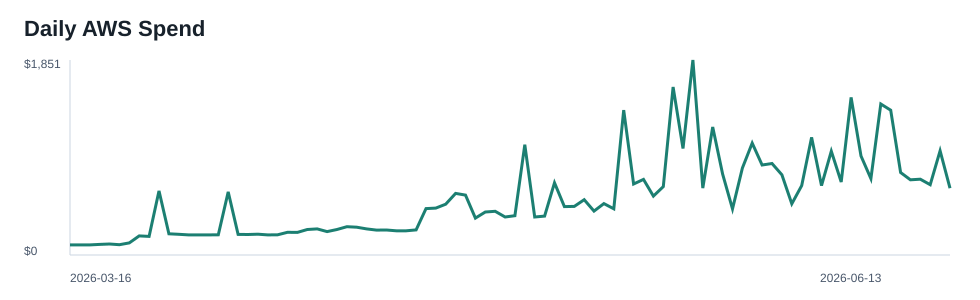
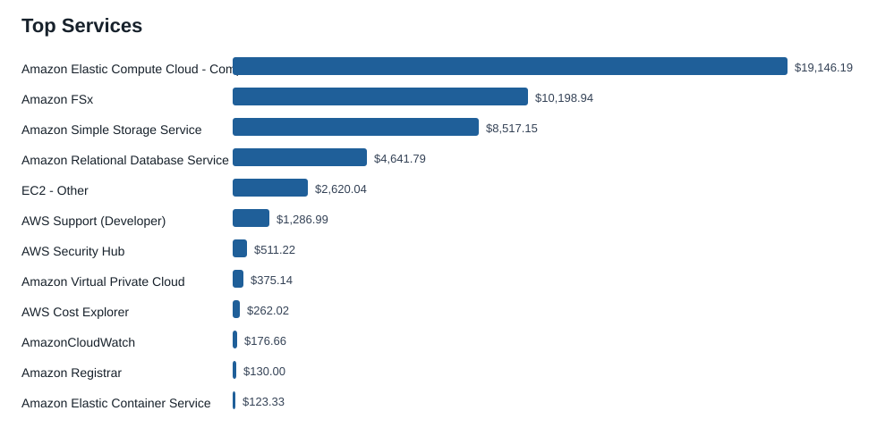
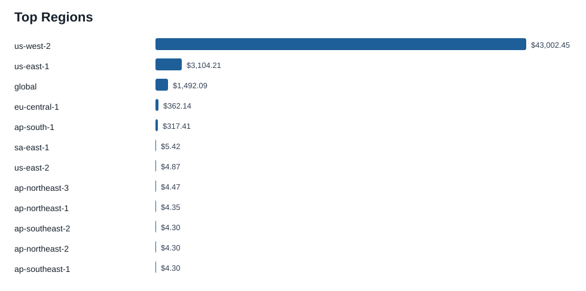
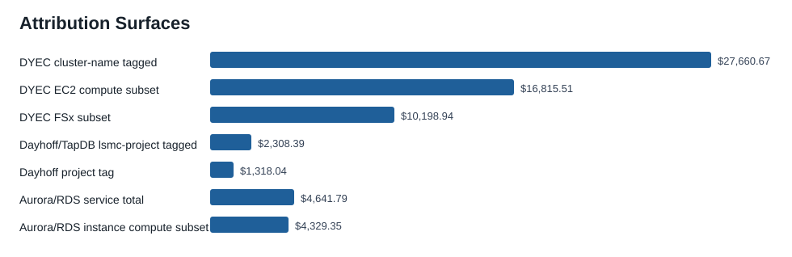

# AWS 90-Day Cost Attribution Report

Generated: 2026-06-14T21:48:21.167146Z
AWS profile: `lsmc`
Account: `108782052779`
Window: 2026-03-16 through 2026-06-13 inclusive (`Cost Explorer End=2026-06-14`)
Metric: `UnblendedCost`

No AWS mutations were performed. Tagging, stopping, deleting, lifecycle changes, rightsizing, and cleanup actions below are findings or recommendations only.

## Executive Summary

The account spent **$48,343.63** in the last complete 90 billing days. The top services remain concentrated in EC2 compute, FSx, S3, EC2-Other, and RDS/Aurora.

| Service | 90-day spend |
| --- | --- |
| Amazon Elastic Compute Cloud - Compute | $19,146.19 |
| Amazon FSx | $10,198.94 |
| Amazon Simple Storage Service | $8,517.15 |
| Amazon Relational Database Service | $4,641.79 |
| EC2 - Other | $2,620.04 |
| AWS Support (Developer) | $1,286.99 |
| AWS Security Hub | $511.22 |
| Amazon Virtual Private Cloud | $375.14 |

| Region | 90-day spend |
| --- | --- |
| us-west-2 | $43,002.45 |
| us-east-1 | $3,104.21 |
| global | $1,492.09 |
| eu-central-1 | $362.14 |
| ap-south-1 | $317.41 |
| sa-east-1 | $5.42 |
| us-east-2 | $4.87 |
| ap-northeast-3 | $4.47 |

## Overview Plots









## Time Trend

| Period | Spend |
| --- | --- |
| 2026-03-16 | $2,831.44 |
| 2026-04-01 | $9,334.55 |
| 2026-05-01 | $24,026.22 |
| 2026-06-01 | $12,151.43 |

## Attribution Surfaces

These surfaces are not all mutually exclusive. They are separated by evidence type because the historical billing tags do not cover every app stack.

| Surface | Evidence | 90-day spend | Confidence |
| --- | --- | --- | --- |
| DYEC cluster-name tagged | `parallelcluster:cluster-name` nonblank | $27,660.67 | high for tagged cluster resources |
| DYEC EC2 compute subset | service=EC2 Compute + nonblank cluster-name tag | $16,815.51 | high for tagged EC2 compute |
| DYEC FSx subset | service=Amazon FSx + nonblank cluster-name tag | $10,198.94 | high for tagged FSx |
| Dayhoff/TapDB lsmc-project tagged | `lsmc-project` starts dayhoff/tapdb | $2,308.39 | high for resources carrying lsmc-project |
| Dayhoff project tag | `project=dayhoff-all` | $1,318.04 | separate tag surface; may overlap |
| Aurora/RDS service total | service=Amazon Relational Database Service | $4,641.79 | high service total, not app-specific |
| Aurora/RDS instance compute subset | RDS usage types matching instance/box/multi-AZ/CPU credit | $4,329.35 | usage-type heuristic |

### DYEC / ParallelCluster

The strongest DYEC historical view is the nonblank `parallelcluster:cluster-name` Cost Explorer tag. It attributes **$27,660.67** over the window. The service mix under that tag is:

| Service | DYEC cluster-tagged spend |
| --- | --- |
| Amazon Elastic Compute Cloud - Compute | $16,815.51 |
| Amazon FSx | $10,198.94 |
| EC2 - Other | $568.98 |
| AmazonCloudWatch | $42.51 |
| Amazon Virtual Private Cloud | $23.13 |
| Amazon Route 53 | $11.50 |
| Amazon DynamoDB | $0.08 |
| AWS Lambda | $0.00 |

Top cluster-name values:

| Cluster tag value | 90-day spend |
| --- | --- |
| may26-d | $3,688.69 |
| ifx-go | $2,630.45 |
| hyb-hg003 | $1,879.23 |
| mk-gotime3 | $1,851.03 |
| fk-260509-use | $1,824.33 |
| hyb-only | $1,599.38 |
| inflextion-g24 | $1,382.12 |
| dra-enabled | $1,047.28 |
| dyecX4 | $874.55 |
| dyec-test | $844.31 |
| at-sanity | $830.78 |
| dec219-cluster | $827.28 |
| XL-pilot | $795.05 |
| BigB-4-mk | $742.62 |
| daylily-1773059211 | $520.01 |

### Dayhoff / TapDB

The strongest historical Dayhoff view is the nonblank `lsmc-project` values beginning with `dayhoff` plus `tapdb` values. That tag surface attributes **$2,308.39**. The generic `project=dayhoff-all` tag separately attributes **$1,318.04** and may overlap with the `lsmc-project` view, so it is not added to it.

| Service | Dayhoff/TapDB lsmc-project spend |
| --- | --- |
| Amazon Relational Database Service | $1,423.25 |
| Amazon Elastic Compute Cloud - Compute | $853.43 |
| EC2 - Other | $27.53 |
| Amazon Elastic Load Balancing | $1.96 |
| AWS Secrets Manager | $1.20 |
| Amazon Route 53 | $1.00 |
| Amazon EC2 Container Registry (ECR) | $0.01 |
| Amazon Virtual Private Cloud | $0.01 |
| Amazon Simple Notification Service | $0.00 |

Top `lsmc-project` values in the Dayhoff/TapDB family:

| lsmc-project value | 90-day spend |
| --- | --- |
| dayhoff+us-west-2 | $1,395.19 |
| tapdb-us-east-1 | $135.15 |
| tapdb-us-west-2 | $134.31 |
| dayhoff-ddev96 | $106.56 |
| dayhoff+us-east-1 | $106.32 |
| dayhoff-day | $91.30 |
| dayhoff-dev | $85.97 |
| dayhoff-inf | $81.97 |
| dayhoff-joshdev | $55.27 |
| dayhoff-jemdev5 | $38.42 |
| dayhoff-jemdev2 | $18.29 |
| dayhoff-jemdev3 | $17.35 |
| dayhoff-inf9 | $8.84 |
| dayhoff-inf10 | $8.43 |
| dayhoff-inf11 | $6.69 |

### Aurora / RDS

The full RDS/Aurora service cost is **$4,641.79**. The apparent instance-class compute subset from RDS usage types is **$4,329.35**; storage, I/O, backup, and other RDS/Aurora usage remain outside that subset.

| RDS usage type | 90-day spend |
| --- | --- |
| USW2-InstanceUsageIOOptimized:db.r8g.2xl | $946.45 |
| USW2-InstanceUsageIOOptimized:db.r8g.xl | $946.32 |
| USW2-InstanceUsage:db.r6g.large | $561.60 |
| InstanceUsage:db.r5.large | $377.13 |
| InstanceUsage:db.r6g.large | $366.77 |
| USW2-InstanceUsage:db.r5.large | $336.03 |
| InstanceUsage:db.t3.medium | $247.00 |
| InstanceUsage:db.t4g.medium | $192.02 |
| USW2-Aurora:ServerlessV2IOOptimizedUsage | $184.33 |
| USW2-InstanceUsage:db.r8g.large | $170.17 |
| USW2-InstanceUsage:db.t4g.medium | $93.77 |
| USW2-InstanceUsage:db.t4g.micro | $86.80 |
| RDS:GP2-Storage | $53.77 |
| USW2-RDS:GP2-Storage | $18.14 |
| USW2-RDS:GP3-Storage | $17.45 |

Live Aurora/RDS resources by classification:

| Class | Live RDS/Aurora resources |
| --- | --- |
| dayhoff | 20 |
| unallocated | 4 |
| dyec_cluster | 2 |
| terrarium | 2 |
| aquarium | 1 |

### Terrarium And Aquarium

Terrarium and Aquarium do not appear in the active Cost Explorer tag keys for this window. Their exact 90-day historical spend cannot be separated from Cost Explorer tags without adding/activating billing tags before the spend occurs.

Recent resource-level Cost Explorer data for 2026-06-01 through 2026-06-13 provides a partial actual-spend signal:

| Class | Recent resource-level spend | 30.4-day run-rate |
| --- | --- | --- |
| unallocated | $4,851.30 | $11,358.57 |
| dayhoff | $2,625.60 | $6,147.44 |
| terrarium | $62.07 | $145.33 |
| aquarium | $13.70 | $32.08 |

Recent resource-level split by class and service:

| Class | Service | Recent spend | 30.4-day run-rate |
| --- | --- | --- | --- |
| unallocated | Amazon Elastic Compute Cloud - Compute | $4,451.13 | $10,421.64 |
| dayhoff | Amazon Relational Database Service | $1,832.89 | $4,291.43 |
| dayhoff | Amazon Elastic Compute Cloud - Compute | $700.59 | $1,640.32 |
| unallocated | EC2 - Other | $275.43 | $644.88 |
| dayhoff | EC2 - Other | $78.07 | $182.79 |
| unallocated | Amazon Virtual Private Cloud | $66.72 | $156.21 |
| unallocated | Amazon Relational Database Service | $58.03 | $135.87 |
| terrarium | EC2 - Other | $28.35 | $66.38 |
| terrarium | Amazon Elastic Container Service | $15.42 | $36.10 |
| dayhoff | Amazon Elastic Load Balancing | $14.05 | $32.90 |
| terrarium | Amazon Relational Database Service | $11.98 | $28.05 |
| aquarium | Amazon Elastic Container Service | $7.71 | $18.05 |
| terrarium | Amazon Elastic Compute Cloud - Compute | $6.33 | $14.82 |
| aquarium | Amazon Relational Database Service | $5.99 | $14.02 |

Live resource counts by classification:

| Class | Live resources |
| --- | --- |
| unallocated | 64 |
| dayhoff | 46 |
| dyec_cluster | 23 |
| terrarium | 18 |
| aquarium | 5 |

## Attribution Limits

Cost Explorer active tag keys for this window were limited to ParallelCluster/project tags. `Name`, CloudFormation stack-name, ECS service, and RDS identifier were not active historical cost allocation tags. Therefore DYEC and Dayhoff/TapDB are separated with historical tag evidence where tags exist, while Terrarium and Aquarium are separated only in live inventory and recent resource-level Cost Explorer data. Unclassified or blank-tag spend remains unallocated rather than inferred.

## Evidence And Artifacts

Raw Cost Explorer JSON:

- `docs/aws_90day_cost_attribution_20260614T213521Z_assets/raw/ce_total_daily.json`
- `docs/aws_90day_cost_attribution_20260614T213521Z_assets/raw/ce_service_daily.json`
- `docs/aws_90day_cost_attribution_20260614T213521Z_assets/raw/ce_service_monthly.json`
- `docs/aws_90day_cost_attribution_20260614T213521Z_assets/raw/ce_region_monthly.json`
- `docs/aws_90day_cost_attribution_20260614T213521Z_assets/raw/ce_usage_type_monthly.json`
- `docs/aws_90day_cost_attribution_20260614T213521Z_assets/raw/ce_service_usage_monthly.json`
- `docs/aws_90day_cost_attribution_20260614T213521Z_assets/raw/ce_service_tag_*.json`
- `docs/aws_90day_cost_attribution_20260614T213521Z_assets/raw/ce_resource_*.json`

Derived data:

- `docs/aws_90day_cost_attribution_20260614T213521Z_assets/data/summary.json`
- `docs/aws_90day_cost_attribution_20260614T213521Z_assets/data/live_resources.json`
- `docs/aws_90day_cost_attribution_20260614T213521Z_assets/data/live_resources.csv`
- `docs/aws_90day_cost_attribution_20260614T213521Z_assets/data/recent_resource_costs.csv`
- `docs/aws_90day_cost_attribution_20260614T213521Z_assets/data/command_records.json`

Collector command status:

- Total AWS command records: 360
- Nonzero command records: 55
- Expected S3 metadata misses: 37 `NoSuchLifecycleConfiguration`, 18 `NoSuchTagSet`
- Unexpected command errors after filtering expected S3 metadata misses: 0

## Reproducibility

The collector is preserved at `docs/aws_90day_cost_attribution_20260614T213521Z_assets/scripts/collect_aws_90day_cost_attribution.py`. Rerun from the repo root with:

```bash
AWS_PROFILE=lsmc AWS_DEFAULT_REGION=us-west-2 python3 docs/aws_90day_cost_attribution_20260614T213521Z_assets/scripts/collect_aws_90day_cost_attribution.py
```
