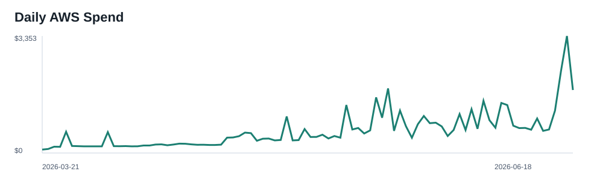
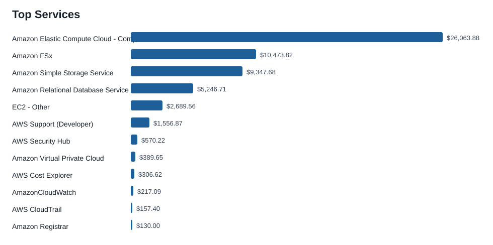
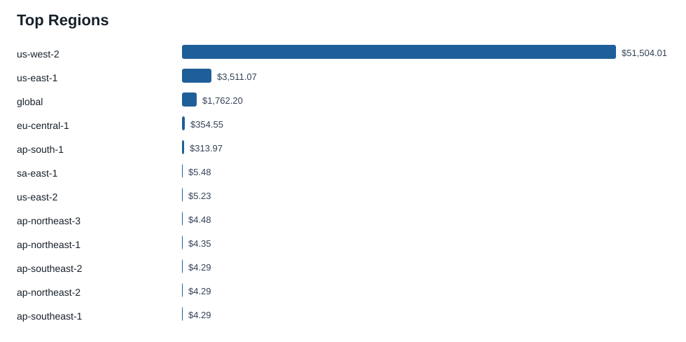
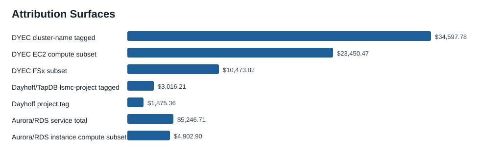

# AWS 90-Day Cost Attribution Report

Generated: 2026-06-19T01:31:50.876654Z
AWS profile: `lsmc`
Account: `108782052779`
Window: 2026-03-21 through 2026-06-18 inclusive (`Cost Explorer End=2026-06-19`)
Metric: `UnblendedCost`

No AWS mutations were performed. Tagging, stopping, deleting, lifecycle changes, rightsizing, and cleanup actions below are findings or recommendations only.

## Executive Summary

The account spent **$57,512.08** in the last complete 90 billing days. The top services remain concentrated in EC2 compute, FSx, S3, EC2-Other, and RDS/Aurora.

| Service | 90-day spend |
| --- | --- |
| Amazon Elastic Compute Cloud - Compute | $26,063.88 |
| Amazon FSx | $10,473.82 |
| Amazon Simple Storage Service | $9,347.68 |
| Amazon Relational Database Service | $5,246.71 |
| EC2 - Other | $2,689.56 |
| AWS Support (Developer) | $1,556.87 |
| AWS Security Hub | $570.22 |
| Amazon Virtual Private Cloud | $389.65 |

| Region | 90-day spend |
| --- | --- |
| us-west-2 | $51,504.01 |
| us-east-1 | $3,511.07 |
| global | $1,762.20 |
| eu-central-1 | $354.55 |
| ap-south-1 | $313.97 |
| sa-east-1 | $5.48 |
| us-east-2 | $5.23 |
| ap-northeast-3 | $4.48 |

## Overview Plots









## Time Trend

| Period | Spend |
| --- | --- |
| 2026-03-21 | $2,339.29 |
| 2026-04-01 | $9,334.55 |
| 2026-05-01 | $24,026.22 |
| 2026-06-01 | $21,812.02 |

## Attribution Surfaces

These surfaces are not all mutually exclusive. They are separated by evidence type because the historical billing tags do not cover every app stack.

| Surface | Evidence | 90-day spend | Confidence |
| --- | --- | --- | --- |
| DYEC cluster-name tagged | `parallelcluster:cluster-name` nonblank | $34,597.78 | high for tagged cluster resources |
| DYEC EC2 compute subset | service=EC2 Compute + nonblank cluster-name tag | $23,450.47 | high for tagged EC2 compute |
| DYEC FSx subset | service=Amazon FSx + nonblank cluster-name tag | $10,473.82 | high for tagged FSx |
| Dayhoff/TapDB lsmc-project tagged | `lsmc-project` starts dayhoff/tapdb | $3,016.21 | high for resources carrying lsmc-project |
| Dayhoff project tag | `project=dayhoff-all` | $1,875.36 | separate tag surface; may overlap |
| Aurora/RDS service total | service=Amazon Relational Database Service | $5,246.71 | high service total, not app-specific |
| Aurora/RDS instance compute subset | RDS usage types matching instance/box/multi-AZ/CPU credit | $4,902.90 | usage-type heuristic |

### DYEC / ParallelCluster

The strongest DYEC historical view is the nonblank `parallelcluster:cluster-name` Cost Explorer tag. It attributes **$34,597.78** over the window. The service mix under that tag is:

| Service | DYEC cluster-tagged spend |
| --- | --- |
| Amazon Elastic Compute Cloud - Compute | $23,450.47 |
| Amazon FSx | $10,473.82 |
| EC2 - Other | $594.43 |
| AmazonCloudWatch | $43.73 |
| Amazon Virtual Private Cloud | $23.54 |
| Amazon Route 53 | $11.70 |
| Amazon DynamoDB | $0.09 |
| AWS Lambda | $0.00 |

Top cluster-name values:

| Cluster tag value | 90-day spend |
| --- | --- |
| ultimarerun | $4,655.99 |
| may26-d | $3,688.69 |
| ifx-go | $2,635.41 |
| altairval | $2,026.49 |
| hyb-hg003 | $1,879.23 |
| mk-gotime3 | $1,851.03 |
| fk-260509-use | $1,824.33 |
| hyb-only | $1,599.38 |
| inflextion-g24 | $1,382.12 |
| dyecX4 | $1,188.91 |
| dra-enabled | $1,047.28 |
| dyec-test | $844.31 |
| at-sanity | $830.78 |
| dec219-cluster | $827.28 |
| XL-pilot | $795.05 |

### Dayhoff / TapDB

The strongest historical Dayhoff view is the nonblank `lsmc-project` values beginning with `dayhoff` plus `tapdb` values. That tag surface attributes **$3,016.21**. The generic `project=dayhoff-all` tag separately attributes **$1,875.36** and may overlap with the `lsmc-project` view, so it is not added to it.

| Service | Dayhoff/TapDB lsmc-project spend |
| --- | --- |
| Amazon Relational Database Service | $1,810.61 |
| Amazon Elastic Compute Cloud - Compute | $1,168.04 |
| EC2 - Other | $33.07 |
| Amazon Elastic Load Balancing | $1.96 |
| AWS Secrets Manager | $1.51 |
| Amazon Route 53 | $1.00 |
| Amazon EC2 Container Registry (ECR) | $0.01 |
| Amazon Virtual Private Cloud | $0.01 |
| Amazon Simple Notification Service | $0.00 |

Top `lsmc-project` values in the Dayhoff/TapDB family:

| lsmc-project value | 90-day spend |
| --- | --- |
| dayhoff+us-west-2 | $1,778.87 |
| tapdb-us-east-1 | $172.45 |
| tapdb-us-west-2 | $171.29 |
| dayhoff-ddev96 | $142.73 |
| dayhoff+us-east-1 | $138.84 |
| dayhoff-day | $127.26 |
| dayhoff-dev | $122.08 |
| dayhoff-inf | $118.07 |
| dayhoff-joshdev | $91.14 |
| dayhoff-jemdev5 | $75.00 |
| dayhoff-jemdev2 | $18.29 |
| dayhoff-jemdev3 | $17.35 |
| dayhoff-inf9 | $8.84 |
| dayhoff-inf10 | $8.43 |
| dayhoff-inf11 | $6.69 |

### Aurora / RDS

The full RDS/Aurora service cost is **$5,246.71**. The apparent instance-class compute subset from RDS usage types is **$4,902.90**; storage, I/O, backup, and other RDS/Aurora usage remain outside that subset.

| RDS usage type | 90-day spend |
| --- | --- |
| USW2-InstanceUsageIOOptimized:db.r8g.2xl | $1,102.97 |
| USW2-InstanceUsageIOOptimized:db.r8g.xl | $1,102.84 |
| USW2-InstanceUsage:db.r6g.large | $558.74 |
| InstanceUsage:db.r5.large | $472.54 |
| USW2-InstanceUsage:db.r5.large | $431.15 |
| InstanceUsage:db.r6g.large | $395.37 |
| InstanceUsage:db.t3.medium | $238.36 |
| USW2-Aurora:ServerlessV2IOOptimizedUsage | $219.53 |
| USW2-InstanceUsage:db.r8g.large | $200.25 |
| InstanceUsage:db.t4g.medium | $198.37 |
| USW2-InstanceUsage:db.t4g.medium | $108.81 |
| USW2-InstanceUsage:db.t4g.micro | $88.19 |
| RDS:GP2-Storage | $51.91 |
| USW2-RDS:GP3-Storage | $20.96 |
| USW2-RDS:GP2-Storage | $18.45 |

Live Aurora/RDS resources by classification:

| Class | Live RDS/Aurora resources |
| --- | --- |
| dayhoff | 20 |
| unallocated | 4 |
| dyec_cluster | 2 |
| terrarium | 2 |
| aquarium | 1 |

### Terrarium And Aquarium

Terrarium and Aquarium do not appear in the active Cost Explorer tag keys for this window. Their exact 90-day historical spend cannot be separated from Cost Explorer tags without adding/activating billing tags before the spend occurs.

Recent resource-level Cost Explorer data for 2026-06-05 through 2026-06-18 provides a partial actual-spend signal:

| Class | Recent resource-level spend | 30.4-day run-rate |
| --- | --- | --- |
| unallocated | $10,013.10 | $21,769.55 |
| dayhoff | $2,823.44 | $6,138.46 |
| terrarium | $64.85 | $140.99 |
| aquarium | $14.30 | $31.09 |

Recent resource-level split by class and service:

| Class | Service | Recent spend | 30.4-day run-rate |
| --- | --- | --- | --- |
| unallocated | Amazon Elastic Compute Cloud - Compute | $9,547.59 | $20,757.48 |
| dayhoff | Amazon Relational Database Service | $1,910.70 | $4,154.07 |
| dayhoff | Amazon Elastic Compute Cloud - Compute | $809.71 | $1,760.40 |
| unallocated | EC2 - Other | $331.98 | $721.76 |
| dayhoff | EC2 - Other | $88.33 | $192.04 |
| unallocated | Amazon Virtual Private Cloud | $73.05 | $158.82 |
| unallocated | Amazon Relational Database Service | $60.48 | $131.49 |
| terrarium | EC2 - Other | $29.50 | $64.14 |
| terrarium | Amazon Elastic Container Service | $16.10 | $35.00 |
| dayhoff | Amazon Elastic Load Balancing | $14.69 | $31.94 |
| terrarium | Amazon Relational Database Service | $12.48 | $27.13 |
| aquarium | Amazon Elastic Container Service | $8.06 | $17.52 |
| terrarium | Amazon Elastic Compute Cloud - Compute | $6.76 | $14.70 |
| aquarium | Amazon Relational Database Service | $6.24 | $13.57 |

Live resource counts by classification:

| Class | Live resources |
| --- | --- |
| unallocated | 64 |
| dayhoff | 46 |
| dyec_cluster | 25 |
| terrarium | 18 |
| aquarium | 5 |

## Attribution Limits

Cost Explorer active tag keys for this window were limited to ParallelCluster/project tags. `Name`, CloudFormation stack-name, ECS service, and RDS identifier were not active historical cost allocation tags. Therefore DYEC and Dayhoff/TapDB are separated with historical tag evidence where tags exist, while Terrarium and Aquarium are separated only in live inventory and recent resource-level Cost Explorer data. Unclassified or blank-tag spend remains unallocated rather than inferred.

## Evidence And Artifacts

Raw Cost Explorer JSON:

- `docs/aws_90day_cost_attribution_20260618T160028Z_assets/raw/ce_total_daily.json`
- `docs/aws_90day_cost_attribution_20260618T160028Z_assets/raw/ce_service_daily.json`
- `docs/aws_90day_cost_attribution_20260618T160028Z_assets/raw/ce_service_monthly.json`
- `docs/aws_90day_cost_attribution_20260618T160028Z_assets/raw/ce_region_monthly.json`
- `docs/aws_90day_cost_attribution_20260618T160028Z_assets/raw/ce_usage_type_monthly.json`
- `docs/aws_90day_cost_attribution_20260618T160028Z_assets/raw/ce_service_usage_monthly.json`
- `docs/aws_90day_cost_attribution_20260618T160028Z_assets/raw/ce_service_tag_*.json`
- `docs/aws_90day_cost_attribution_20260618T160028Z_assets/raw/ce_resource_*.json`

Derived data:

- `docs/aws_90day_cost_attribution_20260618T160028Z_assets/data/summary.json`
- `docs/aws_90day_cost_attribution_20260618T160028Z_assets/data/live_resources.json`
- `docs/aws_90day_cost_attribution_20260618T160028Z_assets/data/live_resources.csv`
- `docs/aws_90day_cost_attribution_20260618T160028Z_assets/data/recent_resource_costs.csv`
- `docs/aws_90day_cost_attribution_20260618T160028Z_assets/data/command_records.json`
- `docs/aws_90day_cost_attribution_20260618T160028Z_assets/html/index.html`

Collector command status:

- Total AWS command records: 361
- Nonzero command records: 55
- Expected S3 metadata misses: 37 `NoSuchLifecycleConfiguration`, 18 `NoSuchTagSet`
- Unexpected command errors after filtering expected S3 metadata misses: 0

## Reproducibility

The collector is preserved at `docs/aws_90day_cost_attribution_20260618T160028Z_assets/scripts/collect_aws_90day_cost_attribution.py`. Rerun from the repo root with:

```bash
AWS_PROFILE=lsmc AWS_DEFAULT_REGION=us-west-2 python3 docs/aws_90day_cost_attribution_20260618T160028Z_assets/scripts/collect_aws_90day_cost_attribution.py
```
