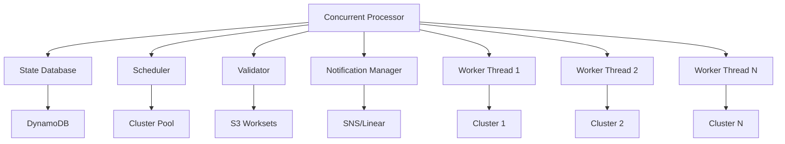

# Concurrent Workset Processing

This document describes the concurrent workset processing capabilities that enable parallel execution of multiple worksets across multiple clusters.

## Overview

The concurrent processing system allows the Daylily workset monitor to process multiple worksets simultaneously, dramatically improving throughput and reducing overall processing time.

## Architecture



## Key Features

### 1. Parallel Execution
- Process up to 10+ worksets concurrently (configurable)
- Thread pool executor for efficient resource utilization
- Automatic load balancing across available clusters

### 2. Cluster Affinity Routing
- Route worksets to specific clusters based on:
  - Data locality (minimize data transfer)
  - Cost optimization (use cheapest available cluster)
  - Resource requirements (match workset needs to cluster capacity)
  - Manual affinity settings

### 3. Configurable Concurrency Limits
- Global max concurrent worksets
- Per-cluster max concurrent worksets
- Per-customer max concurrent worksets
- Dynamic adjustment based on cluster capacity

### 4. Retry and Recovery
- Automatic retry with exponential backoff
- Transient vs. permanent error classification
- Partial retry capability (resume from failed step)
- Dead letter queue for repeatedly failing worksets

## Configuration

### Processor Configuration

```python
from daylib.workset_concurrent_processor import ProcessorConfig

config = ProcessorConfig(
    max_concurrent_worksets=10,  # Global limit
    max_workers=5,  # Thread pool size
    poll_interval_seconds=30,  # How often to check for new work
    enable_retry=True,  # Enable automatic retry
    enable_validation=True,  # Validate before processing
    enable_notifications=True,  # Send notifications
)
```

### Cluster Affinity

Set cluster affinity for a workset:

```python
from daylib.workset_state_db import WorksetStateDB

db = WorksetStateDB("daylily-worksets", "us-west-2")

# Set affinity based on data locality
db.set_cluster_affinity(
    workset_id="ws-001",
    cluster_name="cluster-us-west-2a",
    affinity_reason="data_locality",
)
```

### Retry Configuration

Configure retry behavior in `daylily_work.yaml`:

```yaml
samples:
  - sample_id: sample1
    fastq_r1: sample1_R1.fq.gz

reference_genome: hg38
priority: normal
max_retries: 3  # Max retry attempts
```

## Usage

### Starting the Concurrent Processor

```python
from daylib.workset_concurrent_processor import ConcurrentWorksetProcessor, ProcessorConfig
from daylib.workset_state_db import WorksetStateDB
from daylib.workset_scheduler import WorksetScheduler
from daylib.workset_validation import WorksetValidator
from daylib.workset_notifications import NotificationManager

# Initialize components
state_db = WorksetStateDB("daylily-worksets", "us-west-2")
scheduler = WorksetScheduler(state_db)
validator = WorksetValidator("us-west-2")
notification_manager = NotificationManager(
    sns_topic_arn="arn:aws:sns:us-west-2:123456789012:workset-notifications",
    region="us-west-2",
)

# Create processor
config = ProcessorConfig(
    max_concurrent_worksets=10,
    max_workers=5,
)

processor = ConcurrentWorksetProcessor(
    state_db=state_db,
    scheduler=scheduler,
    config=config,
    validator=validator,
    notification_manager=notification_manager,
)

# Start processing
processor.start()
```

### Monitoring Concurrent Processing

```python
# Check current concurrency
current = state_db.get_concurrent_worksets_count()
print(f"Currently processing {current} worksets")

# Check if we can start more
can_start = state_db.can_start_new_workset(max_concurrent=10)
print(f"Can start new workset: {can_start}")

# Get worksets by cluster
worksets = state_db.get_worksets_by_cluster("cluster-us-west-2a")
print(f"Cluster has {len(worksets)} worksets")
```

## Error Handling and Retry

### Error Categories

The system classifies errors into categories to determine retry behavior:

- **TRANSIENT**: Temporary errors (network, throttling) - **RETRY**
- **RESOURCE**: Resource exhaustion (OOM, disk full) - **RETRY**
- **CONFIGURATION**: Config errors (invalid params) - **NO RETRY**
- **DATA**: Data quality issues - **NO RETRY**
- **PERMANENT**: Unrecoverable errors - **NO RETRY**

### Recording Failures

```python
from daylib.workset_state_db import ErrorCategory

# Record a transient failure (will retry)
should_retry = state_db.record_failure(
    workset_id="ws-001",
    error_details="Network timeout connecting to S3",
    error_category=ErrorCategory.TRANSIENT,
    failed_step="download_fastq",
)

# Record a permanent failure (will not retry)
should_retry = state_db.record_failure(
    workset_id="ws-002",
    error_details="Invalid reference genome specified",
    error_category=ErrorCategory.CONFIGURATION,
)
```

### Exponential Backoff

Retry delays follow exponential backoff:
- Retry 1: 2 seconds
- Retry 2: 4 seconds
- Retry 3: 8 seconds
- Max: 3600 seconds (1 hour)

## Performance Metrics

Monitor concurrent processing performance:

```python
# Get queue statistics
stats = state_db.get_queue_depth()
print(f"Ready: {stats['ready']}")
print(f"In Progress: {stats['in_progress']}")
print(f"Retrying: {stats['retrying']}")
print(f"Failed: {stats['failed']}")
```

## Best Practices

1. **Set appropriate concurrency limits** based on cluster capacity
2. **Use cluster affinity** to minimize data transfer costs
3. **Enable validation** to catch errors early
4. **Monitor retry rates** to identify systemic issues
5. **Set max_retries** appropriately for your workload
6. **Use priority levels** to ensure critical worksets are processed first

## Troubleshooting

### High Retry Rate
- Check for transient infrastructure issues
- Review error logs for patterns
- Consider increasing retry delays

### Low Throughput
- Increase max_concurrent_worksets
- Add more clusters to the pool
- Check for bottlenecks in cluster provisioning

### Worksets Stuck in LOCKED State
- Check for stale locks (auto-released after timeout)
- Verify lock owners are still active
- Manually release locks if needed

## See Also

- [Workset Validation](WORKSET_VALIDATION.md)
- [Retry and Recovery](RETRY_RECOVERY.md)
- [Cluster Affinity](CLUSTER_AFFINITY.md)

