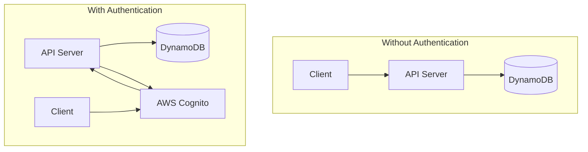

# Optional Authentication

The Workset Monitor API supports optional authentication, allowing you to run with or without AWS Cognito authentication based on your deployment needs.

## Why Optional Authentication?

Different deployment scenarios have different security requirements:

- **Development/Testing**: No authentication needed, faster iteration
- **Internal Deployments**: Network-level security (VPN, security groups) may be sufficient
- **Production/Multi-tenant**: Full authentication with user tracking and access control

## How It Works

### Architecture



### Implementation

The authentication system uses conditional imports and runtime configuration:

1. **Optional Import**: `python-jose` is imported with try/except
2. **Runtime Check**: Authentication is enabled/disabled via `enable_auth` parameter
3. **Graceful Degradation**: API works without authentication dependencies

## Installation Options

### Without Authentication (Default)

```bash
# Install base dependencies only
pip install -e .

# Dependencies installed:
# - boto3, pyyaml, fastapi, uvicorn, pydantic, etc.
# - NO python-jose or passlib
```

### With Authentication

```bash
# Install with authentication support
pip install -e ".[auth]"

# Additional dependencies installed:
# - python-jose[cryptography]
# - passlib[bcrypt]
```

## Usage Examples

### Running Without Authentication

```python
from daylib.workset_api import create_app
from daylib.workset_state_db import WorksetStateDB

state_db = WorksetStateDB("daylily-worksets", "us-west-2")

# Create app without authentication
app = create_app(
    state_db=state_db,
    enable_auth=False,  # No authentication
)

# All endpoints work without tokens
# No Cognito configuration needed
```

### Running With Authentication

```python
from daylib.workset_api import create_app
from daylib.workset_state_db import WorksetStateDB
from daylib.workset_auth import CognitoAuth  # Requires python-jose

state_db = WorksetStateDB("daylily-worksets", "us-west-2")

# Initialize Cognito
cognito_auth = CognitoAuth(
    region="us-west-2",
    user_pool_id="us-west-2_XXXXXXXXX",
    app_client_id="XXXXXXXXXXXXXXXXXXXXXXXXXX",
)

# Create app with authentication
app = create_app(
    state_db=state_db,
    cognito_auth=cognito_auth,
    enable_auth=True,  # Require authentication
)

# All endpoints require valid JWT tokens
```

## Error Handling

### Missing python-jose

If you try to enable authentication without python-jose:

```python
# This will raise ImportError
from daylib.workset_auth import CognitoAuth  # Error: No module named 'jose'

# Solution: Install authentication dependencies
pip install 'python-jose[cryptography]'
```

### Enabling Auth Without Cognito

If you try to enable auth without providing cognito_auth:

```python
# This will raise ValueError
app = create_app(
    state_db=state_db,
    enable_auth=True,  # Error: requires cognito_auth parameter
    cognito_auth=None,
)

# Solution: Provide cognito_auth or disable authentication
```

## Feature Comparison

| Feature | Without Auth | With Auth |
|---------|-------------|-----------|
| **Installation** | Simple | Requires extra packages |
| **AWS Cognito** | Not needed | Required |
| **JWT Tokens** | Not needed | Required |
| **User Tracking** | No | Yes |
| **Access Control** | No | Yes |
| **Multi-tenant** | Basic | Full support |
| **Audit Logs** | Limited | Complete |
| **Production Ready** | Internal only | Yes |
| **Setup Time** | Minutes | Hours |
| **Maintenance** | Low | Medium |

## Security Considerations

### Without Authentication

**When to use:**
- Development and testing
- Internal tools behind VPN
- Trusted network environments
- Single-tenant deployments

**Security measures:**
- Deploy in private subnet
- Use security groups
- Enable VPN access only
- Monitor API access logs
- Use AWS IAM for service access

### With Authentication

**When to use:**
- Production deployments
- Multi-tenant environments
- Public-facing APIs
- Compliance requirements

**Security measures:**
- Enable MFA for users
- Rotate credentials regularly
- Use HTTPS only
- Monitor failed auth attempts
- Set appropriate token expiration
- Implement rate limiting

## Migration Path

You can start without authentication and add it later:

### Phase 1: Development (No Auth)
```python
app = create_app(state_db=state_db, enable_auth=False)
```

### Phase 2: Testing (Optional Auth)
```python
# Test with auth in staging
if os.getenv("ENVIRONMENT") == "production":
    app = create_app(state_db=state_db, cognito_auth=auth, enable_auth=True)
else:
    app = create_app(state_db=state_db, enable_auth=False)
```

### Phase 3: Production (Required Auth)
```python
app = create_app(state_db=state_db, cognito_auth=auth, enable_auth=True)
```

## Testing

### Test Without Authentication
```bash
# No special setup needed
pytest tests/test_workset_api.py
```

### Test With Authentication
```bash
# Install auth dependencies
pip install -e ".[auth]"

# Run auth-specific tests
pytest tests/test_workset_auth.py
pytest tests/test_optional_auth.py
```

## Example Scripts

Two example scripts are provided:

1. **`examples/run_api_without_auth.py`**
   - No authentication required
   - Quick start for development
   - Suitable for internal use

2. **`examples/run_api_with_auth.py`**
   - Full authentication enabled
   - Production-ready setup
   - Requires Cognito configuration

## Best Practices

1. **Start Simple**: Begin without authentication for development
2. **Add Security**: Enable authentication before production deployment
3. **Document Choice**: Clearly document which mode you're using
4. **Monitor Access**: Enable CloudWatch logging regardless of auth mode
5. **Plan Migration**: Design for adding authentication later if needed

## See Also

- [Authentication Setup Guide](AUTHENTICATION_SETUP.md) - Detailed setup instructions
- [Customer Portal Guide](CUSTOMER_PORTAL.md) - Multi-tenant features
- [Quick Reference](QUICK_REFERENCE.md) - Common operations
- [Feature Summary](FEATURE_SUMMARY.md) - All features overview

