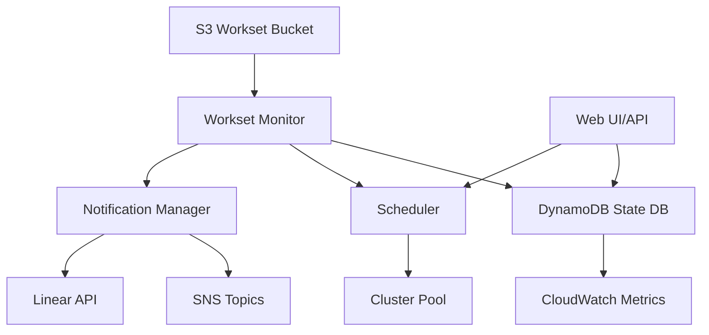

# Workset Monitor Enhancements

This document describes the enhanced workset monitoring system with improved observability, scheduling, and user experience.

## Overview

The enhanced workset monitoring system provides:

- **DynamoDB-based state management** - Replaces S3 sentinel files with queryable, real-time state tracking
- **Distributed locking** - Reliable lock mechanism using DynamoDB conditional writes
- **Priority queue scheduling** - Intelligent workset scheduling with cost optimization
- **Notification system** - SNS and Linear API integration for alerts
- **REST API & Web UI** - FastAPI-based dashboard for monitoring and management
- **CloudWatch metrics** - Comprehensive observability and monitoring

## Architecture



## Components

### 1. DynamoDB State Management (`daylib/workset_state_db.py`)

Replaces S3 sentinel files with a robust state tracking system.

**Features:**
- Atomic state transitions with audit trail
- Distributed locking with automatic stale lock release
- Priority-based querying
- CloudWatch metrics integration

**Schema:**
```python
{
    "workset_id": "string",           # Primary key
    "state": "ready|locked|in_progress|complete|error|ignored",
    "priority": "urgent|normal|low",
    "bucket": "string",
    "prefix": "string",
    "created_at": "ISO8601",
    "updated_at": "ISO8601",
    "lock_owner": "string",           # Optional
    "lock_acquired_at": "ISO8601",    # Optional
    "cluster_name": "string",         # Optional
    "error_details": "string",        # Optional
    "metrics": {...},                 # Optional
    "state_history": [...]            # Audit trail
}
```

**Usage:**
```python
from daylib.workset_state_db import WorksetStateDB, WorksetState, WorksetPriority

# Initialize
db = WorksetStateDB(
    table_name="daylily-worksets",
    region="us-west-2",
    lock_timeout_seconds=3600,
)

# Create table (one-time setup)
db.create_table_if_not_exists()

# Register workset
db.register_workset(
    workset_id="ws-001",
    bucket="my-bucket",
    prefix="worksets/ws-001/",
    priority=WorksetPriority.URGENT,
    metadata={"samples": 10, "estimated_cost": 50.0},
)

# Acquire lock
if db.acquire_lock("ws-001", owner_id="monitor-1"):
    # Process workset
    db.update_state(
        workset_id="ws-001",
        new_state=WorksetState.IN_PROGRESS,
        reason="Pipeline started",
        cluster_name="cluster-1",
    )
    
    # Release lock when done
    db.release_lock("ws-001", owner_id="monitor-1")
```

### 2. Notification System (`daylib/workset_notifications.py`)

Multi-channel notification system with filtering.

**Supported Channels:**
- AWS SNS (email, SMS)
- Linear API (project management)

**Usage:**
```python
from daylib.workset_notifications import (
    NotificationManager,
    SNSNotificationChannel,
    LinearNotificationChannel,
    NotificationEvent,
)

# Create manager
manager = NotificationManager()

# Add SNS channel
sns_channel = SNSNotificationChannel(
    topic_arn="arn:aws:sns:us-west-2:123456789:daylily-alerts",
    region="us-west-2",
)
manager.add_channel(sns_channel)

# Add Linear channel
linear_channel = LinearNotificationChannel(
    api_key="lin_api_...",
    team_id="team-123",
)
manager.add_channel(linear_channel)

# Configure filters (optional)
manager.set_filters(
    event_types=["error", "completion"],  # Only errors and completions
    priorities=["urgent"],                 # Only urgent worksets
)

# Send notification
event = NotificationEvent(
    workset_id="ws-001",
    event_type="error",
    state="error",
    message="Pipeline failed",
    priority="urgent",
    error_details="ValueError: Invalid input",
)
manager.notify(event)
```

### 3. Priority Queue Scheduler (`daylib/workset_scheduler.py`)

Intelligent scheduling with cost optimization and resource awareness.

**Features:**
- Priority-based execution (urgent > normal > low)
- Cost-based scheduling within priority groups
- Resource-aware cluster selection
- Cluster capacity tracking

**Usage:**
```python
from daylib.workset_scheduler import (
    WorksetScheduler,
    ClusterCapacity,
    WorksetRequirements,
)

# Initialize
scheduler = WorksetScheduler(
    state_db=db,
    max_concurrent_worksets_per_cluster=3,
    cost_optimization_enabled=True,
)

# Register cluster
scheduler.register_cluster(
    ClusterCapacity(
        cluster_name="cluster-1",
        availability_zone="us-west-2d",
        max_vcpus=256,
        current_vcpus_used=0,
        max_memory_gb=2048,
        current_memory_gb_used=0,
        active_worksets=0,
        max_concurrent_worksets=3,
        cost_per_vcpu_hour=0.05,
    )
)

# Get next workset to execute
next_workset = scheduler.get_next_workset()

# Make scheduling decision
decision = scheduler.schedule_workset(
    workset_id="ws-001",
    requirements=WorksetRequirements(
        estimated_cost_usd=50.0,
        preferred_availability_zone="us-west-2d",
    ),
)
```

### 4. REST API & Web UI (`daylib/workset_api.py`)

FastAPI-based web interface for monitoring and management.

**Endpoints:**

| Method | Path | Description |
|--------|------|-------------|
| GET | `/` | Health check |
| POST | `/worksets` | Register new workset |
| GET | `/worksets/{id}` | Get workset details |
| GET | `/worksets` | List worksets (with filters) |
| PUT | `/worksets/{id}/state` | Update workset state |
| POST | `/worksets/{id}/lock` | Acquire lock |
| DELETE | `/worksets/{id}/lock` | Release lock |
| GET | `/queue/stats` | Get queue statistics |
| GET | `/scheduler/stats` | Get scheduler statistics |
| GET | `/worksets/next` | Get next workset to execute |

**Running the API:**
```bash
# Basic usage
./bin/daylily-workset-api \
    --table-name daylily-worksets \
    --region us-west-2 \
    --port 8000

# With scheduler enabled
./bin/daylily-workset-api \
    --table-name daylily-worksets \
    --enable-scheduler \
    --create-table \
    --verbose

# Development mode with auto-reload
./bin/daylily-workset-api \
    --reload \
    --verbose
```

**API Examples:**
```bash
# Register workset
curl -X POST http://localhost:8000/worksets \
  -H "Content-Type: application/json" \
  -d '{
    "workset_id": "ws-001",
    "bucket": "my-bucket",
    "prefix": "worksets/ws-001/",
    "priority": "urgent",
    "metadata": {"samples": 10}
  }'

# Get workset status
curl http://localhost:8000/worksets/ws-001

# List ready worksets
curl "http://localhost:8000/worksets?state=ready&limit=10"

# Get queue stats
curl http://localhost:8000/queue/stats

# Get next workset to execute
curl http://localhost:8000/worksets/next
```

## Deployment

### 1. DynamoDB Table Setup

```bash
# Create table using AWS CLI (with on-demand billing)
aws dynamodb create-table \
    --table-name daylily-worksets \
    --attribute-definitions \
        AttributeName=workset_id,AttributeType=S \
        AttributeName=state,AttributeType=S \
        AttributeName=priority,AttributeType=S \
        AttributeName=created_at,AttributeType=S \
    --key-schema \
        AttributeName=workset_id,KeyType=HASH \
    --global-secondary-indexes \
        '[{
            "IndexName": "state-priority-index",
            "KeySchema": [
                {"AttributeName": "state", "KeyType": "HASH"},
                {"AttributeName": "priority", "KeyType": "RANGE"}
            ],
            "Projection": {"ProjectionType": "ALL"}
        },
        {
            "IndexName": "created-at-index",
            "KeySchema": [
                {"AttributeName": "state", "KeyType": "HASH"},
                {"AttributeName": "created_at", "KeyType": "RANGE"}
            ],
            "Projection": {"ProjectionType": "ALL"}
        }]' \
    --billing-mode PAY_PER_REQUEST \
    --region us-west-2

# Or use the Python API (recommended)
python3 -c "
from daylib.workset_state_db import WorksetStateDB
db = WorksetStateDB('daylily-worksets', 'us-west-2')
db.create_table_if_not_exists()
"
```

### 2. SNS Topic Setup

```bash
# Create SNS topic
aws sns create-topic \
    --name daylily-workset-alerts \
    --region us-west-2

# Subscribe email
aws sns subscribe \
    --topic-arn arn:aws:sns:us-west-2:123456789:daylily-workset-alerts \
    --protocol email \
    --notification-endpoint your-email@example.com
```

### 3. IAM Permissions

Required IAM permissions for the monitor:

```json
{
  "Version": "2012-10-17",
  "Statement": [
    {
      "Effect": "Allow",
      "Action": [
        "dynamodb:PutItem",
        "dynamodb:GetItem",
        "dynamodb:UpdateItem",
        "dynamodb:Query",
        "dynamodb:Scan",
        "dynamodb:DescribeTable",
        "dynamodb:CreateTable"
      ],
      "Resource": [
        "arn:aws:dynamodb:*:*:table/daylily-worksets",
        "arn:aws:dynamodb:*:*:table/daylily-worksets/index/*"
      ]
    },
    {
      "Effect": "Allow",
      "Action": [
        "sns:Publish"
      ],
      "Resource": "arn:aws:sns:*:*:daylily-workset-alerts"
    },
    {
      "Effect": "Allow",
      "Action": [
        "cloudwatch:PutMetricData"
      ],
      "Resource": "*"
    },
    {
      "Effect": "Allow",
      "Action": [
        "s3:GetObject",
        "s3:ListBucket"
      ],
      "Resource": [
        "arn:aws:s3:::your-workset-bucket",
        "arn:aws:s3:::your-workset-bucket/*"
      ]
    }
  ]
}
```

## Migration from S3 Sentinel Files

To migrate from the old S3 sentinel file system:

1. **Deploy DynamoDB table** and API
2. **Run migration script** to populate DynamoDB from existing S3 state
3. **Update monitor** to use new state management
4. **Verify** both systems in parallel for a transition period
5. **Deprecate** S3 sentinel files once stable

## Monitoring & Observability

### CloudWatch Metrics

The system publishes metrics to CloudWatch:

- `WorksetStateTransitions` - State change events
- `WorksetQueueDepth` - Number of worksets in each state
- `WorksetLockAcquisitions` - Lock acquisition attempts
- `WorksetLockFailures` - Failed lock acquisitions
- `WorksetProcessingDuration` - Time in each state

### Dashboards

Create CloudWatch dashboards to visualize:
- Queue depth over time
- Processing throughput
- Error rates
- Lock contention
- Cost per workset

## Testing

Run the test suite:

```bash
# Install test dependencies
pip install pytest pytest-cov pytest-asyncio

# Run all tests
pytest tests/ -v

# Run with coverage
pytest tests/ --cov=daylib --cov-report=html

# Run specific test file
pytest tests/test_workset_state_db.py -v
```

## Troubleshooting

### Stale Locks

If worksets are stuck in LOCKED state:

```python
# Check lock status
workset = db.get_workset("ws-001")
print(f"Lock owner: {workset.get('lock_owner')}")
print(f"Lock acquired: {workset.get('lock_acquired_at')}")

# Force release (use with caution)
db.release_lock("ws-001", owner_id=workset["lock_owner"])
```

### Queue Backlog

If queue depth is growing:

```bash
# Check queue stats
curl http://localhost:8000/queue/stats

# Check scheduler stats
curl http://localhost:8000/scheduler/stats

# List ready worksets
curl "http://localhost:8000/worksets?state=ready&limit=100"
```

## Future Enhancements

- [ ] Web dashboard UI (React/Vue frontend)
- [ ] Slack integration
- [ ] PagerDuty integration
- [ ] Advanced scheduling policies (SLA-based, deadline-aware)
- [ ] Cost prediction and budgeting
- [ ] Automatic cluster scaling based on queue depth
- [ ] Workset dependency management
- [ ] Retry policies and exponential backoff
- [ ] Multi-region support
