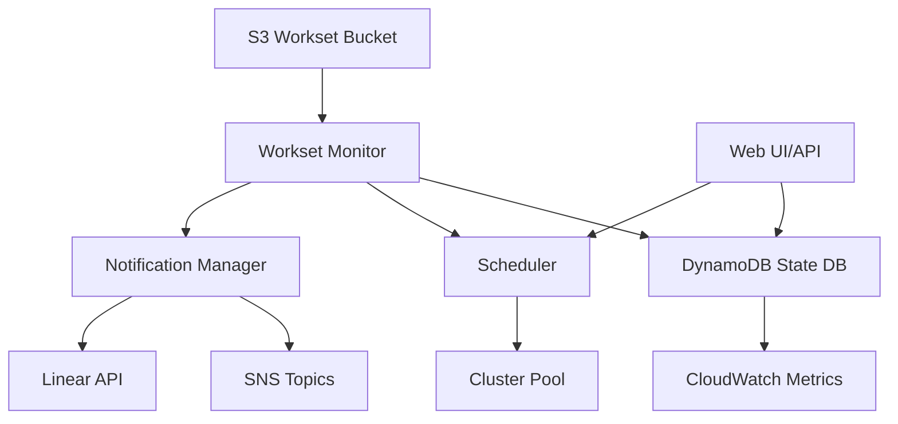

# Workset Monitor Enhancements

## 🎯 Overview

The enhanced workset monitoring system provides production-grade observability, scheduling, and management for Daylily worksets. It replaces the S3 sentinel file-based state management with a robust DynamoDB-backed system featuring distributed locking, priority queuing, multi-channel notifications, and a REST API.

## ✨ Key Features

- **DynamoDB State Management** - Atomic operations, queryable state, full audit trail
- **Distributed Locking** - Safe coordination across multiple monitor instances
- **Priority Queue** - Three-tier priority system (urgent, normal, low)
- **Smart Scheduling** - Cost-aware and resource-aware workset scheduling
- **Multi-Channel Notifications** - SNS and Linear API integration
- **REST API** - FastAPI-based web interface with OpenAPI docs
- **CloudWatch Integration** - Comprehensive metrics and monitoring
- **Comprehensive Testing** - 19 unit tests with mocked AWS services

## 📚 Documentation

- **[Quick Start Guide](./QUICKSTART_WORKSET_MONITOR.md)** - Get started in 5 minutes
- **[Full Documentation](./WORKSET_MONITOR_ENHANCEMENTS.md)** - Complete technical reference
- **[Implementation Summary](../IMPLEMENTATION_SUMMARY.md)** - Development overview

## 🚀 Quick Start

### 1. Install Dependencies

```bash
# Using conda (recommended)
conda activate DAY-EC
pip install -e .

# Or using pip
pip install -e .
```

### 2. Create DynamoDB Table

```python
from daylib.workset_state_db import WorksetStateDB

db = WorksetStateDB("daylily-worksets", "us-west-2")
db.create_table_if_not_exists()
```

### 3. Start the API

```bash
./bin/daylily-workset-api \
    --table-name daylily-worksets \
    --region us-west-2 \
    --port 8000 \
    --verbose
```

### 4. Access the API

- **API**: http://localhost:8000
- **Docs**: http://localhost:8000/docs
- **Health**: http://localhost:8000/

## 📦 Components

### Core Modules

| Module | Description | Lines |
|--------|-------------|-------|
| `daylib/workset_state_db.py` | DynamoDB state management | 400+ |
| `daylib/workset_notifications.py` | Multi-channel notifications | 300+ |
| `daylib/workset_scheduler.py` | Intelligent scheduling | 260+ |
| `daylib/workset_api.py` | FastAPI web interface | 260+ |

### CLI Tools

| Tool | Description |
|------|-------------|
| `bin/daylily-workset-api` | Launch web API server |

### Tests

| Test Suite | Tests | Coverage |
|------------|-------|----------|
| `tests/test_workset_state_db.py` | 10 | State management |
| `tests/test_workset_notifications.py` | 9 | Notifications |

**Total**: 19 tests, all passing ✅

## 🔧 Usage Examples

### Register a Workset

```python
from daylib.workset_state_db import WorksetStateDB, WorksetPriority

db = WorksetStateDB("daylily-worksets", "us-west-2")

db.register_workset(
    workset_id="ws-001",
    bucket="my-bucket",
    prefix="worksets/ws-001/",
    priority=WorksetPriority.URGENT,
    metadata={"samples": 10, "estimated_cost": 50.0},
)
```

### Acquire Lock and Process

```python
if db.acquire_lock("ws-001", owner_id="monitor-1"):
    # Process workset
    db.update_state(
        workset_id="ws-001",
        new_state=WorksetState.IN_PROGRESS,
        reason="Processing started",
    )
    
    # ... do work ...
    
    db.release_lock("ws-001", owner_id="monitor-1")
```

### Send Notifications

```python
from daylib.workset_notifications import (
    NotificationManager,
    SNSNotificationChannel,
    NotificationEvent,
)

manager = NotificationManager()
manager.add_channel(SNSNotificationChannel(
    topic_arn="arn:aws:sns:us-west-2:123:alerts",
    region="us-west-2",
))

manager.notify(NotificationEvent(
    workset_id="ws-001",
    event_type="error",
    state="error",
    message="Pipeline failed",
    priority="urgent",
))
```

### Use the REST API

```bash
# Register workset
curl -X POST http://localhost:8000/worksets \
  -H "Content-Type: application/json" \
  -d '{"workset_id": "ws-001", "bucket": "my-bucket", "prefix": "ws-001/"}'

# Get status
curl http://localhost:8000/worksets/ws-001

# Get queue stats
curl http://localhost:8000/queue/stats

# Get next workset
curl http://localhost:8000/worksets/next
```

## 🧪 Testing

```bash
# Run all tests
~/miniconda3/envs/DAY-EC/bin/python -m pytest tests/ -v

# Run specific test file
~/miniconda3/envs/DAY-EC/bin/python -m pytest tests/test_workset_state_db.py -v

# Run with coverage (requires pytest-cov)
~/miniconda3/envs/DAY-EC/bin/python -m pytest tests/ --cov=daylib --cov-report=html
```

## 📊 Architecture



## 🔐 IAM Permissions

Required AWS permissions:

- **DynamoDB**: PutItem, GetItem, UpdateItem, Query, Scan, CreateTable
- **SNS**: Publish
- **CloudWatch**: PutMetricData
- **S3**: GetObject, ListBucket (for workset data)

See [full documentation](./WORKSET_MONITOR_ENHANCEMENTS.md#iam-permissions) for complete IAM policy.

## 🚦 Status

- ✅ Core state management implemented
- ✅ Distributed locking working
- ✅ Priority queue functional
- ✅ Notifications integrated
- ✅ REST API operational
- ✅ Tests passing (19/19)
- ✅ Documentation complete
- ⏳ Production deployment pending
- ⏳ Web dashboard UI (future)

## 📈 Next Steps

1. **Deploy to Development** - Test with real worksets
2. **Integration Testing** - Verify with existing monitor
3. **Production Rollout** - Gradual migration from S3 sentinels
4. **Web Dashboard** - Build React/Vue frontend
5. **Additional Integrations** - Slack, PagerDuty, etc.

## 🤝 Contributing

See [CONTRIBUTING.md](../CONTRIBUTING.md) for development guidelines.

## 📝 License

MIT License - See [LICENSE](../LICENSE) for details.

## 🆘 Support

- **Issues**: https://github.com/Daylily-Informatics/daylily-ephemeral-cluster/issues
- **Documentation**: [docs/](.)
- **Email**: daylily@daylilyinformatics.com

