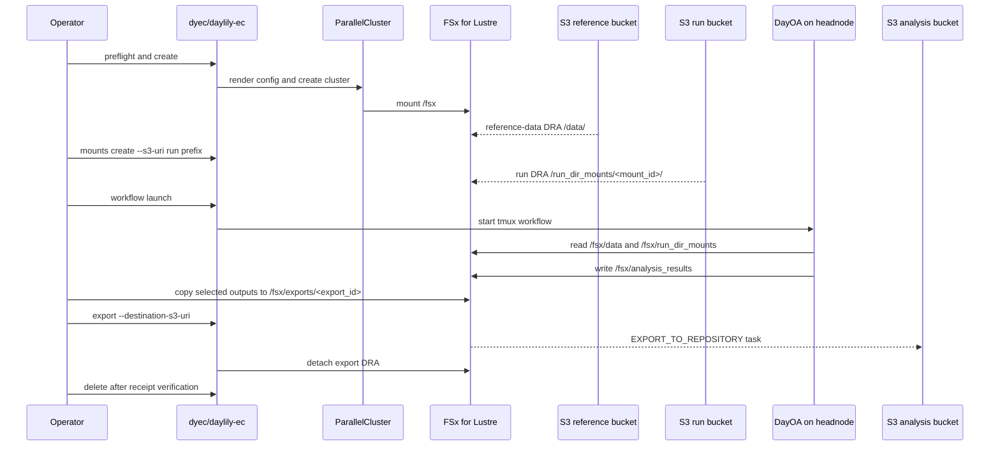
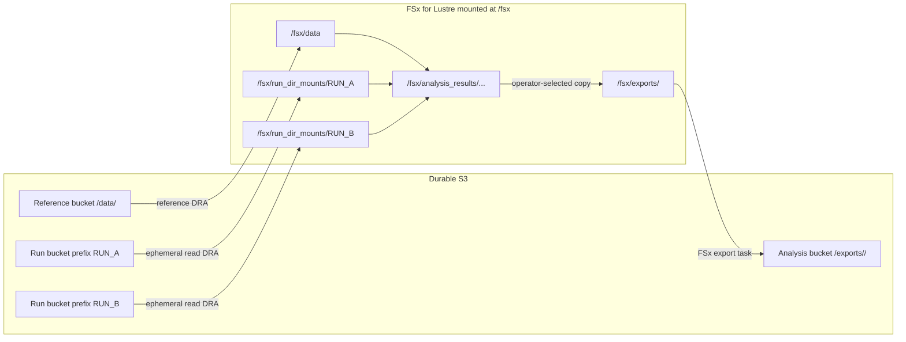
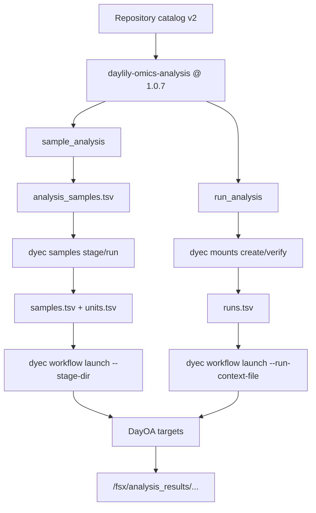

# DRA FSx Strategy

This is the current DayEC data-plane model. FSx for Lustre is the high-performance namespace attached to the cluster. S3 buckets remain the durable storage layer.

## Namespace Contract

| Purpose | Headnode path | FSx API path | S3 side | Lifecycle |
|---|---|---|---|---|
| Reference data | `/fsx/data/` | `/data/` | `<reference-bucket>/data/` | Created with the cluster |
| Run inputs | `/fsx/run_dir_mounts/<mount_id>/` | `/run_dir_mounts/<mount_id>/` | selected run prefix | Created and deleted on demand |
| Workflow outputs | `/fsx/analysis_results/...` | `/analysis_results/...` | none by default | Local to the FSx filesystem until exported |
| Export staging | `/fsx/exports/<export_id>/` | `/exports/<export_id>/` | selected analysis bucket/prefix | Temporary output DRA |

Run-directory DRAs are read-oriented by default. They configure AutoImport events and no AutoExport policy. Export DRAs are created only for selected output payloads and are detached after the FSx export task completes.

## Cluster And Run Lifecycle

## FSx And S3 Topology

## Pipeline Catalog Flow

`config/daylily_available_repositories.yaml` defines repositories and launch profiles. The DayOA repository and every DayOA command are pinned to `1.0.7`.

## Export Rule

Export is not automatic writeback from the run mount or reference mount. The supported export flow is:

1. choose the outputs under `/fsx/analysis_results/...`
2. copy them into `/fsx/exports/<export_id>/...`
3. run `dyec export --source-path /exports/<export_id>/... --destination-s3-uri s3://...`
4. keep `fsx_export.yaml`
5. delete the cluster only after the receipt shows `status: success` and `detached: true`
