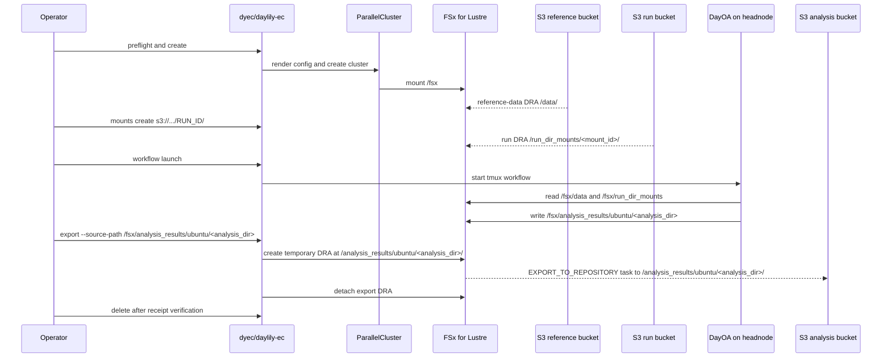
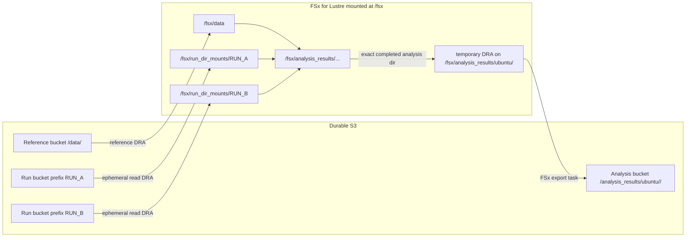
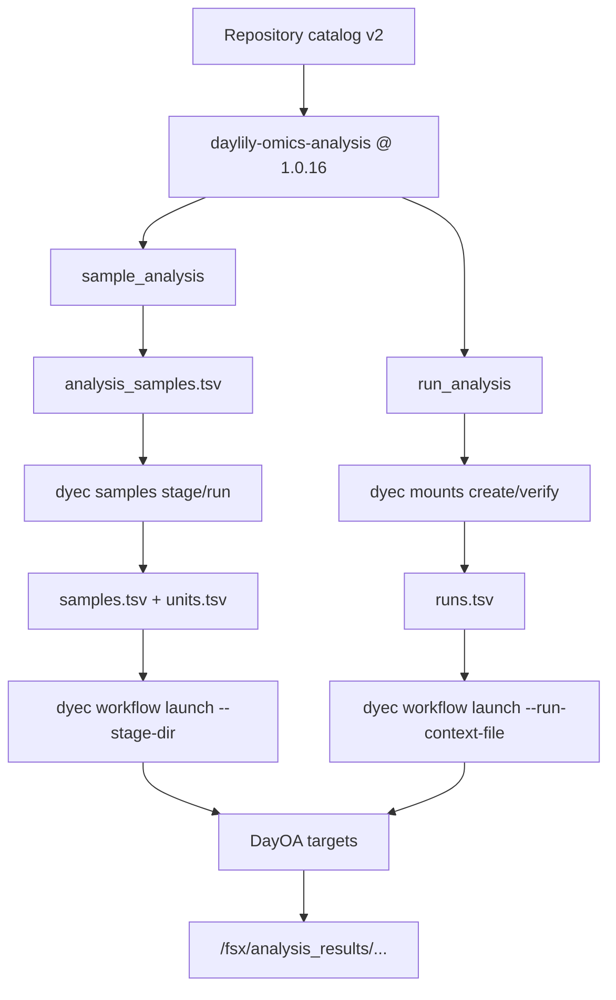

# DRA FSx Strategy

This is the current DayEC data-plane model. FSx for Lustre is the high-performance namespace attached to the cluster. S3 buckets remain the durable storage layer.

## Namespace Contract

| Purpose | Headnode path | FSx API path | S3 side | Lifecycle |
|---|---|---|---|---|
| Reference data | `/fsx/data/` | `/data/` | `<reference-bucket>/data/` | Created with the cluster |
| Run inputs | `/fsx/run_dir_mounts/<mount_id>/` | `/run_dir_mounts/<mount_id>/` | selected run prefix | Created and deleted on demand |
| Workflow outputs | `/fsx/analysis_results/...` | `/analysis_results/...` | none by default | Local to the FSx filesystem until exported |
| Direct analysis export | `/fsx/analysis_results/ubuntu/<analysis_dir>/` | `/analysis_results/ubuntu/<analysis_dir>/` | `s3://bucket/analysis_results/ubuntu/<analysis_dir>/` | Temporary output DRA |

Run-directory DRAs are read-oriented by default. They configure AutoImport events and no AutoExport policy. Export DRAs are created directly on one completed analysis directory, run one explicit FSx export task, and are detached after the task completes.

## Cluster And Run Lifecycle

## FSx And S3 Topology

## Pipeline Catalog Flow

`config/daylily_available_repositories.yaml` defines repositories and launch profiles. The DayOA repository and every DayOA command are pinned to `1.0.16`.

## Export Rule

Export is not automatic writeback from the run mount or reference mount. The supported export flow is:

1. choose one completed directory under `/fsx/analysis_results/ubuntu/<analysis_dir>`
2. run `dyec export --source-path /fsx/analysis_results/ubuntu/<analysis_dir> --destination-s3-uri s3://bucket/analysis_results/ubuntu/<analysis_dir>/`
3. keep `fsx_export.yaml`
4. delete the cluster only after the receipt shows `status: success`, `task_lifecycle: SUCCEEDED`, and `detached: true`

The bucket is always explicit. DayEC validates that the S3 key suffix matches the normalized source analysis directory and writes FSx task reports outside the exported prefix under `daylily-monitor/fsx-export/<analysis_dir>/...`.
