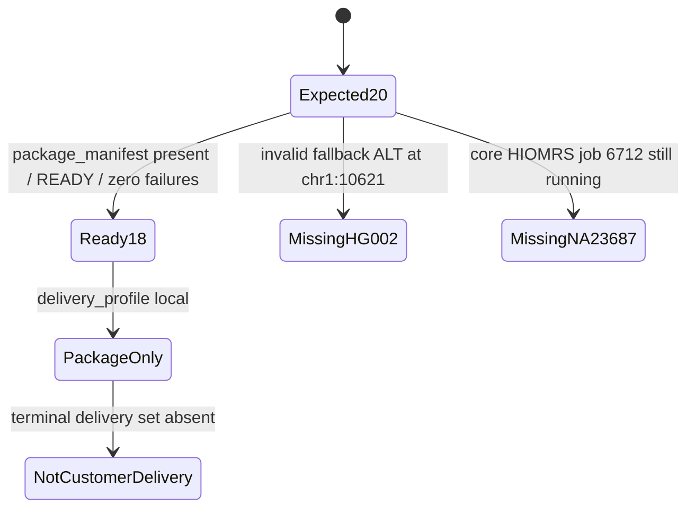
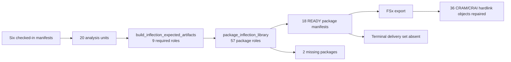
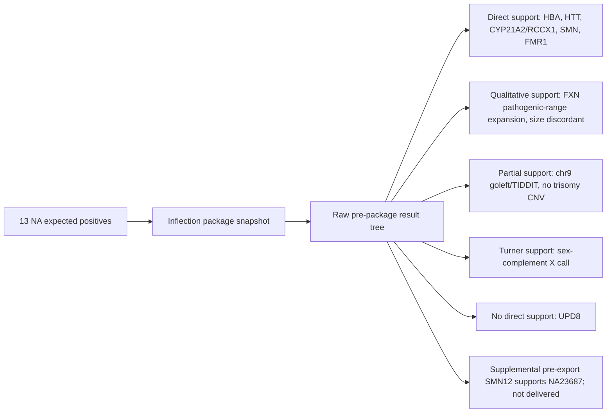
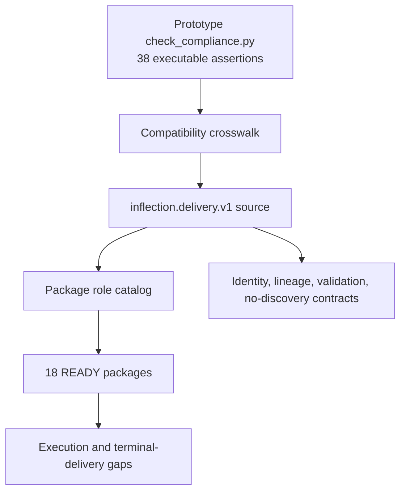

# Bjuice20 Inflection Deliverables Technical Report

Generated: `20260720T123613Z`

## Technical Summary

The Bjuice20 manifest universe defines **20 samples, 40 libraries, 80 sequencing inputs, and 20 HIOMRS analysis units**. The checked-in in-flight export receipt reports **18 per-analysis-unit Inflection packages present**, every listed package at `package_state=READY` with zero artifact failures. Two packages were not produced in the snapshot: `HG002` and `NA23687`.

This report treats `s3://lsmc-dayoa-analysis-results-usw2/validation/inflight_pr53_recovery_20260720T011608Z/ifx-p2-1000-120-0715/bjuiceprevalanalysis-complete/` as the primary package evidence boundary. The original local build could not refresh S3 through the default credential chain, but the NA call-support refresh used explicit `--profile lsmc --region us-west-2` access for bounded raw pre-package result files and delivered package call artifacts. Package presence, missing-package reasons, terminal-artifact absence, and export repair status still come from checked-in receipts. The NA call-support section now separates raw result evidence, delivered package evidence, and the supplemental successful pre-export raw SMN12 evidence used for `NA23687`.

The report does **not** claim customer-delivery readiness. The in-flight receipt explicitly says the delivery profile is `local`, package-only analytical artifacts were available, and final MultiQC/evidence/delivery-set artifacts were absent at snapshot start.

## Package Status

| sample | analysis_unit_uid | package_manifest_status | package_state | expected_package_artifact_roles | missing_reason |
| --- | --- | --- | --- | --- | --- |
| HG001 | BJUICEPREVAL-COMPLETE-HG001-HIOMRS | present | READY | 57 |  |
| HG002 | BJUICEPREVAL-COMPLETE-HG002-HIOMRS | missing | not_produced | 57 | No package manifest in the in-flight snapshot; package validation rejected invalid fallback ALT allele GGCGCAGGCGCAGAG. at chr1:10621 after LongReadSV phenotype handling and SR fallback completed. |
| HG003 | BJUICEPREVAL-COMPLETE-HG003-HIOMRS | present | READY | 57 |  |
| HG004 | BJUICEPREVAL-COMPLETE-HG004-HIOMRS | present | READY | 57 |  |
| HG005 | BJUICEPREVAL-COMPLETE-HG005-HIOMRS | present | READY | 57 |  |
| HG006 | BJUICEPREVAL-COMPLETE-HG006-HIOMRS | present | READY | 57 |  |
| HG007 | BJUICEPREVAL-COMPLETE-HG007-HIOMRS | present | READY | 57 |  |
| NA05067 | BJUICEPREVAL-COMPLETE-NA05067-HIOMRS | present | READY | 57 |  |
| NA10798 | BJUICEPREVAL-COMPLETE-NA10798-HIOMRS | present | READY | 57 |  |
| NA13189 | BJUICEPREVAL-COMPLETE-NA13189-HIOMRS | present | READY | 57 |  |
| NA14732 | BJUICEPREVAL-COMPLETE-NA14732-HIOMRS | present | READY | 57 |  |
| NA14733 | BJUICEPREVAL-COMPLETE-NA14733-HIOMRS | present | READY | 57 |  |
| NA15603 | BJUICEPREVAL-COMPLETE-NA15603-HIOMRS | present | READY | 57 |  |
| NA15848 | BJUICEPREVAL-COMPLETE-NA15848-HIOMRS | present | READY | 57 |  |
| NA15849 | BJUICEPREVAL-COMPLETE-NA15849-HIOMRS | present | READY | 57 |  |
| NA19235 | BJUICEPREVAL-COMPLETE-NA19235-HIOMRS | present | READY | 57 |  |
| NA20027 | BJUICEPREVAL-COMPLETE-NA20027-HIOMRS | present | READY | 57 |  |
| NA20230 | BJUICEPREVAL-COMPLETE-NA20230-HIOMRS | present | READY | 57 |  |
| NA20775 | BJUICEPREVAL-COMPLETE-NA20775-HIOMRS | present | READY | 57 |  |
| NA23687 | BJUICEPREVAL-COMPLETE-NA23687-HIOMRS | missing | not_produced | 57 | No package manifest in the in-flight snapshot; HIOMRS core job 6712 was still running and terminal gVCF/VCF plus package manifest were absent at snapshot start. |

## Expected Inflection Files Per Library

Each produced package is expected to carry **57 package artifact roles**. The source-level expected-artifact manifest declares **9 required analytical roles**, and `package_inflection_library` expands those into indexes, QC, package metrics, SegDup gene outputs, SMN evidence, short-read CRAM/CRAI, and package-compliance artifacts.

The full per-sample by per-role matrix is in `daylily-ephemeral-cluster/docs/plans/20260720T123613Z_bjuice20_inflection_deliverables_artifacts/expected_files_matrix.tsv`. For the 18 ready packages, the observed status in that matrix is `present_in_ready_manifest` because the checked-in package-availability receipt states each listed package was `READY` with zero failures. For `HG002` and `NA23687`, every expected role is marked `missing_package`.

| artifact_group | roles_per_package |
| --- | --- |
| alignment | 2 |
| cnv | 2 |
| evidence_qc | 5 |
| mitochondrial | 2 |
| repeat_expansion | 3 |
| segdup | 30 |
| small_variants | 2 |
| smn | 6 |
| sv | 5 |

## Missing Data And Runtime

`HG002` was blocked after LongReadSV phenotype handling and the separate short-read fallback path completed, because package validation rejected an invalid fallback ALT allele (`GGCGCAGGCGCAGAG.` at `chr1:10621`). `NA23687` was not terminal at snapshot start: HIOMRS core job `6712` was still running, and the terminal gVCF/VCF plus package manifest were absent.

Terminal delivery artifacts were absent at snapshot start:

- `DAY_final_multiqc.html`
- `DAY_final_multiqc_data/multiqc_data.json`
- `dayoa_evidence_manifest.json`
- `INFLECTION_delivery_set/delivery_set_manifest.json`

Runtime evidence is incomplete for the all-20 snapshot in this local checkout. The checked-in HG003 subset summary exists, but terminal controller timing and per-AU benchmark TSVs for the package snapshot were not refreshed as part of the NA raw/package call-support pass. The runtime table therefore records the evidence gap rather than computing unsupported wall or best-case values. See `daylily-ephemeral-cluster/docs/plans/20260720T123613Z_bjuice20_inflection_deliverables_artifacts/runtime_summary.tsv`.

## Truth And Coriell Expected Positives

The seven HG samples have GIAB truth/control paths in `samples.tsv`; package-level GIAB F-scores were not extracted in this refresh. For the 13 NA/Coriell samples, a bounded S3 call-support refresh inspected raw pre-package ExpansionHunter, SegDup YAML/VCF, SMN12, CNV, SV, goleft indexcov, sex-complement, and Peddy evidence where available; delivered package files were retained as cross-checks. The successful 2026-07-19 pre-export raw SMN12 file is used as supplemental `NA23687` call support, while the repaired in-flight package snapshot still records `NA23687` as not delivered.

Full call-support evidence is in `daylily-ephemeral-cluster/docs/plans/20260720T123613Z_bjuice20_inflection_deliverables_artifacts/na_truth_call_support.tsv` and `daylily-ephemeral-cluster/docs/plans/20260720T123613Z_bjuice20_inflection_deliverables_artifacts/na_truth_call_evidence.json`. Raw-result availability is summarized in `daylily-ephemeral-cluster/docs/plans/20260720T123613Z_bjuice20_inflection_deliverables_artifacts/na_prepackage_result_inventory.tsv`. Public expected-positive source URLs remain in `daylily-ephemeral-cluster/docs/plans/20260720T123613Z_bjuice20_inflection_deliverables_artifacts/coriell_expected_positives.tsv`.

| sample | support_status | supporting_call_evidence | interpretation |
| --- | --- | --- | --- |
| NA05067 | partial_support | CNV records=0 (successful_pre_export_raw); goleft chr9 mean=1.1281 median=1.07 windows=8442; LongReadSV large chr9 events=0; TIDDIT large chr9 events=80 (filters {'BelowExpectedLinks': 47, 'FewLinks': 4, 'PASS': 27, 'RegionalQ': 2}); examples: chr9:182185-65673763 INV 65491578bp BelowExpectedLinks; chr9:808734-132142623 INV 131333889bp BelowExpectedLinks; chr9:2279156-3813748 DUP:INV 1534592bp PASS | Raw pre-package data has chromosome 9 dosage/SV evidence, but it does not directly call the public trisomy 9 karyotype. |
| NA10798 | called | HBA copy numbers: non-duplication=1, a3.7=2, a4.2=2; non-duplication: Heterozygous deletion (CN=1, Non-duplicationregion) -alpha3.7: Normal copy number (CN=2) -alpha4.2: Normal copy number(CN=2) Clinical interpretation: Abnormal non-duplication CN=1 with unusualpattern - Requires manual review | Matches a heterozygous HBA-region deletion signal compatible with the expected --FIL/alpha alpha truth. |
| NA13189 | called | ExpansionHunter HTT HD_HTT: genotype=40/52, CI=40-40/50-63, max_allele=52, status=pathogenic_range; expected larger allele 50 CAG | Observed max allele 52 with CI including 50; directly supports the HTT CAG truth call. |
| NA14732 | called | RCCX1 copy numbers: CYP21A2=1, CYP21A1P=2, total_cyp21=3, functional_count=1, pseudo_count=2; module_count=3 | Matches heterozygous loss of functional CYP21A2 copy number. |
| NA14733 | called | RCCX1 copy numbers: CYP21A2=1, CYP21A1P=2, total_cyp21=3, functional_count=1, pseudo_count=2; module_count=3 | Matches heterozygous loss of functional CYP21A2 copy number. |
| NA15603 | outside_pipeline_scope_no_supporting_call | CNV records=0 (successful_pre_export_raw); raw ROH/UPD/BAF-matching objects=0; package metrics list standard CNV, SV, SegDup, SMN, repeat, SNV, mito roles but no ROH/UPD role. | No produced package evidence directly supports chromosome 8 uniparental isodisomy. |
| NA15848 | qualitative_support_size_discordant | ExpansionHunter FXN FRDA_FXN: genotype=8/89, CI=8-8/74-149, max_allele=89, status=pathogenic_range; expected about 830 GAA repeats | ExpansionHunter calls FXN in pathogenic range, supporting the expansion class but not the public absolute repeat size. |
| NA15849 | qualitative_support_size_discordant | ExpansionHunter FXN FRDA_FXN: genotype=8/81, CI=8-8/72-141, max_allele=81, status=pathogenic_range; expected about 920 GAA repeats | ExpansionHunter calls FXN in pathogenic range, supporting the expansion class but not the public absolute repeat size. |
| NA19235 | called | expected SMN1/SMN2=4/0; raw SMN12=4/0 (successful_pre_export_raw); SMNCopyNumberCaller=4/0; Sentieon=4/0; overall_concordance=CONCORDANT; status=CALLED | Matches the expected public SMN1/SMN2 copy-number truth. |
| NA20027 | called_raw_qc_support | CNV records=0 (successful_pre_export_raw); LongReadSV large chrX/Y events=0; TIDDIT large chrX/Y events=4 (types {'INV': 4}); sex_complement=X, x_copy_state=1, y_copy_state=0, indexcov_cn_x=0.94, indexcov_cn_y=0.03; peddy ped_sex=unknown, predicted_sex=male, error=True, het_ratio=0 | Raw sex-complement QC supports X monosomy / 45,X Turner syndrome at the chromosome-complement level. |
| NA20230 | called | ExpansionHunter FMR1 FXS_FMR1: genotype=55, CI=50-73, max_allele=55, status=intermediate_or_uncertain; expected 53 CGG repeats | Observed max allele 55 with CI including 53; directly supports the FMR1 intermediate-repeat truth call. |
| NA20775 | called_primary_smn_discordant | expected SMN1/SMN2=3/1; raw SMN12=3/1 (successful_pre_export_raw); SMNCopyNumberCaller=3/1; Sentieon=3/2; overall_concordance=DISCORDANT; status=CALLED | SMNCopyNumberCaller matches the expected public SMN1/SMN2 truth, but Sentieon disagrees on SMN2. |
| NA23687 | called_supplemental_prepackage_not_delivered | Repaired in-flight package manifest absent; successful_pre_export_raw SMN12=1/2, isCarrier=True, Info=PASS:Majority. | Supports the expected SMA carrier SMN1/SMN2=1/2 truth in supplemental raw pre-package data, but not in the delivered package snapshot. |

The machine-readable GIAB/Coriell truth-status table is `daylily-ephemeral-cluster/docs/plans/20260720T123613Z_bjuice20_inflection_deliverables_artifacts/truth_fscore_status.tsv`.

## Gap Analysis Against The Original Functionality

| area | classification | evidence | source |
| --- | --- | --- | --- |
| Package identity and source lineage | verified/no gap | Prototype regex/discovery identity was replaced by explicit six-manifest identity and package IDs. | daylily-omics-analysis/docs/plans/20260717T000232Z_inflection_prototype_compatibility_crosswalk.md |
| Core expected-artifact declaration | verified/no gap | Source declares nine required expected-artifact roles and package rule consumes exact workflow inputs. | daylily-omics-analysis/daylily_omics_analysis/expected_artifacts.py |
| Package artifact expansion | verified/no gap | Package runbook describes 57 artifact rows per package; source/test evidence covers QC, indexes, SegDup genes, SMN, CRAM/CRAI, and package compliance roles. | daylily-ephemeral-cluster/docs/plans/20260719T211558Z_inflection_package_export_runbook.md |
| Produced bjuice20 packages | execution/data gap | 18 of 20 package manifests were present and READY; HG002 and NA23687 were not available in the snapshot. | daylily-ephemeral-cluster/docs/plans/20260720T011608Z_bjuice20_inflight_fsx_export/inflection_packages_available.md |
| Terminal Inflection delivery set | terminal-delivery gap | Final MultiQC, MultiQC data, evidence manifest, and delivery-set manifest were absent at snapshot start. | daylily-ephemeral-cluster/docs/plans/20260720T011608Z_bjuice20_inflight_fsx_export/inflection_packages_available.md |
| FSx to S3 export | packaging/export gap repaired | Initial export missed 36 hardlinked CRAM/CRAI package objects; manual repair copied and validated all 36 with zero failures. | daylily-ephemeral-cluster/docs/plans/20260720T011608Z_bjuice20_inflight_fsx_export/manual_copy_20260720T023359Z/manual_copy_completion.md |
| Live S3 raw/package call refresh for this report | partial evidence refresh | Default credentials were unavailable during the original build, but the NA call-support refresh used explicit --profile lsmc S3 access for bounded raw pre-package result files, delivered package call files, and the supplemental successful pre-export raw SMN12 evidence. Runtime, GIAB F-scores, and terminal delivery artifacts remain unrefreshed. | daylily-ephemeral-cluster/docs/plans/20260720T123613Z_bjuice20_inflection_deliverables_artifacts/na_truth_call_support.tsv |

The important distinction is that source capability and package construction are mostly verified by the checked-in DayOA source, tests, and crosswalk. The remaining gaps are execution/data availability (`HG002`, `NA23687` as delivered packages), terminal delivery artifacts, runtime/GIAB F-score extraction, and package-manifest refresh beyond the bounded NA raw/package call-support evidence.

## Methods And Sources

Inputs reviewed:

- `daylily-ephemeral-cluster/docs/plans/20260719T133324Z_majors_bjuiceprevalanalysis_complete_artifacts/manifests/samples.tsv`, `daylily-ephemeral-cluster/docs/plans/20260719T133324Z_majors_bjuiceprevalanalysis_complete_artifacts/manifests/libraries.tsv`, `daylily-ephemeral-cluster/docs/plans/20260719T133324Z_majors_bjuiceprevalanalysis_complete_artifacts/manifests/analysis_units.tsv`, and sibling manifest TSVs.
- `daylily-ephemeral-cluster/docs/plans/20260720T011608Z_bjuice20_inflight_fsx_export/inflection_packages_available.md`.
- `daylily-ephemeral-cluster/docs/plans/20260720T011608Z_bjuice20_inflight_fsx_export/manual_copy_20260720T023359Z/manual_copy_completion.md`.
- `daylily-ephemeral-cluster/docs/plans/20260719T211558Z_inflection_package_export_runbook.md`.
- `daylily-omics-analysis/docs/plans/20260717T000232Z_inflection_prototype_compatibility_crosswalk.md`.
- `daylily-omics-analysis/docs/plans/20260719T205542Z_inflection_producer_source_merge_ledger.md`.
- `daylily-omics-analysis/daylily_omics_analysis/expected_artifacts.py`.
- `daylily-omics-analysis/workflow/rules/inflection_delivery.smk`.
- Bounded S3 raw pre-package result files and package call artifacts under the `inflight_pr53_recovery_20260720T011608Z` snapshot, read with `--profile lsmc --region us-west-2` for the NA call-support refresh.
- Supplemental raw SMN12 evidence under `s3://lsmc-dayoa-analysis-results-usw2/validation/pre_13.0.11_8_g1d44044_20260719T214703Z/ifx-p2-1000-120-0715/bjuiceprevalanalysis-complete/daylily-omics-analysis/results/day/hg38`, used only to record `NA23687` biological call support while preserving its missing delivered-package status.

Generated artifacts:

- `daylily-ephemeral-cluster/docs/plans/20260720T123613Z_bjuice20_inflection_deliverables_artifacts/package_inventory.tsv`
- `daylily-ephemeral-cluster/docs/plans/20260720T123613Z_bjuice20_inflection_deliverables_artifacts/expected_files_matrix.tsv`
- `daylily-ephemeral-cluster/docs/plans/20260720T123613Z_bjuice20_inflection_deliverables_artifacts/package_role_catalog.tsv`
- `daylily-ephemeral-cluster/docs/plans/20260720T123613Z_bjuice20_inflection_deliverables_artifacts/expected_artifact_role_catalog.tsv`
- `daylily-ephemeral-cluster/docs/plans/20260720T123613Z_bjuice20_inflection_deliverables_artifacts/coriell_expected_positives.tsv`
- `daylily-ephemeral-cluster/docs/plans/20260720T123613Z_bjuice20_inflection_deliverables_artifacts/truth_fscore_status.tsv`
- `daylily-ephemeral-cluster/docs/plans/20260720T123613Z_bjuice20_inflection_deliverables_artifacts/runtime_summary.tsv`
- `daylily-ephemeral-cluster/docs/plans/20260720T123613Z_bjuice20_inflection_deliverables_artifacts/gap_analysis.tsv`
- `daylily-ephemeral-cluster/docs/plans/20260720T123613Z_bjuice20_inflection_deliverables_artifacts/na_truth_call_support.tsv`
- `daylily-ephemeral-cluster/docs/plans/20260720T123613Z_bjuice20_inflection_deliverables_artifacts/na_truth_call_evidence.json`
- `daylily-ephemeral-cluster/docs/plans/20260720T123613Z_bjuice20_inflection_deliverables_artifacts/na_prepackage_result_inventory.tsv`
- `daylily-ephemeral-cluster/docs/plans/20260720T123613Z_bjuice20_inflection_deliverables_artifacts/na_truth_call_support_flow.mmd`
- `daylily-ephemeral-cluster/docs/plans/20260720T123613Z_bjuice20_inflection_deliverables_artifacts/investigate_na_truth_calls.py`
- `daylily-ephemeral-cluster/docs/plans/20260720T123613Z_bjuice20_inflection_deliverables_artifacts/report_summary.json`
- `daylily-ephemeral-cluster/docs/plans/20260720T123613Z_bjuice20_inflection_deliverables_artifacts/package_status_state.mmd`
- `daylily-ephemeral-cluster/docs/plans/20260720T123613Z_bjuice20_inflection_deliverables_artifacts/manifest_to_package_flow.mmd`
- `daylily-ephemeral-cluster/docs/plans/20260720T123613Z_bjuice20_inflection_deliverables_artifacts/gap_analysis_flow.mmd`

## Recommended Next Steps

1. Re-run the package-manifest, benchmark, and GIAB concordance extraction from S3 or FSx when terminal evidence is available.
2. Refresh this report with actual per-AU benchmark totals, wall-clock controller timing, and GIAB F-scores.
3. Run a terminal export after controller `rc=0` and final MultiQC/evidence/delivery-set artifacts exist, then add a dated terminal-delivery section rather than overwriting the in-flight snapshot truth.
