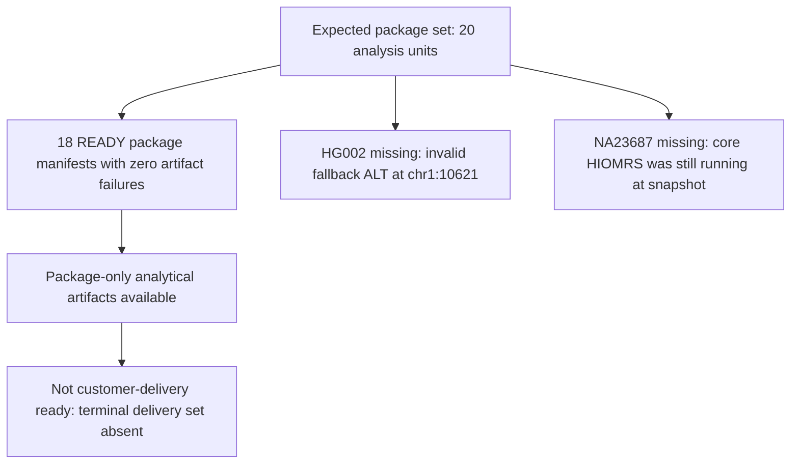
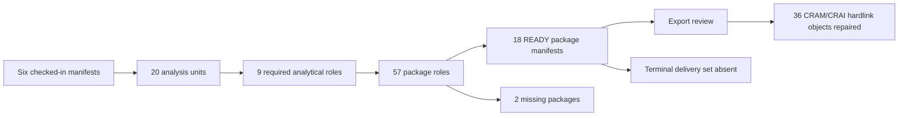
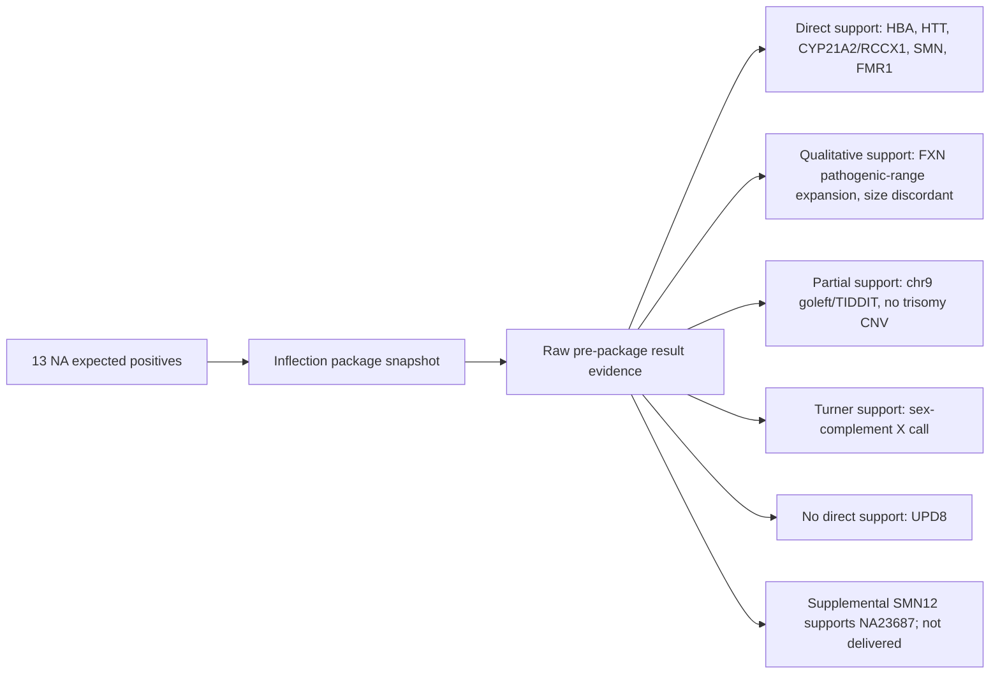
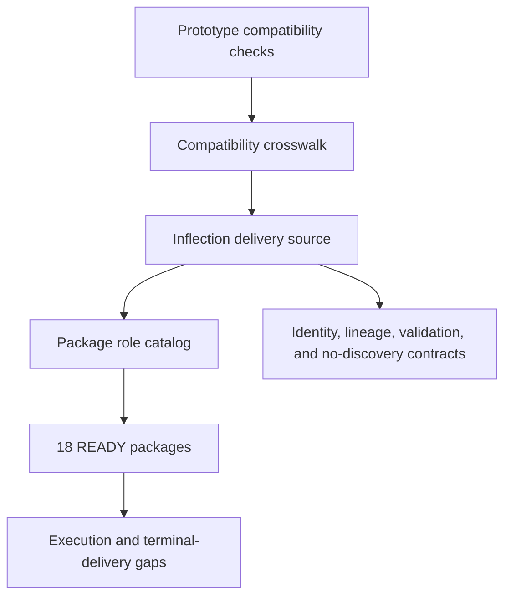

# Bjuice20 Inflection Deliverables Technical Report

Generated: `20260720T123613Z`

## Technical Summary

The Bjuice20 manifest universe defines **20 samples, 40 libraries, 80 sequencing inputs, and 20 HIOMRS analysis units**. The in-flight package receipt reports **18 per-analysis-unit Inflection packages present**, every listed package at `package_state=READY` with zero artifact failures. Two packages were not produced in the snapshot: `HG002` and `NA23687`.

Package presence, missing-package reasons, terminal-artifact absence, and export repair status come from the in-flight package receipt. The NA/Coriell call-support review separates raw result evidence, delivered package evidence, and supplemental pre-package SMN12 evidence used for `NA23687`.

This report does **not** claim customer-delivery readiness. The receipt says the delivery profile was package-only analytical output, and final MultiQC/evidence/delivery-set artifacts were absent at snapshot start.

## Package Status

| sample | analysis_unit_uid | package_manifest_status | package_state | expected_package_artifact_roles | missing_reason |
| --- | --- | --- | --- | --- | --- |
| HG001 | BJUICEPREVAL-COMPLETE-HG001-HIOMRS | present | READY | 57 |  |
| HG002 | BJUICEPREVAL-COMPLETE-HG002-HIOMRS | missing | not_produced | 57 | No package manifest in the in-flight snapshot; package validation rejected invalid fallback ALT allele `GGCGCAGGCGCAGAG.` at `chr1:10621` after LongReadSV phenotype handling and short-read fallback completed. |
| HG003 | BJUICEPREVAL-COMPLETE-HG003-HIOMRS | present | READY | 57 |  |
| HG004 | BJUICEPREVAL-COMPLETE-HG004-HIOMRS | present | READY | 57 |  |
| HG005 | BJUICEPREVAL-COMPLETE-HG005-HIOMRS | present | READY | 57 |  |
| HG006 | BJUICEPREVAL-COMPLETE-HG006-HIOMRS | present | READY | 57 |  |
| HG007 | BJUICEPREVAL-COMPLETE-HG007-HIOMRS | present | READY | 57 |  |
| NA05067 | BJUICEPREVAL-COMPLETE-NA05067-HIOMRS | present | READY | 57 |  |
| NA10798 | BJUICEPREVAL-COMPLETE-NA10798-HIOMRS | present | READY | 57 |  |
| NA13189 | BJUICEPREVAL-COMPLETE-NA13189-HIOMRS | present | READY | 57 |  |
| NA14732 | BJUICEPREVAL-COMPLETE-NA14732-HIOMRS | present | READY | 57 |  |
| NA14733 | BJUICEPREVAL-COMPLETE-NA14733-HIOMRS | present | READY | 57 |  |
| NA15603 | BJUICEPREVAL-COMPLETE-NA15603-HIOMRS | present | READY | 57 |  |
| NA15848 | BJUICEPREVAL-COMPLETE-NA15848-HIOMRS | present | READY | 57 |  |
| NA15849 | BJUICEPREVAL-COMPLETE-NA15849-HIOMRS | present | READY | 57 |  |
| NA19235 | BJUICEPREVAL-COMPLETE-NA19235-HIOMRS | present | READY | 57 |  |
| NA20027 | BJUICEPREVAL-COMPLETE-NA20027-HIOMRS | present | READY | 57 |  |
| NA20230 | BJUICEPREVAL-COMPLETE-NA20230-HIOMRS | present | READY | 57 |  |
| NA20775 | BJUICEPREVAL-COMPLETE-NA20775-HIOMRS | present | READY | 57 |  |
| NA23687 | BJUICEPREVAL-COMPLETE-NA23687-HIOMRS | missing | not_produced | 57 | No package manifest in the in-flight snapshot; HIOMRS core execution was still running and the terminal gVCF/VCF plus package manifest were absent. |

## Expected Inflection Files Per Library

Each produced package is expected to carry **57 package artifact roles**. The source-level expected-artifact manifest declares **9 required analytical roles**, and `package_inflection_library` expands those into indexes, QC, package metrics, SegDup gene outputs, SMN evidence, short-read CRAM/CRAI, and package-compliance artifacts.

For the 18 ready packages, the observed status in the expected-file matrix is `present_in_ready_manifest` because each listed package was `READY` with zero failures. For `HG002` and `NA23687`, every expected role is marked `missing_package`.

| artifact_group | roles_per_package |
| --- | --- |
| alignment | 2 |
| cnv | 2 |
| evidence_qc | 5 |
| mitochondrial | 2 |
| repeat_expansion | 3 |
| segdup | 30 |
| small_variants | 2 |
| smn | 6 |
| sv | 5 |

## Missing Data

`HG002` was blocked after LongReadSV phenotype handling and the separate short-read fallback path completed, because package validation rejected an invalid fallback ALT allele (`GGCGCAGGCGCAGAG.` at `chr1:10621`).

`NA23687` was not terminal at snapshot start. HIOMRS core execution was still running, and the terminal gVCF/VCF plus package manifest were absent.

Terminal delivery artifacts were absent at snapshot start:

- `DAY_final_multiqc.html`
- `DAY_final_multiqc_data/multiqc_data.json`
- `dayoa_evidence_manifest.json`
- `INFLECTION_delivery_set/delivery_set_manifest.json`

## Truth And Coriell Expected Positives

The seven HG samples have GIAB truth/control paths in `samples.tsv`; package-level GIAB F-scores were not extracted in this refresh. For the 13 NA/Coriell samples, the call-support review inspected raw pre-package ExpansionHunter, SegDup YAML/VCF, SMN12, CNV, SV, goleft indexcov, sex-complement, and Peddy evidence where available; delivered package files were retained as cross-checks. Supplemental pre-export raw SMN12 evidence supports the `NA23687` biological call, while the package snapshot still records `NA23687` as not delivered.

| sample | support_status | supporting_call_evidence | interpretation |
| --- | --- | --- | --- |
| NA05067 | partial_support | CNV records=0; goleft chr9 mean=1.1281, median=1.07, windows=8442; LongReadSV large chr9 events=0; TIDDIT large chr9 events=80. | Raw pre-package data has chromosome 9 dosage/SV evidence, but it does not directly call the public trisomy 9 karyotype. |
| NA10798 | called | HBA copy numbers: non-duplication=1, a3.7=2, a4.2=2; HBA interpretation indicates heterozygous deletion with manual review. | Matches a heterozygous HBA-region deletion signal compatible with the expected Filipino alpha-thalassemia deletion truth. |
| NA13189 | called | ExpansionHunter HTT `HD_HTT`: genotype=40/52, CI=40-40/50-63, max_allele=52, status=pathogenic_range; expected larger allele 50 CAG. | Observed max allele 52 with CI including 50; directly supports the HTT CAG truth call. |
| NA14732 | called | RCCX1 copy numbers: CYP21A2=1, CYP21A1P=2, total_cyp21=3, functional_count=1, pseudo_count=2; module_count=3. | Matches heterozygous loss of functional CYP21A2 copy number. |
| NA14733 | called | RCCX1 copy numbers: CYP21A2=1, CYP21A1P=2, total_cyp21=3, functional_count=1, pseudo_count=2; module_count=3. | Matches heterozygous loss of functional CYP21A2 copy number. |
| NA15603 | outside_pipeline_scope_no_supporting_call | CNV records=0; raw ROH/UPD/BAF-matching objects=0; package metrics include standard CNV, SV, SegDup, SMN, repeat, SNV, and mitochondrial roles but no ROH/UPD role. | No produced package evidence directly supports chromosome 8 uniparental isodisomy. |
| NA15848 | qualitative_support_size_discordant | ExpansionHunter FXN `FRDA_FXN`: genotype=8/89, CI=8-8/74-149, max_allele=89, status=pathogenic_range; expected about 830 GAA repeats. | ExpansionHunter calls FXN in pathogenic range, supporting the expansion class but not the public absolute repeat size. |
| NA15849 | qualitative_support_size_discordant | ExpansionHunter FXN `FRDA_FXN`: genotype=8/81, CI=8-8/72-141, max_allele=81, status=pathogenic_range; expected about 920 GAA repeats. | ExpansionHunter calls FXN in pathogenic range, supporting the expansion class but not the public absolute repeat size. |
| NA19235 | called | Expected SMN1/SMN2=4/0; raw SMN12=4/0; SMNCopyNumberCaller=4/0; Sentieon=4/0; overall_concordance=CONCORDANT. | Matches the expected public SMN1/SMN2 copy-number truth. |
| NA20027 | called_raw_qc_support | CNV records=0; LongReadSV large chrX/Y events=0; TIDDIT large chrX/Y events=4; sex_complement=X, x_copy_state=1, y_copy_state=0, indexcov_cn_x=0.94, indexcov_cn_y=0.03. | Raw sex-complement QC supports X monosomy / 45,X Turner syndrome at the chromosome-complement level. |
| NA20230 | called | ExpansionHunter FMR1 `FXS_FMR1`: genotype=55, CI=50-73, max_allele=55, status=intermediate_or_uncertain; expected 53 CGG repeats. | Observed max allele 55 with CI including 53; directly supports the FMR1 intermediate-repeat truth call. |
| NA20775 | called_primary_smn_discordant | Expected SMN1/SMN2=3/1; raw SMN12=3/1; SMNCopyNumberCaller=3/1; Sentieon=3/2; overall_concordance=DISCORDANT. | SMNCopyNumberCaller matches the expected public SMN1/SMN2 truth, but Sentieon disagrees on SMN2. |
| NA23687 | called_supplemental_prepackage_not_delivered | Package manifest absent; supplemental pre-package raw SMN12=1/2, isCarrier=True, Info=PASS:Majority. | Supports the expected SMA carrier SMN1/SMN2=1/2 truth in supplemental raw pre-package data, but not in the delivered package snapshot. |

## Gap Analysis Against The Original Functionality

| area | classification | evidence |
| --- | --- | --- |
| Package identity and source lineage | verified/no gap | Prototype regex/discovery identity was replaced by explicit six-manifest identity and package IDs. |
| Core expected-artifact declaration | verified/no gap | Source declares nine required expected-artifact roles and package rule consumes exact workflow inputs. |
| Package artifact expansion | verified/no gap | Package construction expands to 57 artifact rows per package, covering QC, indexes, SegDup genes, SMN, CRAM/CRAI, and package-compliance roles. |
| Produced bjuice20 packages | execution/data gap | 18 of 20 package manifests were present and READY; `HG002` and `NA23687` were not available in the package snapshot. |
| Terminal Inflection delivery set | terminal-delivery gap | Final MultiQC, MultiQC data, evidence manifest, and delivery-set manifest were absent at snapshot start. |
| Export repair | packaging/export gap repaired | Initial export review found 36 missing hardlinked CRAM/CRAI package objects; manual repair copied and validated all 36 with zero failures. |
| Raw/package call refresh | partial evidence refresh | The call-support review included bounded raw pre-package result files, delivered package call files, and supplemental pre-export raw SMN12 evidence for `NA23687`. Runtime, GIAB F-scores, and terminal delivery artifacts remain unrefreshed. |

The important distinction is that source capability and package construction are mostly verified by the source, tests, and crosswalk. The remaining gaps are execution/data availability (`HG002`, `NA23687` as delivered packages), terminal delivery artifacts, runtime/GIAB F-score extraction, and package-manifest refresh beyond the bounded NA raw/package call-support evidence.

## Next Steps

- Release the data tonight for verification of loading compatibility.
