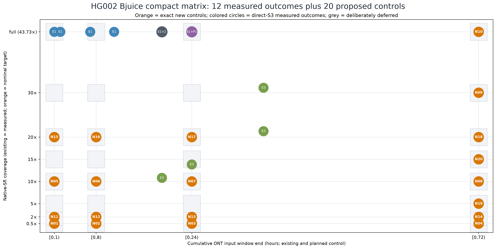

# HG002 Bjuice compact native-SR × cumulative-ONT AU matrix proposal

UTC opened: 2026-08-18T11:12:10Z

State: CONFIGURATION PREPARED — this document and the linked configuration do
not authorize a workflow, cluster, Slurm, DRA, S3, source-data, or budget
mutation.

## Recommendation

Replace the original 81-cell full-factorial suggestion with one **20-AU Bjuice
HG002 custom matrix run**, while retaining **all 12 existing E1/E3/P1
observations** as the measured evidence layer. The complete proposed matrix is
therefore 20 new AUs plus 12 existing outcomes. The existing observations are
not rerun or relabelled.

This is deliberately sparse, not a claim of a completed response surface. It
fully crosses 0.5×, 2×, 10×, and 20× native-SR targets against four cumulative
ONT-input windows, then adds a long-LR SR ladder at 5×, 15×, 30×, and full
(43.73×) native SR.

## Compact planning figure and data

- [Exact proposed control cells](20260818T111210Z_hg002_bjuice_expanded_au_matrix_proposal_assets/compact_new_au_cells.tsv)
- [All 12 current observations reused in the figure](20260818T111210Z_hg002_bjuice_expanded_au_matrix_proposal_assets/current_observation_reuse.tsv)
- [Prepared 20-AU catalog execution configuration](20260818T111210Z_hg002_bjuice_expanded_au_matrix_proposal_assets/bjuice_hg002_20new_execution_config/README.md)

Colored existing circles use direct-S3 native-SR Mosdepth values and their
source-manifest ONT input end hours. Orange circles use exact proposed input
controls. No planned ONT time window is converted into a claimed achieved LR
coverage, and no intended Illumina fraction is substituted for a measured
native-SR coverage.

## Twenty new controlled AUs

All ONT windows are half-open cumulative input intervals beginning at zero.
`full` means the direct Illumina source, measured at 43.73× native SR. The
fractional controls use that 43.73× terminal direct-coverage denominator; the
completed AUs must retain measured native-SR and LR Mosdepth values.

The planned ONT values are nominal design strata, not claims of achieved LR
Mosdepth coverage. At execution the exact `[start,end)` interval selects the
input; actual LR coverage is measured after completion.

| New AU | Nominal ILMN target | Illumina fraction | Nominal ONT stratum | ONT window | Reason |
| --- | ---: | ---: | ---: | --- | --- |
| N01 | 0.5× | 0.011433798 | 0.5× | [0,1) | Low-SR / low-LR corner |
| N02 | 0.5× | 0.011433798 | 4× | [0,8) | Low-SR short-LR edge |
| N03 | 0.5× | 0.011433798 | 12× | [0,24) | Low-SR 24-hour comparator |
| N04 | 0.5× | 0.011433798 | 30× | [0,72) | Low-SR / maximal requested-LR corner |
| N05 | 10× | 0.228675966 | 0.5× | [0,1) | Controlled mid-SR / low-LR anchor |
| N06 | 10× | 0.228675966 | 4× | [0,8) | Controlled mid-SR short-LR anchor |
| N07 | 10× | 0.228675966 | 12× | [0,24) | Controlled mid-SR 24-hour anchor |
| N08 | 10× | 0.228675966 | 30× | [0,72) | Controlled mid-SR / long-LR anchor |
| N09 | 30× | 0.686027898 | 30× | [0,72) | High-SR / long-LR anchor |
| N10 | full (43.73×) | 1.000000000 | 30× | [0,72) | Full-input endpoint |
| N11 | 2× | 0.045735193 | 0.5× | [0,1) | Low/mid-SR low-LR cross |
| N12 | 2× | 0.045735193 | 4× | [0,8) | Low/mid-SR short-LR cross |
| N13 | 2× | 0.045735193 | 12× | [0,24) | Low/mid-SR 24-hour cross |
| N14 | 2× | 0.045735193 | 30× | [0,72) | Low/mid-SR long-LR cross |
| N15 | 20× | 0.457351932 | 0.5× | [0,1) | Upper-mid-SR / low-LR cross |
| N16 | 20× | 0.457351932 | 4× | [0,8) | Upper-mid-SR / short-LR cross |
| N17 | 20× | 0.457351932 | 12× | [0,24) | Upper-mid-SR / 24-hour cross |
| N18 | 20× | 0.457351932 | 30× | [0,72) | Upper-mid-SR / long-LR cross |
| N19 | 5× | 0.114337983 | 30× | [0,72) | Long-LR SR-ladder low point |
| N20 | 15× | 0.343013949 | 30× | [0,72) | Long-LR SR-ladder middle point |

The 61 unselected cells are intentionally deferred. This 20-AU matrix
preserves both requested extremes: 0.5× ILMN × `[0,1)` ONT and full ILMN ×
`[0,72)` ONT.

## Existing evidence reused, without relabelling it

| Existing set | Outcomes reused | What it contributes | Important boundary |
| --- | ---: | --- | --- |
| E1 | 7 | Full native-SR (43.73×) LR ramp at [0,1), [0,2), [0,7), [0,11), [0,19) twice, and [0,24) | Its intended Illumina fractions are not achieved SR targets: every direct-S3 native-SR measurement is 43.73×. |
| E3 | 4 | Measured mid/high-SR anchors: 10.81×/9.67× LR at [0,19), 13.83×/11.43× LR at [0,24), and 21.33× plus 31.12×/14.71× LR at [0,36) | These are measured outcomes, not substitutes for exact planned controls. |
| P1 | 1 | Independent full-SR / [0,24) outcome at 43.73× native SR and 11.43× LR | Co-locates with E1's 43.73×/11.43× point and is retained as an independent outcome. |

The E1 analysis-unit names include values such as `p5xp5` and `10x5`, but
their measured native-SR outcomes form a valuable full-SR LR ramp, not valid
low- or mid-SR downsampling rows. The new AUs supply that missing control.

## Configuration and acceptance contract

1. The execution capsule selects the current catalog command
   `bjuice-v2-hg002-custom-multi-analysis-unit-hiomr2-kitchensink-mega`, which
   currently pins the released DayOA maximum, `15.0.24`.
2. It uses the terminal direct Illumina denominator of 43.73× and an explicit
   `dyec.bjuice_v2_hg002_custom_au_plan.v1` with all twenty rows.
3. DYEC's supported manifest generator creates the six-manifest input set;
   the catalog controller materializes it inside its clone. No controller
   config is kept under `/home/ubuntu`.
4. Confirm the actual source has all `[0,72)` ONT chunks before render. The
   interval is input time, never an assertion of 72× LR coverage.
5. Retain native-SR, RSR-audit, and LR Mosdepth summaries plus the generated
   manifests and custom plan in the exported analysis clone.
6. Accept a new cell only when its exported clone permits independent reading
   of all three coverage summaries. Plot measured native-SR/LR, never the
   requested controls, as performance coordinates.

## Execution boundary

The configuration is prepared but no render, dry run, workflow, Slurm, DRA,
or export has been started. Separate authorization must name the cluster,
project/cost center, concurrency, and export policy.
