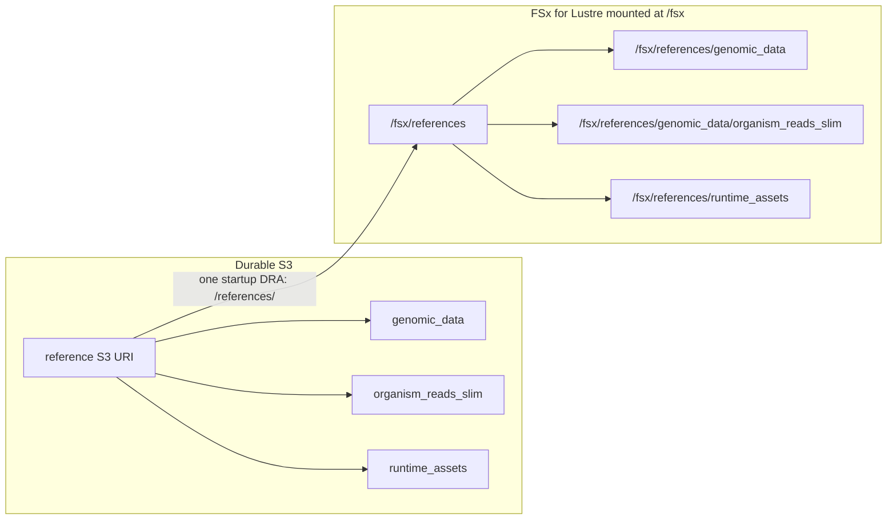
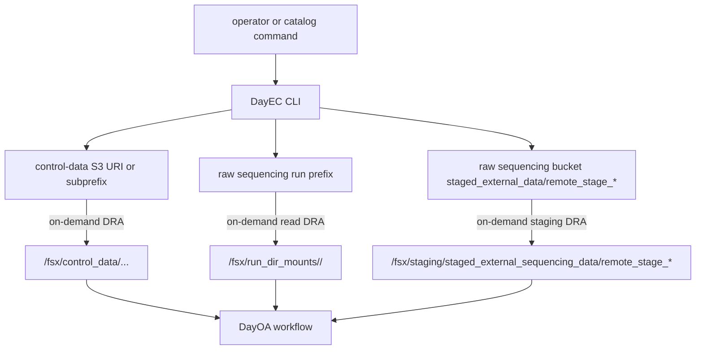
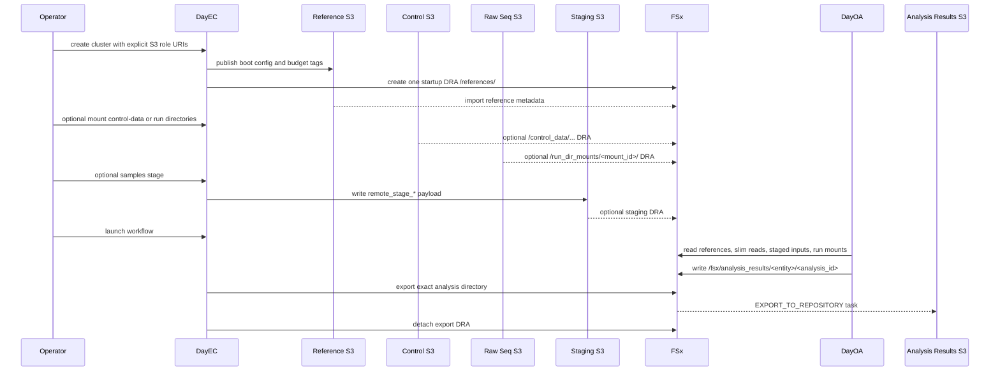
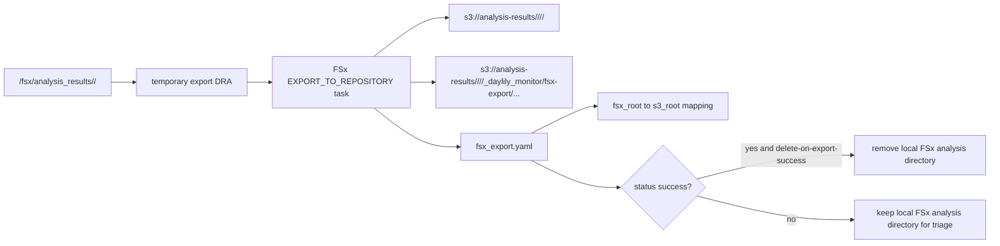

# DayEC S3 Bucket Lifecycle For WGS Analysis

This document is the run report template and data-plane reference for DayEC WGS
analysis. Every live cluster run should state the concrete S3 URI for each
storage role below, whether it is mounted on FSx, and where exported FSx data is
written.

## Current Contract

Cluster creation imports exactly one FSx data repository association:

| Startup DRA | FSx API path | Headnode path | S3 source | Import timing |
|---|---|---|---|---|
| References | `/references/` | `/fsx/references/` | `<reference_s3_uri>/` | Created during cluster creation with metadata import |

No other S3 bucket is mounted during cluster creation. Control data, staging,
run directories, and exports are attached only after the cluster is created.
DayEC fails cluster creation before the AWS mutation if the rendered cluster
config contains any startup DRA other than `/references/`.

## Required Run Report

For each DayEC WGS run, report these fields before launch. Use concrete S3
URIs, not placeholder angle-bracket forms. The active DayEC config keys are
`reference_s3_uri`, `control_data_s3_uri`, and `stage_s3_uri`.

| Role | LSMC value to report | Mounted at cluster create? | Mounted later? | Notes |
|---|---|---:|---:|---|
| Reference storage URI | `reference_s3_uri=s3://lsmc-dayoa-references-usw2/` | Yes | No | One startup DRA at `/fsx/references`; includes genomic references, runtime assets, and slim validation reads. |
| Control-data storage URI | `control_data_s3_uri=s3://lsmc-dayoa-control-data-usw2/` | No | Optional | On-demand DRA at `/fsx/control_data/...` for large curated validation/control reads not kept in references. If control data is moved under raw sequencing storage, report the exact prefix, for example `control_data_s3_uri=s3://lsmc-ssf-sequencing-data/control-data/`. |
| Raw sequencing storage URI | `s3://lsmc-ssf-sequencing-data/raw/...` or `s3://lsmc-ssf-sequencing-data/basecalls/...` | No | Optional | On-demand DRA at `/fsx/run_dir_mounts/<mount_id>/`; read-only by default. |
| Staging storage URI | `stage_s3_uri=s3://lsmc-ssf-sequencing-data/staged_external_data/` | No | Optional | On-demand DRA per staged prefix at `/fsx/staging/staged_external_sequencing_data/remote_stage_*`. |
| Analysis export destination | `export_destination_s3_uri=s3://lsmc-dayoa-analysis-results-usw2/validation/<cluster>/<executing_entity>/<analysis_id>/` | No | Yes, during export | Temporary output DRA on one completed `/fsx/analysis_results/...` directory. |
| Local FSx analysis root | `/fsx/analysis_results/<executing_entity>/<analysis_id>/` | Local FSx only | Exported by explicit trigger | This is scratch on FSx until exported. |

For the LSMC us-west-2 validation contract, the concrete role bindings are:

| Role | S3 URI | FSx path when mounted | Direction |
|---|---|---|---|
| References | `s3://lsmc-dayoa-references-usw2/` | `/fsx/references/` | S3 to FSx metadata import/read |
| Runtime assets | `s3://lsmc-dayoa-references-usw2/runtime_assets/` | `/fsx/references/runtime_assets/` | Included in the references DRA |
| Slim validation reads | `s3://lsmc-dayoa-references-usw2/genomic_data/organism_reads_slim/` | `/fsx/references/genomic_data/organism_reads_slim/` | Included in the references DRA |
| Full control data | `s3://lsmc-dayoa-control-data-usw2/` | `/fsx/control_data/...` | On-demand S3 to FSx DRA |
| Raw run data | `s3://lsmc-ssf-sequencing-data/raw/...` or `s3://lsmc-ssf-sequencing-data/basecalls/...` | `/fsx/run_dir_mounts/<mount_id>/` | On-demand read DRA |
| External staging | `s3://lsmc-ssf-sequencing-data/staged_external_data/remote_stage_*` | `/fsx/staging/staged_external_sequencing_data/remote_stage_*` | On-demand staging DRA |
| Analysis results | `s3://lsmc-dayoa-analysis-results-usw2/<prefix>/<executing_entity>/<analysis_id>/` | Temporary DRA at `/fsx/analysis_results/<executing_entity>/<analysis_id>/` | FSx export task to S3 |

The same DayEC role names can be backed by different S3 URIs in
different accounts. For public Daylily mirrors, the references role should use
`s3://daylily-dayoa-references-usw2/` and must exclude LSMC/RCRF/private,
license, commercial-tool, and internal budget material. If curated control data
is consolidated under the raw sequencing bucket, point `control_data_s3_uri` at
the explicit prefix, for example `s3://lsmc-ssf-sequencing-data/control-data/`,
and mount only the needed subprefix after cluster creation.

## Bucket Roles

### Reference Storage

The reference S3 URI is used on every cluster. It is the only S3 storage role
mounted automatically at cluster creation.

Expected contents:

| Prefix | Purpose | FSx path |
|---|---|---|
| `genomic_data/organism_references/` | FASTA, indexes, dictionaries, and stable reference manifests | `/fsx/references/genomic_data/organism_references/` |
| `genomic_data/organism_annotations/` | Known sites, GIAB truth VCF/BED, reportable regions, VEP/cache/reference annotations | `/fsx/references/genomic_data/organism_annotations/` |
| `genomic_data/organism_reads_slim/` | Small command-catalog and smoke-test validation read sets | `/fsx/references/genomic_data/organism_reads_slim/` |
| `runtime_assets/cluster_boot_config/` | Current cluster boot scripts copied by `dyec create` before cluster creation | `/fsx/references/runtime_assets/cluster_boot_config/` |
| `runtime_assets/cached_envs/` | Private cached environments needed by cluster jobs | `/fsx/references/runtime_assets/cached_envs/` |
| `runtime_assets/tool_specific_resources/` | Tool jars, Apptainer packages, workflow tool resources | `/fsx/references/runtime_assets/tool_specific_resources/` |
| `runtime_assets/budget_tags/` | ParallelCluster project budget tag TSV | `/fsx/references/runtime_assets/budget_tags/` |

DayEC writes to the reference S3 URI during create for:

| Write | Destination |
|---|---|
| Cluster boot scripts | `<reference_s3_uri>/runtime_assets/cluster_boot_config/` |
| Budget tag TSV updates | `<reference_s3_uri>/runtime_assets/budget_tags/pcluster-project-budget-tags.tsv` |

Everything under `/fsx/references` is expected to be stable input for jobs, not
analysis output.

### Control Data Storage

The control data S3 URI is required configuration and preflighted, but it is not
mounted at cluster creation. It is mounted only when a run needs large
curated validation/control data that should not slow down every startup.

Expected contents:

| Prefix | Purpose | Typical FSx path |
|---|---|---|
| `genomic_data/organism_reads/` | Larger curated GIAB/HG002/HG003/HG005 reads for validation | `/fsx/control_data/genomic_data/organism_reads/` |
| `cram_data/` | Curated CRAM/BAM control datasets | `/fsx/control_data/cram_data/` |
| Technology-specific control prefixes | Larger non-slim technology datasets | `/fsx/control_data/<prefix>/` |

Control-data DRAs are on demand and should be scoped as narrowly as possible,
for example a technology subprefix rather than the full bucket, when that is
enough for the command set being tested.

### Raw Sequencing Bucket

Raw sequencing data remains in sequencing storage. DayEC should not copy raw
run directories into references. Instead, a selected S3 run prefix is attached
to the already-created cluster under `/fsx/run_dir_mounts/<mount_id>/`.

Typical LSMC prefixes:

| Prefix | Purpose | Typical FSx path |
|---|---|---|
| `s3://lsmc-ssf-sequencing-data/raw/...` | Raw instrument run data | `/fsx/run_dir_mounts/<mount_id>/` |
| `s3://lsmc-ssf-sequencing-data/basecalls/...` | Basecalled or demultiplexed run output | `/fsx/run_dir_mounts/<mount_id>/` |
| `s3://lsmc-ssf-sequencing-data/staged_external_data/` | Mutable DayEC staging root | `/fsx/staging/staged_external_sequencing_data/...` |

Run-directory mounts are read-oriented by default: no AutoExport policy is set,
and outputs must go to `/fsx/analysis_results/...` or the explicit export
destination.

### Staging Prefix

Staging is mutable and on demand. It is not a cluster startup DRA.

When `dyec samples stage` needs to materialize external sample input, it creates
a unique staged prefix:

```text
s3://lsmc-ssf-sequencing-data/staged_external_data/remote_stage_<timestamp>_<id>/
```

and mounts that exact prefix at:

```text
/fsx/staging/staged_external_sequencing_data/remote_stage_<timestamp>_<id>/
```

Retired staging paths such as `/fsx/staging/staged_sample_data` and old
`/fsx/data` role paths are not part of the active contract.

### Analysis Results Bucket

DayOA writes workflow outputs to local FSx first:

```text
/fsx/analysis_results/<executing_entity>/<analysis_id>/
```

This directory is scratch until exported. The supported export flow creates a
temporary DRA on that exact analysis directory, starts an FSx
`EXPORT_TO_REPOSITORY` task, writes an `fsx_export.yaml` receipt, and detaches
the DRA with `DeleteDataInFileSystem=false`.

The receipt is the explicit FSx-to-S3 mapping contract. It records the export
source, destination, task lifecycle, detach state, and derived FSx/S3 roots.
The current `dyec export` command is provider-neutral: it records the export
receipt and does not accept external metadata-service URL, token, registration,
or identity options.

The export destination must end with the same logical suffix:

```text
s3://<analysis-results-bucket>/<prefix>/<executing_entity>/<analysis_id>/
```

FSx export reports are written inside the requested destination under:

```text
_daylily_monitor/fsx-export/<timestamp>/export-report/
```

After a workflow controller succeeds, use the catalog's separate DYEC export
visit and DRA command against `/fsx/analysis_results/<executing_entity>/<analysis_id>/`.
The default export contract retains FSx data; cleanup is a separate destructive
operation after a successful receipt and is never part of DayOA execution.

## Lifecycle By Phase

| Phase | Buckets touched | FSx paths | What happens |
|---|---|---|---|
| Preflight | reference, control-data, staging root | none | DayEC validates explicit S3 roles and required reference/runtime prefixes. |
| Create | reference | `/fsx/references/` | DayEC publishes boot config and budget tags, then ParallelCluster creates one reference DRA. |
| Headnode setup | reference | `/fsx/references/runtime_assets/...` | Boot scripts, cached envs, tool resources, and budget tags are consumed from references. |
| Sample staging | staging root, possibly reference/control-data/source S3 objects | `/fsx/staging/staged_external_sequencing_data/remote_stage_*` | DayEC copies/stages external sample inputs and attaches the staged prefix on demand. |
| Run-directory analysis | raw sequencing bucket | `/fsx/run_dir_mounts/<mount_id>/` | DayEC attaches a selected run prefix on demand for run QC or run-context workflows. |
| Validation/control analysis | control-data S3 URI | `/fsx/control_data/...` | DayEC attaches selected curated control-data prefixes on demand. |
| Workflow execution | reference, staging, run mounts, control-data, local FSx | `/fsx/analysis_results/...` | DayOA reads inputs and writes outputs to local FSx scratch. |
| Export | analysis-results bucket | temporary DRA on `/fsx/analysis_results/<entity>/<id>/` | DayEC exports the completed analysis directory to the explicit S3 destination and detaches the DRA. |
| Cleanup | FSx local scratch only, if enabled | `/fsx/analysis_results/<entity>/<id>/` | With `--delete-on-export-success`, DayEC removes the exported local FSx directory after successful export. |

## Diagrams

### Startup Data Plane



### On-Demand Mounts



### WGS Read And Write Flow



### Result Export And Optional FSx Cleanup



## Buckets Outside The Active Contract

The following storage roles may still exist from older validation or migration
work, but they are not part of the current WGS startup contract:

| Legacy storage location | Status |
|---|---|
| `lsmc-dayoa-runtime-assets-usw2` | Not part of the static WGS startup contract. It is the backing store for explicitly mounted, immutable vendor runtimes under `cached_envs/<asset>/`; attach one exact version read-only with `dyec mounts create --purpose runtime-asset`, which projects it at `/fsx/reference_asset_mounts/<asset>/`. General startup assets remain under `<reference_s3_uri>/runtime_assets/`. |
| `lsmc-dayoa-staging-usw2` | Legacy standalone staging storage. New staging should use the raw sequencing storage root prefix `staged_external_data/`. |
| `lsmc-dayoa-omics-analysis-us-west-2/data/...` | Legacy overloaded storage layout. New DayEC runs should use explicit reference, control-data, raw sequencing, staging, and export roles. |
| `/fsx/data` | Retired FSx namespace. Active code should fail hard rather than accepting it. |
| `/fsx/runtime_assets` | Retired standalone runtime-assets namespace. Use `/fsx/references/runtime_assets` for static startup assets and `/fsx/reference_asset_mounts/<asset>` for an explicitly mounted immutable vendor runtime. |

If any legacy path above appears in a new run report, treat that as a contract
violation unless the run is explicitly testing legacy migration state. The
bounded `cached_envs/<asset>/` use of the runtime-assets bucket described above
is active and is not a legacy exception.

## Operator Checklist

- Report every S3 role value before launch.
- Confirm the rendered cluster config contains only `/references/` in
  `DataRepositoryAssociations`.
- Report every live DRA with FSx path, S3 URI, purpose, and whether it was
  created during cluster startup or after create.
- For live clusters, collect DRA inventory with
  `aws fsx describe-data-repository-associations --filters Name=file-system-id,Values=<fsx-id>`
  and report `AssociationId`, `FileSystemPath`, `DataRepositoryPath`, and
  lifecycle.
- Keep control-data, run directories, and staging as post-create mounts.
- Export completed `/fsx/analysis_results/<entity>/<analysis_id>` directories
  to explicit S3 result destinations.
- After a successful export, delete the local FSx analysis directory only when
  `--delete-on-export-success` was requested or a human explicitly approves the
  cleanup.
