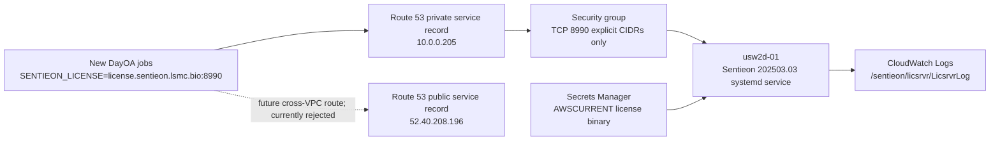

# Sentieon License Server Operations

This runbook is the operating contract for the dedicated Sentieon license
service introduced on the `10.3.4` release branch. Branches created from this
release line inherit the same contract through the source and packaged DYEC
defaults and their regression tests.

The only supported client endpoint is:

```text
license.sentieon.lsmc.bio:8990
```

The current license expires on **2026-07-31**. A replacement license must be
installed and validated before that date. Treat **2026-07-24** as the internal
cutoff for a proven renewal so there is at least one week for remediation.

| Date | Renewal gate |
|---|---|
| `2026-07-17` (T-14) | Named owner confirms that the replacement file has been issued for the exact backend FQDN |
| `2026-07-24` (T-7) | Replacement is materialized, restarted, and proven through the one-client gate; pause expansion if it is not |
| `2026-07-31` (expiry) | Stop admitting new Sentieon work unless the replacement is proven; do not restore a local license path |

Process health does not waive these gates. An active daemon or successful TCP
connect does not prove that a newly admitted job will receive a valid token.

## Vendor Contract

Sentieon's AWS guide requires a license server and tells compute clients to set
`SENTIEON_LICENSE` to `FQDN:8990`. The vendor's documented server and client
interfaces are:

```text
<SENTIEON_DIR>/bin/sentieon licsrvr --start --log <log> <license-file>
<SENTIEON_DIR>/bin/sentieon licsrvr --stop <license-file>
<SENTIEON_DIR>/bin/sentieon licclnt ping --server <host>:<port>
```

References:

- [Sentieon AWS deployment guide](https://support.sentieon.com/docs/appnotes/aws_deployment/)
- [Sentieon LICSRVR reference](https://support.sentieon.com/docs/usages/licsrvr/licsrvr/)
- [Sentieon LICCLNT reference](https://support.sentieon.com/docs/usages/licclnt/licclnt/)
- [AWS Secrets Manager secret version updates](https://docs.aws.amazon.com/secretsmanager/latest/userguide/manage_update-secret-value.html)
- [AWS Secrets Manager staging-label updates](https://docs.aws.amazon.com/secretsmanager/latest/apireference/API_UpdateSecretVersionStage.html)
- [AWS CloudWatch agent log collection](https://docs.aws.amazon.com/AmazonCloudWatch/latest/monitoring/Install-CloudWatch-Agent.html)
- [AWS CloudWatch agent configuration](https://docs.aws.amazon.com/AmazonCloudWatch/latest/monitoring/CloudWatch-Agent-Configuration-File-Details.html)
- [Route 53 multivalue routing](https://docs.aws.amazon.com/Route53/latest/DeveloperGuide/routing-policy-multivalue.html)

The Sentieon references establish the `FQDN:8990`, `licsrvr`, and `licclnt`
interfaces. The repository controls the systemd, IAM, Secrets Manager,
split-horizon DNS, and client-migration design. The linked vendor pages do not
establish that a client retries every address returned by DNS, so round-robin
expansion has an additional vendor-confirmation gate below.

## Production Architecture

| Surface | Production value |
|---|---|
| AWS account | `108782052779` |
| Region / AZ | `us-west-2` / `us-west-2d` |
| CloudFormation stack | `sentieon-license-usw2d-01` |
| EC2 instance | `i-03c42907b08018d1a` (`t3.xlarge`) |
| Backend identity | `usw2d-01.sentieon.lsmc.bio` |
| Client service identity | `license.sentieon.lsmc.bio:8990` |
| Private address | `10.0.0.205` |
| Elastic IP | `52.40.208.196` |
| Security group | `sg-004e7647782ff1cf9` |
| Runtime | Sentieon `202503.03` under `/opt/sentieon/202503.03` |
| Service | `sentieon-license-server.service` |
| Secret name | `dayec/sentieon/license-servers/usw2d-01` |
| CloudWatch log group | `/sentieon/licsrvr/LicsrvrLog` |
| Initial client cluster | `sentlic-e` |

The public and private Route 53 records are split-horizon. Clients in the
license-server VPC resolve the private address. The current network validator
supports same-VPC clients only and fails closed for cross-VPC clients. A future
cross-VPC cutover requires a separately reviewed route contract and an observed
NAT egress `/32`; the public record does not imply public ingress.



## Hard Safety Boundaries

1. Never print, paste, diff, commit, upload to an unencrypted object, or place
   the vendor license contents or key in shell arguments, logs, tests, plans,
   receipts, user data, or CloudFormation parameters.
2. Among runtime/workload roles, only the dedicated license-server instance
   role may call `secretsmanager:DescribeSecret` and
   `secretsmanager:GetSecretValue` on the exact production secret. A separately
   authorized deployment operator may create, verify, or rotate a version.
   DYEC headnode and compute roles must not receive either permission.
3. TCP 8990 must never allow `0.0.0.0/0`. Every ingress CIDR must be an
   observed and approved client network or NAT egress address.
4. Do not restart active DayOA controllers, cancel jobs, or administer Slurm
   for a license cutover. Configuration changes apply to new login shells and
   new jobs only.
5. Do not start a per-node `licsrvr`, probe a local license server, discover a
   local `.lic` file, or restore a file-based fallback. Missing or malformed
   endpoint configuration fails hard.
6. A CloudFormation change that replaces `LicenseServerInstance`, its EIP, or
   its private hosted zone is destructive and requires a separate, explicit
   approval after the exact replacement effect is shown.
7. Remote administration is SSM-only. Verify that the remote identity is
   `ubuntu`; use targeted `sudo` only for service and protected-file actions.
8. DayOA execution still follows the DayOA agent contract: persistent tmux,
   separate `source dyoainit`, `dy-a`, and `dy-r` commands, and never raw
   `snakemake`.
9. Read-only inspection does not authorize a stack update, secret-version
   change, service restart, DNS edit, SG edit, or client reconfiguration. Each
   live step must be in the approved cutover or maintenance window. Any
   destructive replacement or teardown requires the separate second approval
   required by `AGENTS.md`.

## Repository Sources Of Truth

Use the `10.3.4` branch or an immutable release made from it. Do not deploy
from a dirty checkout.

The source and packaged global configs must be byte-identical:

```bash
cmp -s \
  config/daylily_cli_global.yaml \
  daylily_ec/resources/payload/config/daylily_cli_global.yaml
```

They must contain exactly this client contract:

```yaml
daylily:
  sentieon_license:
    mode: server
    endpoint: license.sentieon.lsmc.bio:8990
```

`daylily.sentieon_lic_path` is forbidden. The headnode bootstrap validates the
server-mode mapping and exports `SENTIEON_LICENSE` for new login shells. DayOA
activation, Slurm submission, Singularity execution, wrappers, and active
Sentieon rules must preserve the endpoint string unchanged.

The initial production soak retains a randomized 1-160 second delay immediately
before each Sentieon client process starts. That delay smooths connection
bursts; it does not start or probe a local server and does not replace endpoint
health validation.

Cluster bootstrap assets are content-addressed and write-once. Cluster creation
publishes the exact five-file boot bundle under
`runtime_assets/cluster_boot_config/releases/sha256-<bundle-digest>/` and renders
that immutable prefix into the cluster configuration. Never overwrite the
legacy shared `runtime_assets/cluster_boot_config/` keys. Existing clusters must
be updated through a reviewed ParallelCluster change set that changes only
compute-queue custom-action URIs to an immutable release prefix.

The infrastructure source is
`docs/plans/20260712T102020Z_sentieon_license_server_usw2d_cloudformation.yaml`.
Secret ingestion and server-side materialization are implemented by
`daylily_ec/aws/sentieon_license.py`. The stack is termination-protected.
Always create and inspect an UPDATE change set before execution; never run a
blind stack update.

The template path above is mandatory. If it is absent from the exact reviewed
ref, stop. Do not substitute a console-edited template, an older local copy, or
the vendor Terraform stack. Likewise, do not hand-create the systemd unit on the
host; deploy the reviewed repository artifact through the stack.

### Future Branch Gate

"All future branches" means every branch derived from the `10.3.4` release
commit inherits this source contract. It does not rewrite already-diverged Git
history. A branch created from an older base must explicitly merge or
cherry-pick the complete reviewed cutover commit set before it can be released.

Required regression checks for a descendant DYEC branch include:

```bash
python -m pytest -q \
  tests/test_sentieon_license.py \
  tests/test_packaged_defaults.py \
  tests/test_headnode_readiness.py

cmp -s \
  config/daylily_cli_global.yaml \
  daylily_ec/resources/payload/config/daylily_cli_global.yaml
```

Required regression checks for the paired DayOA branch include:

```bash
python -m pytest -q \
  tests/test_sentieon_license_endpoint_activation.py \
  tests/test_sentieon_license_endpoint_contract.py \
  tests/test_shell_wrapper_contracts.py
```

Release review must reject any branch that restores a local `.lic` default,
node-local `licsrvr`, a local readiness probe, or an endpoint fallback.

## Operator Environment

Run local DYEC commands from an activated `10.3.4` checkout:

```bash
cd /path/to/daylily-ephemeral-cluster
source ./activate

export AWS_PROFILE=lsmc
export AWS_REGION=us-west-2
export CLUSTER_NAME=sentlic-e
export LICENSE_STACK=sentieon-license-usw2d-01
export LICENSE_INSTANCE_ID=i-03c42907b08018d1a
export LICENSE_BACKEND=usw2d-01.sentieon.lsmc.bio
export LICENSE_ENDPOINT=license.sentieon.lsmc.bio:8990
export LICENSE_SECRET_ID=dayec/sentieon/license-servers/usw2d-01
export LICENSE_LOG_GROUP=/sentieon/licsrvr/LicsrvrLog
```

Confirm the branch and AWS identity before any mutation:

```bash
test "$(git branch --show-current)" = "10.3.4"
git status --short
aws --profile "$AWS_PROFILE" sts get-caller-identity
aws --profile "$AWS_PROFILE" --region "$AWS_REGION" \
  cloudformation describe-stacks --stack-name "$LICENSE_STACK" \
  --query 'Stacks[0].{Status:StackStatus,TerminationProtection:EnableTerminationProtection,StackId:StackId}'
aws --profile "$AWS_PROFILE" --region "$AWS_REGION" \
  cloudformation describe-stack-resource \
  --stack-name "$LICENSE_STACK" \
  --logical-resource-id LicenseServerInstance
aws --profile "$AWS_PROFILE" --region "$AWS_REGION" ec2 describe-instances \
  --instance-ids "$LICENSE_INSTANCE_ID" \
  --query 'Reservations[0].Instances[0].{State:State.Name,PrivateIp:PrivateIpAddress,PublicIp:PublicIpAddress,Type:InstanceType,AZ:Placement.AvailabilityZone}'
```

Before the first update, the only acceptable stack states are `CREATE_COMPLETE`
and `UPDATE_COMPLETE`. After the update, require `UPDATE_COMPLETE`. Stop if the
account is not `108782052779`, termination protection is off, the EC2 state is
not `running`, or any identity/address/type/AZ differs from this runbook. A
different instance ID is not an invitation to discover an alternate target.

## Safe Installation Sequence

Perform these gates in order. Preserve metadata-only receipts for each gate.
Steps marked **MUTATING** require the live approval boundary above; commands in
this document are not evidence that approval has been granted.

### 1. Verify The Vendor File Without Displaying It

The file must be the vendor-issued cluster license for
`usw2d-01.sentieon.lsmc.bio`, mode `0600`, and owned by the operator. Do not use
`cat`, `head`, `tail`, `strings`, shell substitution, or debug tracing on it.

```bash
export LICENSE_FILE=/secure/path/Life_Sciences_Data_Manufacturing_cluster.lic
chmod 0600 "$LICENSE_FILE"
stat -f 'mode=%Lp size=%z' "$LICENSE_FILE"
shasum -a 256 "$LICENSE_FILE"
```

The accepted SHA-256 for the first production file is:

```text
6f16e3e301c41d3e21736dc69732146dff8aad9db8eb2707bc0b05e3d7ca20f4
```

Hash equality proves file identity, not license validity. The server-side
vendor validation remains mandatory.

### 2. Ingest The Secret As Binary Material

**MUTATING on first creation.** Use the fail-closed repository helper. It
accepts only a current-user-owned,
non-symlink, private source file; creates `SecretBinary` on first use; and, for
an existing secret, verifies byte equality with `AWSCURRENT`. It refuses to
replace a mismatched current version implicitly. The receipt contains only the
secret ARN, version ID, and SHA-256.

```bash
export LICENSE_METADATA_RECEIPT=docs/plans/<stamp>_sentieon_license_metadata.json

python -m daylily_ec.aws.sentieon_license ensure \
  --license-file "$LICENSE_FILE" \
  --metadata-file "$LICENSE_METADATA_RECEIPT" \
  --secret-name "$LICENSE_SECRET_ID" \
  --region "$AWS_REGION" \
  --profile "$AWS_PROFILE"
```

A mismatch is a rotation gate, not an error to work around. Follow the
explicit rotation procedure later in this runbook. Do not delete or overwrite
the existing secret to make `ensure` pass.

Do not invoke `get-secret-value` manually from an operator terminal. The
repository helper may retrieve `AWSCURRENT` inside its process solely to verify
hash equality; it never emits those bytes. Outside that reviewed helper,
validate only secret metadata and confirm that no resource policy is attached:

```bash
aws --profile "$AWS_PROFILE" --region "$AWS_REGION" \
  secretsmanager describe-secret --secret-id "$LICENSE_SECRET_ID"
aws --profile "$AWS_PROFILE" --region "$AWS_REGION" \
  secretsmanager get-resource-policy --secret-id "$LICENSE_SECRET_ID"
```

The production secret intentionally has no resource policy. Access is granted
only by the dedicated server role's exact identity policy; headnode and compute
roles must remain `implicitDeny` in IAM simulation. A newly attached resource
policy is drift and must be reviewed before any materialization.

Do not materialize the value until the reviewed infrastructure update grants
the exact dedicated server role access. The next gate establishes that IAM
boundary first.

### 3. Preview The Infrastructure Update

Validate the template, create an UPDATE change set, and inspect every proposed
resource change. The accepted change set may update IAM, CloudWatch, bootstrap,
and explicit ingress. It must report no replacement of the instance, EIP,
private hosted zone, or DNS identity.

```bash
aws --profile "$AWS_PROFILE" --region "$AWS_REGION" \
  cloudformation validate-template \
  --template-body \
  file://docs/plans/20260712T102020Z_sentieon_license_server_usw2d_cloudformation.yaml
```

Creating a change set records an AWS object but does not alter stack resources.
Create it with the repository's complete reviewed deployment command,
`--change-set-type UPDATE`, and `CAPABILITY_NAMED_IAM`, then inspect it. Stop if
the exact parameter set or command has not been recorded; do not infer missing
parameters.

```bash
aws --profile "$AWS_PROFILE" --region "$AWS_REGION" \
  cloudformation describe-change-set \
  --stack-name "$LICENSE_STACK" \
  --change-set-name <change-set-name>
```

Hard stop if any `Replacement` field is `True` or `Conditional`, if TCP 8990
becomes public, or if any client role gains secret read access.

### 4. Execute, Materialize, And Wait

**MUTATING.** Execute only the reviewed change-set ID, then wait for stack
completion:

```bash
aws --profile "$AWS_PROFILE" --region "$AWS_REGION" \
  cloudformation execute-change-set --change-set-name <change-set-id>
aws --profile "$AWS_PROFILE" --region "$AWS_REGION" \
  cloudformation wait stack-update-complete --stack-name "$LICENSE_STACK"
```

Verify the instance ID, EIP, private IP, DNS names, security group, termination
protection, IAM policy scope, and CloudWatch retention against the production
architecture table before touching clients.

Now materialize the verified version directly on the server. The secret is
fetched by the instance role and never crosses the SSM command payload. The
helper atomically installs `/etc/sentieon/license.lic` as `root:sentieon` mode
`0640` and verifies its SHA-256 without displaying bytes.

```bash
python -m daylily_ec.aws.sentieon_license materialize \
  --instance-id "$LICENSE_INSTANCE_ID" \
  --metadata-file "$LICENSE_METADATA_RECEIPT" \
  --region "$AWS_REGION" \
  --profile "$AWS_PROFILE"
```

`materialize` replaces the on-host file atomically but does not reload the
running vendor daemon. For initial installation, start the reviewed unit if it
is inactive. For rotation, restart it only in the declared maintenance window.
Do not assume that replacing the file updates a running server.

Install the exact runtime and systemd unit without changing service state, then
install and configure the exact CloudWatch Agent build:

```bash
python -m daylily_ec.aws.sentieon_license_server install \
  --instance-id "$LICENSE_INSTANCE_ID" \
  --region "$AWS_REGION" \
  --profile "$AWS_PROFILE"

python -m daylily_ec.aws.sentieon_license_server install-cloudwatch-agent \
  --instance-id "$LICENSE_INSTANCE_ID" \
  --region "$AWS_REGION" \
  --profile "$AWS_PROFILE"

python -m daylily_ec.aws.sentieon_license_server configure-logging \
  --instance-id "$LICENSE_INSTANCE_ID" \
  --region "$AWS_REGION" \
  --profile "$AWS_PROFILE"
```

The `install` operation never starts or restarts the license service. Initial
startup is a distinct mutation:

```bash
python -m daylily_ec.aws.sentieon_license_server start \
  --instance-id "$LICENSE_INSTANCE_ID" \
  --region "$AWS_REGION" \
  --profile "$AWS_PROFILE"
```

### 5. Validate The Server

Use the approved SSM interactive path and verify `id -un` returns `ubuntu`.
Do not use SSH and do not run a remote command as `root`.

On the server:

```bash
id -un
sudo systemctl is-enabled sentieon-license-server.service
sudo systemctl is-active sentieon-license-server.service
sudo systemctl show sentieon-license-server.service \
  -p ActiveState -p SubState -p MainPID -p ExecMainStatus
sudo ss -lntp 'sport = :8990'
/opt/sentieon/202503.03/bin/sentieon licclnt ping \
  --server usw2d-01.sentieon.lsmc.bio:8990
```

Do not print a raw `licsrvr --dump`. If Sentieon support requires a dump,
redirect it to a mode-`0600` file on encrypted local storage, record only the
return code and explicitly approved redacted fields, then remove it. Do not
claim secure erasure from a journaled or copy-on-write filesystem.

### 6. Validate DNS And CloudWatch Metadata

From the license-server VPC, both names must resolve to `10.0.0.205`.
Cross-VPC validation is not enabled in this release. Do not add a NAT CIDR or
rely on the public address until a dedicated validator proves the route and
the exact observed `/32` has been reviewed.

```bash
getent ahostsv4 "$LICENSE_BACKEND"
getent ahostsv4 "${LICENSE_ENDPOINT%:*}"
aws --profile "$AWS_PROFILE" --region "$AWS_REGION" logs \
  describe-log-groups --log-group-name-prefix "$LICENSE_LOG_GROUP"
aws --profile "$AWS_PROFILE" --region "$AWS_REGION" logs \
  describe-log-streams --log-group-name "$LICENSE_LOG_GROUP" \
  --order-by LastEventTime --descending --max-items 5
```

These CloudWatch commands inspect metadata only. Do not dump vendor log events
into tickets or ledgers without reviewing and redacting them.

## Service Lifecycle

The reviewed systemd unit is the only service-control boundary. Inspecting it
and checking state are read-only:

```bash
sudo systemctl cat sentieon-license-server.service
sudo systemctl status sentieon-license-server.service --no-pager
sudo systemctl show sentieon-license-server.service \
  -p LoadState -p ActiveState -p SubState -p UnitFileState \
  -p ExecStart -p ExecStop -p Result -p ExecMainStatus
```

The unit must use the pinned `/opt/sentieon/202503.03/bin/sentieon` binary. Its
start and stop paths must implement these vendor contracts:

```text
licsrvr --start --log <log> /etc/sentieon/license.lic
licsrvr --stop /etc/sentieon/license.lic
```

The license contents must not appear in the unit, environment, journal, or
process arguments; only the protected path may appear.

These commands change production service state and require explicit approval
for that exact action:

```bash
sudo systemctl start sentieon-license-server.service
sudo systemctl stop sentieon-license-server.service
sudo systemctl restart sentieon-license-server.service
```

Use the repository helper for an approved restart so interruption approval is
machine-checkable:

```bash
python -m daylily_ec.aws.sentieon_license_server restart \
  --approve-restart \
  --instance-id "$LICENSE_INSTANCE_ID" \
  --region "$AWS_REGION" \
  --profile "$AWS_PROFILE"
```

Rules:

- A stop or restart is a production license interruption. Announce a
  maintenance window, stop admission of new Sentieon work, and verify no
  cutover-owned validation is in flight. Do not cancel existing jobs.
- Do not replace `systemctl` with an ad hoc background `licsrvr` process.
- Never run a second server process against the same file and port.
- A successful `systemctl` result is insufficient. Require active state, TCP
  8990, backend `licclnt ping`, service-name `licclnt ping`, and a fresh
  CloudWatch log-stream timestamp.
- Do not expose raw vendor logs or `--dump` output in a status report.

## DayOA And DYEC Client Migration

Client migration changes configuration, not the server license material.
Neither headnodes nor compute nodes need access to the secret.

For a cluster created from the `10.3.4` release line:

1. Verify the cluster is ready and SSM is online.
2. Run the supported DYEC headnode configure command from the activated,
   immutable DYEC release.
3. Start a new interactive login shell as `ubuntu`.
4. Verify `SENTIEON_LICENSE` is the service endpoint.
5. Use the installed Sentieon client to ping the service endpoint.
6. Do not restart existing controllers. Only new shells and new jobs receive
   the cutover.
7. Record the exact DYEC commit and explicit DayOA tag/ref. Do not validate from
   a dirty checkout or an unpinned `day-clone` default.

```bash
dyec --json cluster describe \
  --profile "$AWS_PROFILE" \
  --region "$AWS_REGION" \
  --cluster "$CLUSTER_NAME"

dyec headnode configure \
  --profile "$AWS_PROFILE" \
  --region "$AWS_REGION" \
  --cluster "$CLUSTER_NAME" \
  --dyec-deploy-key-secret-arn \
  arn:aws:secretsmanager:us-west-2:108782052779:secret:dayec/github-deploy-keys/lsmc-bio/daylily-ephemeral-cluster-pE4FFN \
  --dayoa-deploy-key-secret-arn \
  arn:aws:secretsmanager:us-west-2:108782052779:secret:dayec/github-deploy-keys/lsmc-bio-daylily-omics-analysis-igtfHD

dyec headnode connect \
  --profile "$AWS_PROFILE" \
  --region "$AWS_REGION" \
  --cluster "$CLUSTER_NAME"
```

Inside the new headnode login shell:

```bash
test "$(id -un)" = ubuntu
test "${SENTIEON_LICENSE:-}" = license.sentieon.lsmc.bio:8990
/fsx/references/runtime_assets/cached_envs/sentieon-genomics-202503.03/bin/sentieon \
  licclnt ping --server "$SENTIEON_LICENSE"
```

Do not search for another runtime or license file. A missing configured
executable is a hard configuration failure.

DayOA activation must use the same endpoint. Perform these checks as `ubuntu`
in a persistent, meaningfully named tmux session with an interactive bash login
shell, sending each command separately:

```bash
source dyoainit
test "$SENTIEON_LICENSE" = license.sentieon.lsmc.bio:8990
dy-a slurm hg38
```

Do not launch a workflow merely to test licensing. A later approved workflow
must use `dy-r` in a persistent tmux session and must retain the explicit DayOA
version pin.

## `sentlic-e` Rollout

`sentlic-e` is the first cluster rollout target. Its initial headnode identity
is `i-048ff099d73057e09` in `us-west-2d`. That is a Gate 0 baseline, not a
discovery fallback. Re-resolve it with `dyec --json cluster describe` and stop
on a mismatch. Do not configure it until ParallelCluster reports
`CREATE_COMPLETE` and SSM is online.

Acceptance for this cluster is:

- the headnode config has server mode and the exact service endpoint;
- a new `ubuntu` login shell exports the endpoint;
- backend and service DNS resolve as expected;
- `licclnt ping --server license.sentieon.lsmc.bio:8990` returns zero;
- IAM policy simulation shows the server role is allowed and every headnode and
  compute role is `implicitDeny`; resource-policy inspection confirms that the
  secret has no resource policy by design. Do not test this by retrieving the
  secret from a client node;
- no workflow was launched and no active controller or Slurm job was touched.

For an initial capacity soak, use the repository's bounded non-workflow client
validator. Increase concurrency in explicit gates of 1, 64, 256, and 1000
clients. Stop on the first nonzero result, connection timeout, server resource
alarm, or license denial. Never substitute an unbounded shell loop.

The higher concurrency gates are blocked until the validator path, immutable
ref/hash, timeout, and maximum concurrency are recorded in the cutover evidence.
If that artifact is absent, complete only the single-client `licclnt ping` and
report capacity validation as blocked. Do not improvise a parallel loop and do
not submit Slurm work to manufacture load.

## Monitoring

Monitor the dedicated service independently from workflow jobs:

| Signal | Healthy condition | Response |
|---|---|---|
| EC2 status checks | Both passed | Investigate instance/VPC; do not replace automatically |
| systemd | enabled and active | Diagnose service and secret hydration |
| TCP 8990 | one listener | Stop duplicate process or repair failed service |
| Backend ping | return code 0 | Check service before DNS |
| Service ping | return code 0 | Check Route 53 and SG after backend passes |
| CloudWatch stream | advancing timestamp | Repair agent/IAM without exposing log payload |
| Secret permissions | server role only | Remove unauthorized grants immediately |
| License expiry | more than 7 days | Escalate renewal at T-30, T-14, and T-7 |

The license expiry must be tracked independently of process health. A running
daemon does not prove that a future job will receive a valid token.

The following checks expose metadata, not secret or vendor-log payloads:

```bash
aws --profile "$AWS_PROFILE" --region "$AWS_REGION" ec2 \
  describe-instance-status --include-all-instances \
  --instance-ids "$LICENSE_INSTANCE_ID"
aws --profile "$AWS_PROFILE" --region "$AWS_REGION" logs \
  describe-log-groups --log-group-name-prefix "$LICENSE_LOG_GROUP" \
  --query 'logGroups[].{name:logGroupName,retention:retentionInDays,kmsKeyId:kmsKeyId,bytes:storedBytes}'
aws --profile "$AWS_PROFILE" --region "$AWS_REGION" logs \
  describe-log-streams --log-group-name "$LICENSE_LOG_GROUP" \
  --order-by LastEventTime --descending --max-items 5 \
  --query 'logStreams[].{name:logStreamName,lastEvent:lastEventTimestamp,lastIngestion:lastIngestionTime}'
aws --profile "$AWS_PROFILE" --region "$AWS_REGION" cloudwatch \
  describe-alarms --alarm-name-prefix sentieon-license
aws --profile "$AWS_PROFILE" --region "$AWS_REGION" secretsmanager \
  describe-secret --secret-id "$LICENSE_SECRET_ID" \
  --query '{ARN:ARN,LastChangedDate:LastChangedDate,VersionIdsToStages:VersionIdsToStages}'
```

Require a non-null, reviewed CloudWatch retention period and an advancing
ingestion timestamp during validation. `INSUFFICIENT_DATA` is not healthy for a
required alarm. Do not use `filter-log-events` in routine monitoring; raw events
must be reviewed and redacted before leaving the encrypted log service.

## License Rotation

Rotation is three distinct mutations: create a new secret version, materialize
that exact version, and restart the service. Approval for one is not approval
for the next. Use different metadata receipt paths for the proven and candidate
versions; never overwrite the rollback receipt.

1. Obtain a new vendor file bound to the exact backend FQDN. For additional
   backends, obtain a separate file with a unique license key.
2. Verify mode, file identity, FQDN binding, entitlement, and expiry without
   printing its contents.
3. Record and retain the current metadata receipt as the rollback receipt.
4. Store the replacement as a new `AWSCURRENT` binary secret version using a
   file reference. Do not place bytes in `--secret-string` or inline shell
   data.
5. Run `ensure` against the replacement file. It must now verify byte equality
   with `AWSCURRENT` and write a new metadata-only receipt.
6. During a declared maintenance window, run `materialize` with the new
   receipt. It installs the exact version atomically as `root:sentieon` mode
   `0640`.
7. Validate the staged file with vendor tooling without emitting raw output.
   Avoid creating a dump; if vendor support requires one, follow the protected
   encrypted-storage handling above and do not claim secure erasure.
8. Restart the systemd service. Never use an ad hoc second server process.
9. Require both backend and service pings, one listener, active systemd state,
   and fresh CloudWatch metadata.
10. Run the 1-client gate before allowing new Sentieon work. Increase load only
   after the previous gate is clean.
11. Retain `AWSPREVIOUS` and its receipt until the soak is complete. Do not
    delete the previous version as part of the same change.

The explicit version update and verification sequence is:

```bash
export PREVIOUS_METADATA_RECEIPT=docs/plans/<previous-stamp>_sentieon_license_metadata.json
export LICENSE_METADATA_RECEIPT=docs/plans/<new-stamp>_sentieon_license_metadata.json
export ROTATION_TOKEN="$(uuidgen | tr '[:upper:]' '[:lower:]')"
test "$PREVIOUS_METADATA_RECEIPT" != "$LICENSE_METADATA_RECEIPT"

aws --profile "$AWS_PROFILE" --region "$AWS_REGION" \
  secretsmanager put-secret-value \
  --secret-id "$LICENSE_SECRET_ID" \
  --secret-binary "fileb://$LICENSE_FILE" \
  --client-request-token "$ROTATION_TOKEN" \
  --query '{ARN:ARN,Name:Name,VersionId:VersionId,VersionStages:VersionStages}'

python -m daylily_ec.aws.sentieon_license ensure \
  --license-file "$LICENSE_FILE" \
  --metadata-file "$LICENSE_METADATA_RECEIPT" \
  --secret-name "$LICENSE_SECRET_ID" \
  --region "$AWS_REGION" \
  --profile "$AWS_PROFILE"

python -m daylily_ec.aws.sentieon_license materialize \
  --instance-id "$LICENSE_INSTANCE_ID" \
  --metadata-file "$LICENSE_METADATA_RECEIPT" \
  --region "$AWS_REGION" \
  --profile "$AWS_PROFILE"
```

AWS Secrets Manager labels the new value `AWSCURRENT` and the displaced value
`AWSPREVIOUS`. Do not rotate more frequently than operationally necessary, and
never place secret bytes in a CLI `--secret-string` argument.

## Rollback

Rollback never means restoring local license files or per-node license servers.

### Failed Server License Rotation

1. Stop admission of new Sentieon work at the application/controller launch
   boundary. Do not cancel running jobs or alter Slurm.
2. Move `AWSCURRENT` back to the last proven version using explicit version
   IDs from the two metadata receipts.
3. Run `materialize` with the retained previous metadata receipt. This fetches
   the exact previous version without moving secret bytes through the operator.
4. Restart only `sentieon-license-server.service` in the declared maintenance
   window.
5. Re-run backend and service pings and the 1-client gate.
6. Keep clients pointed at `license.sentieon.lsmc.bio:8990`.

Use the exact version IDs from the failed and previous metadata receipts:

```bash
aws --profile "$AWS_PROFILE" --region "$AWS_REGION" \
  secretsmanager update-secret-version-stage \
  --secret-id "$LICENSE_SECRET_ID" \
  --version-stage AWSCURRENT \
  --move-to-version-id "$PREVIOUS_VERSION_ID" \
  --remove-from-version-id "$FAILED_VERSION_ID"

python -m daylily_ec.aws.sentieon_license materialize \
  --instance-id "$LICENSE_INSTANCE_ID" \
  --metadata-file "$PREVIOUS_METADATA_RECEIPT" \
  --region "$AWS_REGION" \
  --profile "$AWS_PROFILE"
```

### Failed Client Rollout

If the dedicated endpoint is healthy but new client code is not, stop new
launches. Revert only to a previously proven release that uses the same
dedicated endpoint contract, or roll forward with a corrected client release.
If no endpoint-compatible release exists, keep new launches stopped. Do not
restore `sentieon_lic_path`, discover a `.lic` file, or start a local service.
Existing controllers remain untouched.

### Failed Backend

With one backend, stop new Sentieon launches until that backend is repaired.
With multiple backends, remove only the failed backend's service record after
health evidence and an approved DNS change. Keep the stable client service name.

## Adding Round-Robin Backends

The LSMC expansion contract requires each running backend to use its own
vendor-issued license file and unique key. Treat entitlements as independent;
do not assume that licenses are pooled between servers.

Before creating a second service record, obtain written Sentieon confirmation
that the deployed client version safely handles multiple A-record answers and
document its retry behavior when the selected backend fails after DNS
resolution. `licclnt ping` against each backend proves each server, but does not
prove client failover through the service name.

For each additional backend:

1. Assign a stable backend FQDN and send that exact name to Sentieon.
2. Receive a unique vendor license for that backend.
3. Create a separate secret, IAM role, EC2 instance, log stream, and backend
   DNS record. Never share a secret between servers.
4. Validate the backend directly before adding it to the service name.
5. Add one Route 53 multivalue service record with a unique identifier and the
   same TTL. The current service TTL is 30 seconds.
6. Preserve private split-horizon records and explicit SG client CIDRs.
7. Run staged load gates before considering the backend production-ready.
8. Remove a backend from service DNS before maintenance, wait at least two
   TTLs, verify the service answers no longer contain that address from each
   relevant resolver path, then stop it.

Route 53 multivalue routing can return multiple healthy records but is not a
load balancer. Health checks and their probe CIDRs require an explicit network
design review; never broaden TCP 8990 ingress merely to make a health check
green. Route 53 returns records even when every associated health check is
unhealthy, so multivalue DNS is not a fail-closed admission control. A Network
Load Balancer is a separate approved architecture, not a silent fallback.

## Audit Checklist

- [ ] Branch/ref and commit recorded; checkout clean.
- [ ] AWS account, region, stack, instance, EIP, and SG identities match.
- [ ] Vendor file mode and SHA-256 verified without content output.
- [ ] Secret update receipt contains metadata only.
- [ ] Exact server role is the only role with secret read permission.
- [ ] CloudFormation change set reports no destructive replacement.
- [ ] TCP 8990 ingress contains only explicit approved CIDRs.
- [ ] systemd active; exactly one listener on 8990.
- [ ] Backend and service `licclnt ping` return zero.
- [ ] CloudWatch log-stream timestamp advances; retention is bounded.
- [ ] Required CloudWatch alarms are `OK`, not `INSUFFICIENT_DATA`.
- [ ] New client shell exports the service endpoint.
- [ ] No local-license fallback or local `licsrvr` exists.
- [ ] No active controller/job was restarted, cancelled, or modified.
- [ ] License expiry and next renewal date recorded.
- [ ] Rollback version retained until soak completion.
- [ ] Higher-concurrency validator path, hash, timeout, and cap are recorded, or
      the capacity gate is explicitly blocked.
- [ ] Any multi-backend rollout has written vendor retry confirmation and a
      tested backend-removal procedure.

## Incident Escalation Evidence

Collect only metadata-safe evidence:

- UTC timestamp and operator identity;
- stack, instance, service, and secret version IDs;
- systemd state and exit status;
- listener presence, DNS answers, and `licclnt` return codes;
- SG rule IDs and source CIDRs;
- CloudWatch stream name and last-event timestamp;
- affected new launches, without license contents or raw dump output.

Send entitlement, binding, or server-protocol incidents to Sentieon support.
Send IAM, SG, Route 53, SSM, CloudWatch, or CloudFormation incidents through the
LSMC platform path. Keep secret material out of both channels unless the vendor
explicitly provides a secure transfer mechanism.
